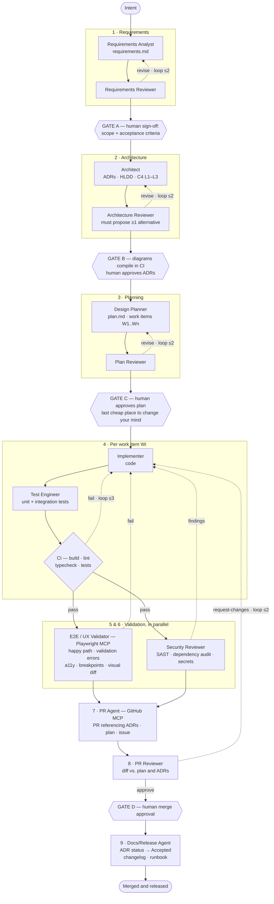

# Bourbon Book

A private, mobile-first bourbon collection that photographs bottles, asks a local Ollama vision model to read the label, and keeps the result in an editable personal catalog. It is an installable web app sized for iPhone and desktop browsers.

## Run locally

```bash
cp .env.example .env
# Set SESSION_SECRET in .env
uv sync
uv run --env-file .env uvicorn bourbonbook.main:app --reload
```

Open `http://localhost:8000`, create an account, and add a bottle. `OLLAMA_URL` has no built-in default and must be set in `.env`. If the selected analyzer is not reachable, the photo is still saved and the review form opens for manual entry.

Form input and select values now use a self-hosted Atkinson Hyperlegible Next font for improved readability. The WOFF2 assets are stored under `bourbonbook/static/fonts/` with a local attribution note.

Development defaults to captured email delivery. Verification and reset messages are retained only
in the running process. To exercise real delivery, set `EMAIL_DELIVERY_MODE=smtp` and configure the
SMTP settings shown in `.env.example`. Links are always built from `PUBLIC_BASE_URL`, never the
incoming Host header.

Application startup runs the idempotent migration bootstrap before serving requests. It initializes
a fresh database, safely stamps a recognized pre-Alembic database, and upgrades an already-versioned
database to the latest revision. Container startup also runs it explicitly before Uvicorn.

Choose the image-analysis provider in `.env` and restart the app:

```dotenv
# Local Ollama (default)
ANALYSIS_PROVIDER=ollama

# Or OpenAI
ANALYSIS_PROVIDER=openai
OPENAI_API_KEY=your-api-key
OPENAI_MODEL=gpt-5.5

# Or the same local models reached through a LiteLLM proxy
ANALYSIS_PROVIDER=litellm
LITELLM_URL=http://litellm:4000/v1
LITELLM_API_KEY=your-litellm-key
LITELLM_MODEL=ollama/qwen3.6:35b
LITELLM_VISION_MODEL=ollama/qwen3-vl:8b
```

`litellm` talks the OpenAI `/chat/completions` surface to a LiteLLM proxy that fronts Ollama, so
photo analysis, name analysis, refinement, catalog extraction, and the vision warm-up all go
through the gateway. It has the same model roles as Ollama -- vision, text, and a shared fallback
-- plus its own context windows (`LITELLM_*_NUM_CTX`, forwarded to Ollama as `num_ctx`) and
optional output-token caps (`LITELLM_*_MAX_TOKENS`). The model names are separate settings because
a LiteLLM route is an alias its own config defines, not the raw Ollama tag. Grounded price search
still calls Ollama Cloud's `web_search`/`web_fetch` directly and needs `OLLAMA_API_KEY`; without it
pricing falls back to the local catalog rather than guessing.

Keep the real API key only in `.env` or your container's secret environment settings; do not add it to `.env.example` or commit it.

Pricing is local-first, regardless of the analysis provider: an exact SQLite catalog match is used
first, followed by an optional Qdrant fuzzy match for the same bottle size. Only a local miss calls
the configured provider's grounded web search, which uses producer listings, official state price
books, and reputable whiskey publications. Every accepted
result has a consulted source URL and is written back to the reusable local catalog; Qdrant is a
rebuildable retrieval index, not the source of truth. The edit page can explicitly refresh MSRP
from the web without re-analyzing the photo.

To enable the optional Qdrant index, set `QDRANT_URL` to its HTTP endpoint (normally port `6333`).
Import vetted source records as JSON Lines with `name`, `size`, `msrp`, `title`, `url`, and optional
`basis`, then run `make price-catalog-ingest PRICE_CATALOG=/path/to/prices.jsonl`. Run
`make price-catalog-reindex` after restoring the database or repairing the Qdrant collection.

For a bulk local inventory update, `make price-catalog-extract-screenshots` reads the configured
PNG, JPEG, or PDF files with the local Ollama vision model. It writes records containing `name`,
`size`, `msrp`, and `price_updated_at`, then upserts them into the local catalog: existing
name-and-size pairs receive the new price and date, while new pairs are added. The date defaults to
the extraction date; invoke `python -m scripts.extract_catalog_screenshots --help` to supply a
known `--price-updated-at` date or custom input/output paths. This workflow never browses the web
and does not include a source URL in the extracted records.

When a user saves a purchase price for a bottle, Bourbon Book uses it as the shared current price
only if the matching name-and-size catalog entry is missing or more than six months old. In that
case the bottle and catalog MSRP are both updated with the user-entered amount and the catalog date
is reset; a fresher catalog entry is not overwritten.

Admins can open `/admin/users` to search users, correct an email address after out-of-band identity
verification, and send verification or reset links. `/admin/usage` shows recent OpenAI/Ollama call
counts, token-like counts, failures, and durations from the local usage ledger. The ledger stores
provider, operation, model, bounded error type, duration, token counts, optional internal user ID,
and timestamp only; it does not store prompts, responses, bottle names, email addresses, URLs, or
API keys. Set `API_USAGE_RETENTION_DAYS` to control local ledger cleanup.

`/admin/catalog` manages the shared bottle-price catalog. It supports name search, name/price
sorting, selectable page sizes, numbered pagination, inline name/price updates, and bulk deletion
of selected rows.

`/admin/config` exposes every setting listed in `.env.example` with server-side type, range, and
allowed-value validation. Secret fields are never displayed; leave one blank to preserve it or use
its clear checkbox for optional secrets. Saves are written atomically with owner-only permissions
to `<DATA_DIR>/.env`, which takes precedence over container environment values at the next startup.
The restart action terminates the app process after returning its response. Production deployments
must use a process supervisor such as Docker with `restart: unless-stopped`; without one, the app
stops and must be started manually.

## Docker / Unraid

The production image is `ghcr.io/adhatcher-org/bourbonbook:latest`. It listens on container port
`8000`, stores all persistent state under `/data`, and runs one Uvicorn worker. Logs are mirrored to
stdout/stderr and written as newline-delimited JSON to `/data/logs/bourbonbook.log`. The checked-in
`compose.yaml` is a local-development smoke-test topology: it publishes
host port `8088`, uses a named volume, and creates an example `bourbon-services` network. Do not copy
those local defaults into Unraid production.

For local Docker testing only:

```bash
cp .env.example .env
docker network create bourbon-services  # once, if it does not already exist
docker network connect bourbon-services ollama  # once, for an existing Ollama container
docker compose up -d --build
```

### Production Unraid Settings

Create an Unraid path setting named `DATA_PATH` and map its host value to container path `/data`.
`/mnt/user/appdata/bourbonbook` is a reasonable example host value, but backups and restores must use
the value actually configured in Unraid.

| Setting name | Unraid type | Container target/key | Example/default | Required | Secret |
| --- | --- | --- | --- | --- | --- |
| Repository | Repository | Image | `ghcr.io/adhatcher-org/bourbonbook:latest` | Yes | No |
| Web UI | WebUI | URL | `https://bourbonbook.aaronhatcher.com` | Yes | No |
| App port | Port | Container `8000` | No host-published port | Yes | No |
| `DATA_PATH` | Path | `/data` | `/mnt/user/appdata/bourbonbook` | Yes | No |
| Docker network | Network | Unraid-selected network | SWAG shared network | Yes | No |
| Optional service network | Network | Additional network | Ollama/service network | If using Ollama | No |
| `APP_ENV` | Variable | `APP_ENV` | `production` | Yes | No |
| `SESSION_SECRET` | Variable | `SESSION_SECRET` | generated with `openssl rand -hex 32` | Yes | Yes |
| `SECURE_COOKIES` | Variable | `SECURE_COOKIES` | `true` | Yes | No |
| `PUBLIC_BASE_URL` | Variable | `PUBLIC_BASE_URL` | `https://bourbonbook.aaronhatcher.com` | Yes | No |
| `PROXY_HEADERS` | Variable | `PROXY_HEADERS` | `true` | Yes | No |
| `FORWARDED_ALLOW_IPS` | Variable | `FORWARDED_ALLOW_IPS` | SWAG fixed IP or smallest proxy CIDR | Yes | No |
| `ANALYSIS_PROVIDER` | Variable | `ANALYSIS_PROVIDER` | `ollama`, `openai`, or `litellm` | Yes | No |
| `OLLAMA_URL` | Variable | `OLLAMA_URL` | `http://ollama:11434` | If using Ollama | No |
| `OLLAMA_MODEL` | Variable | `OLLAMA_MODEL` | `qwen3.6:35b` | Fallback for either Ollama task | No |
| `OLLAMA_NUM_CTX` | Variable | `OLLAMA_NUM_CTX` | `4096` | Fallback/text context window | No |
| `OLLAMA_VISION_MODEL` | Variable | `OLLAMA_VISION_MODEL` | `qwen3.6:35b` | Photo analysis | No |
| `OLLAMA_VISION_NUM_CTX` | Variable | `OLLAMA_VISION_NUM_CTX` | `32768` | Photo and catalog-extraction context window | No |
| `OLLAMA_TEXT_MODEL` | Variable | `OLLAMA_TEXT_MODEL` | unset (falls back to `OLLAMA_MODEL`) | Name-only analysis | No |
| `OLLAMA_TEXT_NUM_CTX` | Variable | `OLLAMA_TEXT_NUM_CTX` | unset (falls back to `OLLAMA_NUM_CTX`) | Optional text-model context window | No |
| `LITELLM_URL` | Variable | `LITELLM_URL` | `http://litellm:4000/v1` | If using LiteLLM | No |
| `LITELLM_API_KEY` | Variable | `LITELLM_API_KEY` | masked value | If the proxy requires a key | Yes |
| `LITELLM_MODEL` | Variable | `LITELLM_MODEL` | `ollama/qwen3.6:35b` | Fallback for either LiteLLM task | No |
| `LITELLM_VISION_MODEL` | Variable | `LITELLM_VISION_MODEL` | unset (falls back to `LITELLM_MODEL`) | Photo analysis and catalog extraction | No |
| `LITELLM_TEXT_MODEL` | Variable | `LITELLM_TEXT_MODEL` | unset (falls back to `LITELLM_MODEL`) | Name-only analysis | No |
| `LITELLM_NUM_CTX` | Variable | `LITELLM_NUM_CTX` | `4096` | Fallback/text context window | No |
| `LITELLM_VISION_NUM_CTX` | Variable | `LITELLM_VISION_NUM_CTX` | `32768` | Photo and catalog-extraction context window | No |
| `LITELLM_TEXT_NUM_CTX` | Variable | `LITELLM_TEXT_NUM_CTX` | unset (falls back to `LITELLM_NUM_CTX`) | Optional text-model context window | No |
| `LITELLM_MAX_TOKENS` | Variable | `LITELLM_MAX_TOKENS` | unset (model decides) | Optional output-token cap | No |
| `LITELLM_VISION_MAX_TOKENS` | Variable | `LITELLM_VISION_MAX_TOKENS` | unset (falls back to `LITELLM_MAX_TOKENS`) | Optional vision output cap | No |
| `LITELLM_TEXT_MAX_TOKENS` | Variable | `LITELLM_TEXT_MAX_TOKENS` | unset (falls back to `LITELLM_MAX_TOKENS`) | Optional text output cap | No |
| `QDRANT_URL` | Variable | `QDRANT_URL` | `http://qdrant:6333` | Local price search index | No |
| `QDRANT_API_KEY` | Variable | `QDRANT_API_KEY` | masked value | If Qdrant requires authentication | Yes |
| `QDRANT_PRICE_COLLECTION` | Variable | `QDRANT_PRICE_COLLECTION` | `bourbonbook_prices` | Local price-search collection | No |
| `OPENAI_API_KEY` | Variable | `OPENAI_API_KEY` | masked value | If using OpenAI | Yes |
| `OPENAI_MODEL` | Variable | `OPENAI_MODEL` | `gpt-5.5` | No | No |
| `EMAIL_DELIVERY_MODE` | Variable | `EMAIL_DELIVERY_MODE` | `smtp` | Yes | No |
| `SMTP_HOST` | Variable | `SMTP_HOST` | relay hostname | Yes for SMTP | No |
| `SMTP_PORT` | Variable | `SMTP_PORT` | `587` | Yes for SMTP | No |
| `SMTP_USERNAME` | Variable | `SMTP_USERNAME` | relay username | Relay-dependent | Yes |
| `SMTP_PASSWORD` | Variable | `SMTP_PASSWORD` | masked value | Relay-dependent | Yes |
| `SMTP_FROM_EMAIL` | Variable | `SMTP_FROM_EMAIL` | `bourbonbook@example.com` | Yes for SMTP | No |
| `SMTP_FROM_NAME` | Variable | `SMTP_FROM_NAME` | `Bourbon Book` | No | No |
| `SMTP_TLS_MODE` | Variable | `SMTP_TLS_MODE` | `starttls` | Yes for SMTP | No |
| `VERIFICATION_TTL_HOURS` | Variable | `VERIFICATION_TTL_HOURS` | `24` | No | No |
| `EMAIL_VERIFICATION_REQUIRED` | Variable | `EMAIL_VERIFICATION_REQUIRED` | `true` | No | No |
| `RESET_TTL_MINUTES` | Variable | `RESET_TTL_MINUTES` | `60` | No | No |
| `DEFAULT_ADMIN_EMAIL` | Variable | `DEFAULT_ADMIN_EMAIL` | owner email | First startup only | No |
| `DEFAULT_ADMIN_PASSWORD` | Variable | `DEFAULT_ADMIN_PASSWORD` | masked temporary value | First startup only | Yes |
| `METRICS_ENABLED` | Variable | `METRICS_ENABLED` | `true` | No | No |
| `API_USAGE_RETENTION_DAYS` | Variable | `API_USAGE_RETENTION_DAYS` | `90` | No | No |
| `LOG_FORMAT` | Variable | `LOG_FORMAT` | `json` | Yes | No |
| `LOG_LEVEL` | Variable | `LOG_LEVEL` | `INFO` | No | No |

Never put real secrets in the image, Compose file, documentation examples, or repository. Use masked
Unraid variables for `SESSION_SECRET`, `OPENAI_API_KEY`, SMTP credentials, and the temporary
bootstrap password. Production startup rejects insecure cookies, non-HTTPS `PUBLIC_BASE_URL`, missing
proxy-header support, an empty forwarded allowlist, and any `*` entry in `FORWARDED_ALLOW_IPS`.

The initial admin is bootstrap-only. Set `DEFAULT_ADMIN_EMAIL` and masked `DEFAULT_ADMIN_PASSWORD`
for the first start, verify that the account was created and received a verification email, then
remove `DEFAULT_ADMIN_PASSWORD` from the Unraid template and restart the container. Startup must
still succeed after removal because an admin already exists. If restoring an empty or pre-admin
database, supply fresh bootstrap values again.

`EMAIL_VERIFICATION_REQUIRED` defaults to `true`. Set it to `false` only for trusted local or
development deployments; existing unverified accounts can then sign in, and newly created accounts
are marked verified without sending an email.

For Ollama, photo analysis uses `OLLAMA_VISION_MODEL` and name-only analysis uses
`OLLAMA_TEXT_MODEL`. Either setting falls back to `OLLAMA_MODEL` when unset, preserving existing
deployments. A vision-capable model is required for uploaded bottle photos. The default,
`qwen3.6:35b`, reports `completion`, `vision`, `tools`, and `thinking` capabilities and can serve
both `OLLAMA_VISION_MODEL` and `OLLAMA_MODEL`/`OLLAMA_TEXT_MODEL` from a single resident model
instead of loading a separate model per task.

Context windows are configured by role: `OLLAMA_VISION_NUM_CTX` defaults to `32768` for bottle
photos, catalog extraction, and vision warm-up. `OLLAMA_NUM_CTX` defaults to `4096` for text work;
set the optional `OLLAMA_TEXT_NUM_CTX` only when the text model needs a different positive value.

Keep the container at one Uvicorn worker. Login, registration, verification, and reset rate limits
are process-local; add a shared limiter before scaling workers or replicas.

The container health check calls `/healthz`, which reports only process liveness. `/readyz` verifies
database connectivity and that Alembic has reached the application migration head.

### Prometheus, SWAG, and Loki

Prometheus should scrape Bourbon Book directly over an internal Docker network, not through the
public HTTPS host. Example scrape job:

```yaml
scrape_configs:
  - job_name: bourbonbook
    static_configs:
      - targets: ["bourbonbook:8000"]
```

If Prometheus is not on the same network as SWAG/Bourbon Book, attach both containers to a dedicated
internal monitoring network. Keep `/metrics`, `/healthz`, and `/readyz` off the public SWAG virtual
host with exact-match denies, for example:

```nginx
location / {
    proxy_pass http://bourbonbook:8000;
    proxy_set_header Host $host;
    proxy_set_header X-Real-IP $remote_addr;
    proxy_set_header X-Forwarded-For $remote_addr;
    proxy_set_header X-Forwarded-Proto $scheme;
    proxy_set_header X-Forwarded-Host $host;
    proxy_set_header X-Forwarded-Port $server_port;
}

location = /metrics { return 404; }
location = /healthz { return 404; }
location = /readyz { return 404; }
```

Replace `bourbonbook` with the actual Docker DNS name if Unraid assigns a different container name.
Use the same SWAG HTTPS route for LAN and Tailscale browser testing; do not publish the application
port on the host for direct browser access. Preserve or replace forwarding headers at SWAG so the app
trusts only SWAG's fixed address or proxy-network CIDR, never arbitrary client-supplied forwarding
headers.

Useful starter PromQL:

```promql
sum(rate(bourbonbook_auth_events_total{event="login",result="failure"}[5m]))
sum(rate(bourbonbook_http_requests_total{status_class="5xx"}[5m]))
sum(rate(bourbonbook_ai_tokens_total{provider="openai"}[5m])) by (operation, direction)
histogram_quantile(0.95, sum(rate(bourbonbook_ai_request_duration_seconds_bucket[5m])) by (le, provider, operation))
sum(rate(bourbonbook_ai_requests_total{result="failure"}[5m])) by (provider, operation)
```

For Promtail/Loki, mount the configured Unraid `DATA_PATH` read-only into the collector and scrape
`<DATA_PATH>/logs/*.log` (inside the app container this is `/data/logs/*.log`). Each line is JSON
regardless of the console `LOG_FORMAT`. Keep low-cardinality labels such as `app`, `container`,
`level`, and optionally `event`; leave request IDs and user IDs as parsed fields, not labels. A
minimal Promtail scrape target is:

```yaml
scrape_configs:
  - job_name: bourbonbook
    static_configs:
      - targets: [localhost]
        labels:
          app: bourbonbook
          __path__: /bourbonbook-data/logs/*.log
    pipeline_stages:
      - json:
          expressions:
            level: severity
            event: event
```

In this example, mount the same Unraid appdata directory at `/bourbonbook-data` in Promtail. Use
external `logrotate` with `copytruncate` or normal rename/create rotation; the app's watched file
handler reopens a replaced file. Useful Loki filters include:

```logql
{app="bourbonbook"} | json | event="login_failed"
{app="bourbonbook"} | json | event="admin_action"
{app="bourbonbook"} | json | event="ai_request_completed" | error_type!=""
{app="bourbonbook"} | json | request_id="paste-request-id"
```

For interactive recovery of the sole administrator, open a container terminal and run
`uv run python -m bourbonbook.admin_cli recover`. It prompts for secrets and does not accept a
password argument that could leak through shell history or the process list.

### Deployment Validation Runbook

Before deploying a migration-enabled image, stop the old Bourbon Book container and copy or snapshot
the complete Unraid host directory configured by `DATA_PATH`, including `bourbonbook.db` and
`uploads/`. Do not make a normal file copy of `bourbonbook.db` while the app is running. Keep the
backup until the upgraded container has started and the catalog, ownership, price sources, and photos
have been checked.

Production rollout checklist:

1. Pull or build the target image and confirm the Unraid template uses the production settings above.
2. Start the container and inspect startup logs for migration bootstrap, admin bootstrap if needed,
   and Uvicorn startup. A partial or unknown unversioned schema intentionally fails startup.
3. Verify internal health from another container on the selected Docker network:
   `curl http://bourbonbook:8000/healthz` and `curl http://bourbonbook:8000/readyz`.
4. Verify public routing through SWAG at `https://bourbonbook.aaronhatcher.com`, including secure
   cookies, redirects, PWA assets, and normal browser access from LAN or Tailscale.
5. Confirm public `https://bourbonbook.aaronhatcher.com/metrics`, `/healthz`, and `/readyz` return
   the configured denial while Prometheus can scrape `http://bourbonbook:8000/metrics` internally.
6. Run the account flow end to end: register, open the captured or delivered verification link,
   confirm verification, land on profile, set a screen name, change profile fields and password,
   request and complete a reset, and delete a test account.
7. Add a bottle using the selected Ollama analysis settings and verify the local-first pricing path,
   final MSRP, and admin API usage totals.
8. Exercise admin user actions from `/admin/users` and review `/admin/usage`.
9. Query Loki for JSON events such as `login_succeeded`, `admin_action`, and
   `ai_request_completed`; confirm secrets, one-time tokens, passwords, and user email addresses are
   absent from logs and metrics.
10. Remove `DEFAULT_ADMIN_PASSWORD` after first admin creation, restart, and confirm startup and
    login still work.

Local pre-PR validation remains:

```bash
make pr-review
```

For rollback, stop the new container, restore the backup from the host path currently configured by
`DATA_PATH`, and redeploy the previous image. Do not rely on schema downgrades as a substitute for a
database and uploads backup.

## iPhone installation

Serve the app over HTTPS, open it in Safari, choose **Share → Add to Home Screen**, and launch Bourbon Book from the new icon. The photo picker uses the rear camera when supported.

## Development

The Makefile is the canonical command interface for local development and CI:

```bash
make install       # install the exact uv.lock environment
make check         # non-mutating format, lint, test, coverage, security, dependency, and integrity checks
make test          # fast deterministic tests
make coverage      # branch coverage with the temporary 80% floor
make pr-review     # all pre-PR gates plus the production image build
make help          # list every available target
```

During development, run focused tests as needed, then run `make check` before opening or updating
a pull request. It validates formatting, lint, deterministic tests, branch coverage, Bandit, the
dependency lock and known vulnerabilities, and diff/tracked-file integrity without synchronizing
the environment or changing tracked project files. `make pr-review` runs that same gate plus the
production Docker build. These checks use test configuration and do not load `.env`; only `make
run_local` loads that file. `build-local` builds the local Compose topology, while `build` builds
the production image used by CI and Unraid.

Repository administrators must configure the `main` branch ruleset to require the `quality`,
`security`, `dependency`, `review-readiness`, and `container` GitHub Actions jobs before merge.
Dependabot opens weekly Python, Actions, and Docker update pull requests, which must pass the same
required checks.

To intentionally upgrade the lock, run `make update`; it audits the upgraded environment and then
runs the complete non-container gate before returning success.

Run the app locally with proxy-header processing disabled:

```bash
make run_local
```

It binds to `127.0.0.1:8000` and defaults `SECURE_COOKIES` to false. Override `HOST` or `PORT` on the
Make command line when needed.

Evaluate either analysis provider against the bottle-image fixtures:

```bash
uv run --env-file .env python -m scripts.evaluate_ollama --provider ollama --model qwen3.6:35b
uv run --env-file .env python -m scripts.evaluate_ollama --provider openai --model gpt-5.5
```

The evaluator reports missing/unvalidated fixtures and scores the four primary vision fields:
product name, brand, fill level, and the status derived from that fill level. Product facts and
prices remain available for diagnostics but do not affect the vision score.

The workflows under `.github/workflows` follow the current `adhatcher-org` patterns: pull-request tests and container builds, plus a multi-architecture GHCR publish on `main`.

## Agent-assisted development workflow

This repository ships a set of AI agents that divide the work of changing it: designing, critiquing,
implementing, testing, and shepherding pull requests. They live in `.claude/agents/` (Claude Code)
and `.codex/agents/` (Codex). `AGENTS.md` is the authoritative description; this section is the map.

Two ideas hold the whole thing together. **Reviewers are separate agents with fresh context** — the
agent that wrote a plan cannot meaningfully critique it, so critics and validators start cold and
are read-only by tool list, not merely by instruction. And **every loop is bounded**, with a human
decision at the two points where a wrong turn gets expensive.

### The chain



### The agents

| Agent | Does | Can write? |
| --- | --- | --- |
| `senior-architect` | Reviews the request against the existing design, plans the change, owns ADRs and the architecture docs | Docs and plans only |
| `architecture-critic` | Independent design review; returns `APPROVE` or `REVISE` with evidence | No |
| `senior-engineer` | Implements one action end to end with tests, runs the local gates | Code, tests, migrations |
| `bourbonbook-reviewer` | Independent code review bound to an exact commit | No |
| `pr-validator` | Runs the full `make pr-review` gate; the only agent that may approve a PR | Approval only |
| `pr-manager` | Writes the PR body, opens the draft, triages CI, updates the tracker | PR text and tracker |
| `vux-tester` | Browser sweep of whole journeys: layout, accessibility, console health, visual diffs | No |
| `e2e-bottle-tester` | Photo-analysis field accuracy against the image fixtures | No |

Four skills carry the domain rules and are applied automatically by the agents when a change crosses
their boundary: `roadmap-action`, `migration-change`, `pwa-visual-check`, and `provider-evaluation`.

### Interacting with them

Ask the architect first for anything non-trivial; it drives the rest of the chain.

```text
@senior-architect  Bottles should support a "sample/pour" status alongside
                   unopened/opened/empty. Plan it.
```

It investigates, drafts a proposal, sends it to the critic itself, and comes back to you with a plan
to approve. You do not need to invoke the critic by hand.

```text
@senior-engineer   Implement A03. Follow the roadmap-action skill.
@vux-tester        Sweep the admin journeys at 390px against https://bourbonbook.orb.local
@pr-manager        Open the draft PR for this branch.
```

Small, obvious fixes do not need the chain — ask `senior-engineer` directly. The chain earns its
overhead when a change touches the schema, a provider, the security boundary, or the design.

### What stops on its own

- **Two human gates.** You approve the plan before code is written, and you merge. No agent merges;
  a merge to `main` triggers `docker-publish.yml` and tags a release.
- **Three-round caps** on critic revisions, CI fixes, and e2e repair cycles. Past that, the agent
  halts and hands you both positions rather than looping.
- **Halt on ambiguity.** If the plan turns out to be wrong mid-implementation, the engineer stops and
  returns to the architect instead of inventing a decision.
- **The as-built invariant.** `docs/architecture/` describes only what is checked in today. Proposed
  work lives in `docs/adr/plan.md` and in `Proposed` ADRs.

### Setup

MCP servers used by the agents are declared in `.mcp.json`: **Playwright** (browser testing) and
**Context7** (version-accurate library docs). Both run via `npx` on first use. The PR agents use the
**GitHub MCP** when it is connected and authorized, and otherwise fall back to `gh` with `GH_TOKEN`
mapped from `GITHUB_PAT`. Note that GitHub does not permit authors to approve their own pull
requests, so remote approval returns `BLOCKED` when the PR author and the authenticated reviewer are
the same account.
