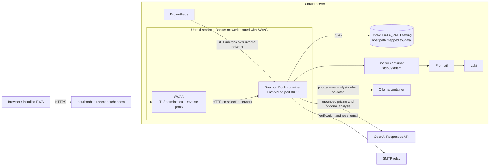

# Bourbon Book Implementation Plan

## Purpose

This plan covers every issue and feature in `todo.md`. It is organized as small, ordered
implementation parts so a different model can complete one part at a time without having to load
the entire project history. Each part should be a separate commit and should leave the test suite
green, except Parts 3–5, which form one atomic identity delivery group and must be merged, deployed,
and released together.

## Implementation Status

| Part | Title | Status | Reference / Notes |
| --- | --- | --- | --- |
| 0 | Introduce Real Database Migrations | Complete | Implemented in `a7ee0ce` (`Add safe database migration bootstrap`). |
| 1 | Fix Grounded MSRP and Secondary-Market Pricing | Complete | Implemented in `a97dcbd` (`Updated to add MSRP and Secondary pricing`). |
| 2 | Add Email Delivery and One-Time Token Primitives | Complete | Implemented in `a507aed` (`Add verified email account flows`). |
| 3 | Prepare Email Authentication Schema and Roles | Complete | Implemented in `a507aed` (`Add verified email account flows`). |
| 4 | Build the User Profile and Account Deletion Flow | Complete | Implemented in `a507aed` (`Add verified email account flows`). |
| 5 | Complete Email Verification, Resend, and Password Reset | Complete | Implemented in `a507aed` and `4ae8b72` (`Run migrations during application startup`). |
| 6 | Add the Admin User Management Screen | Complete | Implemented in `659dc8b` on PR #9 (`feature/logging`) via admin routes, templates, and tests. |
| 7 | Add an Observability and API-Usage Foundation | Complete | Implemented in `659dc8b` on PR #9 with `bourbonbook/observability.py`, `ApiUsage`, and admin usage reporting. |
| 8 | Expose Prometheus Metrics at `/metrics` | Complete | Implemented in `659dc8b` on PR #9 with `/metrics`, request instrumentation, and `tests/test_metrics.py`. |
| 9 | Add Structured Logging for Promtail and Loki | Complete | Implemented in `659dc8b` on PR #9 with structured JSON logging support and `tests/test_logging.py`. |
| 10 | Add the Makefile and Enforce Pre-PR Quality Gates | Complete | Implemented in `72ab2de`; draft PR #2 passed `quality`, `security`, `dependency`, `review-readiness`, and `container`. |
| 11 | Integration, Deployment, and End-to-End Verification | Complete | Implemented on `feature/validation` with readiness checks and Unraid rollout/runbook docs. |

## Branch and Pull Requests

- Current implementation target: PR #9 from `feature/logging` into `main`.
- PR #9 incorporates Parts 6–9 plus the open Dependabot updates from PRs #3–#8:
  - PR #8: bump `astral/uv` from `0.11.7` to `0.11.25`.
  - PR #7: bump `actions/checkout` from `5.0.0` to `7.0.0`.
  - PR #6: bump `docker/build-push-action` from `7.0.0` to `7.2.0`.
  - PR #5: bump `docker/login-action` from `4.1.0` to `4.2.0`.
  - PR #4: bump `docker/setup-qemu-action` from `4.0.0` to `4.1.0`.
  - PR #3: bump `astral-sh/setup-uv` commit reference.

## Current Architecture Snapshot

- FastAPI/Jinja application in `bourbonbook/main.py`; routes and most catalog business logic are
  currently in that one module.
- SQLAlchemy models in `bourbonbook/models.py`, backed by SQLite under `/data` in production.
- `Database.create_all()` creates missing tables but there is no migration framework. It cannot
  add or rename columns in an existing Unraid database.
- Authentication uses a signed session cookie and a `User.username` field.
- Bottle images are private files under `/data/uploads` and are authorized by owner in `/media`.
- Image/name analysis uses either Ollama or OpenAI according to `ANALYSIS_PROVIDER`.
- OpenAI grounded price search already exists in `bourbonbook/openai_provider.py`, including source
  persistence, but `bourbonbook.analysis.search_bottle_prices()` refuses to call it unless
  `ANALYSIS_PROVIDER=openai`.
- The project already runs as a non-root Docker container, logs to stdout/stderr, and exposes
  `/healthz`.
- Production runs on an Unraid server. The Docker network is selected in the Unraid container
  configuration (for example, the network shared with SWAG); it is not hard-coded by the image.
- The public origin is `https://bourbonbook.aaronhatcher.com`; SWAG terminates TLS and proxies to
  the application on its internal container port.
- Persistent container path `/data` is a bind mount whose host path is supplied by the Unraid
  `DATA_PATH` path setting. A typical value is `/mnt/user/appdata/bourbonbook`, but the application
  and image must not depend on that literal host path.
- Unraid already runs local log/monitoring containers. Promtail reads Docker container stdout/stderr
  and sends logs to Loki. Prometheus (the metrics collector identified in `todo.md`) must scrape the
  app's `/metrics` endpoint directly over a shared internal Docker network.
- The repository's current `compose.yaml` does **not** yet represent production: it publishes host
  port `8088`, uses the `bourbonbook-data` named volume, and declares `bourbon-services`. Part 11
  must keep local Compose separate and document the equivalent Unraid container settings: the
  `DATA_PATH` host-path mapping, selected Docker network, and environment variables. Retain any
  additional network actually required for Ollama.

## Production Architecture

### Network and Exposure Rules

- SWAG is the only ingress for browser/user traffic, including requests originating from the LAN or
  Tailscale. In the Unraid container configuration, select a Docker network shared with SWAG and do
  not publish container port 8000 on the host. Local/Tailscale users reach the normal HTTPS SWAG URL,
  while Prometheus and Docker health checks remain internal direct callers.
- Set `PUBLIC_BASE_URL=https://bourbonbook.aaronhatcher.com` and `SECURE_COOKIES=true` in production.
- Preserve the original client/protocol headers in SWAG. Trust forwarded headers only from the
  known SWAG container/network; do not blindly trust arbitrary internet-supplied forwarding headers.
- In the deployed container, enable proxy-header processing with `FORWARDED_ALLOW_IPS` restricted to
  SWAG's fixed container IP (preferred) or the smallest dedicated proxy-network CIDR. Reject `*`.
  For non-Docker local runs, disable proxy-header processing entirely and use the direct socket client
  address/scheme.
- Keep `/metrics`, `/healthz`, and `/readyz` off the public SWAG route. Prometheus and Docker health
  checks should call the container directly. Add an exact-match SWAG deny/404 rule for these paths
  if the general proxy location would otherwise expose them.
- If Prometheus is not attached to the selected application network, attach both Prometheus and
  Bourbon Book to a second existing/internal monitoring network. Do not route monitoring scrapes
  through the public domain.
- Preserve any separate network needed to reach Ollama; a container may join both the SWAG-selected
  network and the Ollama/service network.

## Decisions and Planning Assumptions

These decisions make the requested behavior concrete. Change them before implementation if they do
not match the intended deployment.

1. **Email is the login identifier.** Store it normalized to lowercase for lookup and uniqueness,
   while preserving one canonical email value. Rename form language from username to email.
2. **Email verification is mandatory for every account.** The current `username` value may not be an
   email. If it is a valid email, migrate it but leave the account unverified until the owner
   completes the verification link. If it is not an email, retain it temporarily and require an
   administrator to supply a valid unique address before verification can begin. Preserve passwords,
   bottles, and photos throughout; never invent addresses, grandfather verification, or silently
   discard accounts.
3. **New registration collects email and password.** Screen name is optional during registration
   and can be completed after verification. New accounts cannot use the bottle library until their
   email is verified.
4. **Verification and reset links use the same token service, not the same token.** Each token has
   an explicit purpose, expiry, single-use state, and hashed-at-rest value.
5. **Email delivery uses an SMTP relay.** SMTP host, credentials, TLS mode, sender, and the public
   application URL are environment settings entered in the Unraid Docker container configuration,
   following the same runtime-configuration pattern as the `schwinn` application. No SMTP secret is
   baked into the image or committed configuration.
6. **The initial admin is bootstrapped from runtime parameters.** Add `DEFAULT_ADMIN_EMAIL` and
   `DEFAULT_ADMIN_PASSWORD` to the Unraid container environment. When no admin exists, require both,
   validate them, and either promote the existing account with that normalized email without changing
   its password or create a new unverified admin with the immediately hashed bootstrap password. Send
   the mandatory verification email in either case. These values are bootstrap inputs, not
   continuously enforced desired state: after an admin exists, changing them must never overwrite or
   create an account.
   The admin later changes email or password through `/profile`; document an interactive recovery
   command for a locked-out sole admin that prompts for secrets rather than accepting a password on
   the command line. `DEFAULT_ADMIN_PASSWORD` is temporary bootstrap configuration: remove it from
   the Unraid container after the first admin is created. Subsequent startups must allow it to be
   absent whenever an admin already exists.
7. **The admin can update email and initiate reset/verification emails but cannot view or set a
   plaintext password.** Updating an email revokes existing email tokens, marks the address
   unverified, and sends a fresh verification link.
8. **OpenAI token usage is both persisted and exported.** Prometheus counters are ideal for
   monitoring, while a small database usage ledger supports the requested admin screen. Prompts,
   responses, bottle names, email addresses, and API keys are not stored in usage records.
9. **Metrics contain bounded labels only.** Never label metrics with user ID, email, bottle ID,
   raw URL, exception message, or request ID. Those create cardinality/privacy problems.
10. **Logs are structured JSON in production.** Security events include an internal user ID where
    useful, but never passwords, reset/verification tokens, session cookies, API keys, full form
    bodies, or SMTP credentials.
11. **`/metrics` is unauthenticated inside the application.** Prometheus scrapes it directly over a
    shared internal Docker network. SWAG must not proxy this path publicly. If it ever must be
    internet-reachable, add proxy authentication rather than placing a secret in a query string.
12. **Account deletion is immediate and permanent.** It deletes the user's bottles, price sources,
    tokens, usage ownership links if any, and photo files, then clears the browser session.
13. **Session invalidation is server enforced.** Signed cookie contents are stateless, so clearing or
    reissuing the current browser's cookie does not revoke copies of an older cookie. Every
    authenticated session stores the user's current `session_version`, and every authenticated
    request compares it with the database value. Password changes, successful password resets, user
    email changes, and administrator actions that replace an email address increment this value
    transactionally.
14. **Rate limiting is process-local for the current deployment.** Bourbon Book runs as one Docker
    container with one Uvicorn worker and is expected to have low traffic, so a bounded in-memory
    limiter is sufficient. Counter loss during an operator-controlled restart is acceptable. If the
    app later uses multiple workers or replicas, replace it with a shared Redis/database-backed
    limiter before scaling out.
15. **Price lookup uses a durable in-container queue.** Bottle creation and manual refresh enqueue a
    SQLite-backed job and return promptly. One asynchronous worker in the single application
    container performs OpenAI pricing calls, recovers expired work after restart, and applies results
    only when the bottle identity still matches the queued generation. No Redis, Celery, or separate
    worker container is required for the expected workload.
16. **Proxy trust has explicit deployment modes.** All deployed browser traffic passes through the
    single SWAG container. The Unraid container enables proxy headers and trusts only SWAG through a
    non-wildcard `FORWARDED_ALLOW_IPS`; LAN and Tailscale users still enter through SWAG and are never
    trusted as proxies themselves. A non-Docker local run uses `--no-proxy-headers`, binds to
    `127.0.0.1` by default, and uses `SECURE_COOKIES=false` unless local HTTPS is configured.

## Cross-Cutting Definition of Done

Every implementation part must:

- include or update tests for its behavior and regression risk;
- run `uv run ruff check .` and `uv run pytest --cov=bourbonbook` before Part 10 lands; after Part
  10, use the equivalent Make targets and finish each implementation part with `make pre-ci`;
- preserve CSRF protection on every state-changing browser route;
- preserve owner scoping for bottles and administrator checks for admin routes;
- avoid logging or persisting secrets and one-time link values;
- update `.env.example`, `README.md`, Docker/Unraid notes, and `uv.lock` when configuration or
  dependencies change;
- use migrations against a copy of an existing database, not only a new test database;
- keep all services usable through dependency injection/fakes so tests never send real email or
  call OpenAI/Ollama.

## Requirements-to-Parts Map

| `todo.md` item | Implementation parts |
| --- | --- |
| MSRP and secondary prices missing | 1 |
| Username becomes email | 0, 3 |
| User profile/edit/delete screen | 3, 4 |
| Verification email and profile landing | 2, 3, 5 |
| Forgot/reset password | 2, 5 |
| Admin user and user/API usage views | 3, 6, 7 |
| Prometheus metrics | 7, 8 |
| Promtail/Loki logging | 7, 9 |
| Makefile with standard development/CI targets | 10 |
| Minimum 90% code coverage | 10 |
| Required pre-PR quality/security/dependency gates | 10, 11 |
| Docker/Unraid rollout | 0, 11 |

---

## Part 0 — Introduce Real Database Migrations

**Status: Implemented** in commit `a7ee0ce` (`Add safe database migration bootstrap`).

### Goal

Make all later schema changes safe for the existing persistent SQLite database.

### Files

- `pyproject.toml`, `uv.lock`
- `alembic.ini`
- new `migrations/` directory and initial revision(s)
- `bourbonbook/database.py`
- `Dockerfile`, `compose.yaml`
- tests for migration behavior
- `README.md`, `.env.example` if startup configuration changes

### Implementation

1. Add Alembic using the existing SQLAlchemy metadata from `bourbonbook.models.Base`.
2. Add an initial **baseline revision representing the current schema** (`users`, `bottles`, and
   `price_sources`). Do not let the baseline recreate tables in an existing database.
3. Add a bootstrap command that distinguishes:
   - an empty database: apply all migrations normally;
   - a legacy database with current tables and no Alembic version: validate the expected columns,
     stamp the baseline, then upgrade;
   - a versioned database: run `alembic upgrade head`;
   - an unexpected/partial schema: fail with a clear log instead of guessing.
4. Run the bootstrap explicitly before Uvicorn starts. Prefer a small entrypoint/module over
   migration side effects during import. Keep `create_all()` only for isolated unit tests if useful,
   or remove it after all test setup uses migrations.
5. Enable SQLite foreign keys for every connection (`PRAGMA foreign_keys=ON`) so cascades work as
   designed.
6. Add a migration integration test that creates the legacy schema, inserts a user and bottle,
   runs the upgrade, and proves the data survives.
7. Document stopping the container and backing up
   the Unraid host directory configured by `DATA_PATH` (including `bourbonbook.db` and `uploads/`)
   before the first upgraded container starts. Do not make a naive file copy of a live SQLite
   database.

### Acceptance Criteria

- A fresh database reaches Alembic head and the app starts.
- A copy of the pre-migration schema reaches head without losing users, bottles, photos, or price
  sources.
- Running the migration bootstrap repeatedly is idempotent.
- An incompatible schema stops startup with an actionable error.

### Handoff Boundary

Stop after the migration foundation and tests. Do not add email/admin columns in this part.

---

## Part 1 — Fix Grounded MSRP and Secondary-Market Pricing

### Diagnosed Cause

The app has a grounded OpenAI Responses API call, but
`bourbonbook.analysis.search_bottle_prices()` immediately returns `unavailable` when
`ANALYSIS_PROVIDER` is `ollama`. Since Ollama is the documented default, price search never reaches
OpenAI even when `OPENAI_API_KEY` is set. A second reliability issue is that web search is currently
optional; current OpenAI guidance says `tool_choice="required"` (or a forced web-search choice) is
needed when a search must occur. Finally, strict comparison between a model-returned URL and the
consulted-source list can reject valid prices when harmless tracking or canonical URL variants
differ. Bourbon Book must not resolve redirects or fetch model-provided URLs itself.

Current OpenAI reference for implementation:
<https://developers.openai.com/api/docs/guides/tools-web-search>

### Goal

Use OpenAI grounded web search for prices independently of the image-analysis provider, retain only
prices backed by consulted URLs, expose useful failure states, and keep existing values when no
reliable replacement is found. Run pricing through a durable SQLite-backed queue so browser requests
do not wait on OpenAI.

### Files

- `bourbonbook/analysis.py`
- `bourbonbook/openai_provider.py`
- `bourbonbook/config.py`
- `bourbonbook/models.py`, new Alembic revision
- new `bourbonbook/price_jobs.py`
- `bourbonbook/main.py`
- `bourbonbook/templates/edit.html`, `bourbonbook/templates/detail.html`
- `bourbonbook/static/app.js`
- `tests/test_analysis.py`, `tests/test_openai_provider.py`, `tests/test_app.py`
- focused worker tests such as `tests/test_price_jobs.py`
- `.env.example`, `README.md`

### Durable Job Model

Add one `PriceLookupJob` row per bottle:

- `bottle_id` as the primary key/foreign key with delete cascade;
- monotonically increasing `generation` and an `identity_fingerprint` derived from the normalized
  fields used to identify the bottle;
- bounded `status` (`pending`, `running`, `complete`, `partial`, `not_found`, `not_configured`,
  or `provider_error`);
- `attempts`, `available_at`, `lease_expires_at`, `last_started_at`, `finished_at`, `created_at`, and
  `updated_at`;
- bounded `error_type`, never a raw exception, prompt, bottle name, or source URL.

Reusing one row per bottle bounds table growth. Enqueuing increments `generation`, refreshes the
identity fingerprint, resets retry state, and sets the row to `pending`. A result may update prices
only with a conditional generation/status check, preventing an older request from overwriting a
newer edit or refresh.

### Implementation

1. Decouple the two provider decisions:
   - `ANALYSIS_PROVIDER` continues to select photo/name analysis (`ollama` or `openai`);
   - grounded pricing uses OpenAI whenever `OPENAI_API_KEY` exists;
   - optionally introduce `PRICE_PROVIDER=openai|disabled` for an explicit off switch, defaulting to
     `openai` when a key is configured.
2. Change `search_bottle_prices()` so it does not gate on `ANALYSIS_PROVIDER`.
3. Keep the Responses API `web_search` tool and `include=["web_search_call.action.sources"]`.
   Require the tool for a price lookup and keep live external access enabled. Use a bounded search
   context suitable for a quick product-price lookup.
4. Make the product query more exact by passing available identity fields, not only `Bottle.name`:
   brand, release, edition/batch, age, size, and any image-derived proof/ABV as read-only identity
   constraints. Explicitly exclude store picks or editions that do not match those fields.
   - When proof or ABV came from the bottle image, treat those values as authoritative for that
     bottle. Do not ask web search to discover them, do not include them as requested output fields,
     and never let pricing results replace or “correct” them.
   - Proof/ABV may appear in the prompt only to disambiguate the exact product or release; they are
     not web-enrichment targets.
   - When the image does not provide proof/ABV, leave those fields unchanged/null in this part.
     Grounded lookup of missing proof/ABV is deferred until the known-good product-data source list
     below is supplied.
5. Preserve the evidence policy:
   - MSRP: producer, official control-state price book, or reputable whiskey publication;
   - secondary: recent completed sale/auction evidence, not retailer asking prices;
   - use USD and record the evidence date/basis;
   - return null rather than fabricate or substitute a near-match.
6. Replace the loose price/source output with structured evidence for each candidate price:
   - price, USD currency, evidence type (`official_msrp`, `control_state_price`,
     `whiskey_publication`, or `completed_sale`), evidence/publication date, source title and URL,
     exact-product-match result, and a short basis;
   - for secondary value, require an explicit completed-sale/auction status rather than an asking
     price and return null when completion cannot be established;
   - include returned identity details such as release, edition/batch, size, and age when available so
     the application can compare them with the bottle; proof/ABV remain image-authoritative inputs
     and are not returned enrichment fields.
7. Harden source validation without making application-side network requests:
   - accept only `http` or `https` URLs present in the Responses API's returned source/citation
     metadata;
   - canonicalize locally by normalizing scheme/host casing, default ports, path/trailing slash, and
     known tracking parameters;
   - never follow redirects, resolve shortened links, download pages, or otherwise fetch a
     model-provided URL from Bourbon Book;
   - reject evidence whose returned edition/batch, size, age, or other available identity fields
     conflict with the bottle;
   - treat source membership and schema checks as application guarantees, while documenting that
     source interpretation and evidence quality remain grounded model judgments.
8. Return distinct statuses such as `complete`, `partial`, `not_found`, `not_configured`, and
   `provider_error`. Do not overwrite either existing price/source unless that individual field has
   a validated replacement.
9. Show an accurate result banner on the edit screen: both prices updated, one price updated, no
   reliable evidence, not configured, or provider failure. Do not overwrite the broader photo
   analysis status merely because a price lookup completed; add a separate price lookup status or
   transient result parameter.
10. Label secondary values in the UI as grounded estimates. Keep source links, evidence type/date,
    and basis clearly visible and clickable on the detail page as required when showing web-derived
    information.
11. Add safe diagnostic logging now (operation, model, status, source count, duration; no bottle
    query text). Part 7 will centralize this into usage telemetry.
12. Update docs so an Ollama analyzer plus an OpenAI pricing key is the primary documented hybrid
    configuration. Correct all user-facing instances of `MRSP` to `MSRP`.
13. Add the durable queue and one in-process asynchronous worker:
    - add bounded settings such as `PRICE_JOB_POLL_SECONDS`, `PRICE_JOB_LEASE_SECONDS`,
      `PRICE_JOB_MAX_ATTEMPTS`, and retry backoff limits with documented defaults;
    - create/update the bottle and enqueue its price job in the same short database transaction, then
      redirect immediately to the edit page;
    - claim one due job atomically, record a lease and generation, close the database session, and
      perform the OpenAI call without holding a SQLite transaction or session open;
    - after the call, open a fresh short transaction, reload the bottle/job, verify the claimed
      generation and identity fingerprint still match, and conditionally apply evidence and status;
    - if a newer generation exists, discard/log the older result as a bounded `superseded` outcome
      without mutating the newer pending job; if identity changed without a newer generation, enqueue
      one atomically rather than applying the stale result;
    - retry only transient provider failures with bounded exponential backoff and a configurable
      maximum attempt count; do not retry `not_found` or `not_configured` continuously;
    - recover `running` jobs whose lease expired after process/container interruption, and stop the
      worker cleanly during FastAPI lifespan shutdown;
    - run exactly one queue consumer in the existing single Uvicorn process. Document that multiple
      workers/replicas require a database-safe multi-consumer design before scaling out.
14. Replace synchronous refresh behavior with queue-aware UI:
    - bottle creation and the manual price-refresh action enqueue idempotently and return promptly;
    - show `pending`/`running`, completion, partial, not-found, configuration, and provider-error
      states on the edit page without overwriting photo-analysis status;
    - add an owner-authorized `GET /bottles/{bottle_id}/price-status` endpoint and bounded client
      polling that stops on a terminal state, page hide/navigation, or timeout;
    - disable/relabel the refresh control while the current generation is pending/running so ordinary
      double-clicks do not create duplicate OpenAI calls;
    - allow an explicit retry from terminal failure/not-found states by incrementing the generation.

### Deferred Source-Curation TODO

- [ ] Aaron will add a curated list of known-good sites at a later date, organized by data type:
  producer/product-reference sites suitable for missing product specifications such as proof/ABV;
  official/control-state/publication sites suitable for MSRP; and completed-auction/sale sites
  suitable for secondary estimates. The initial price implementation must work safely without that
  list, while missing proof/ABV lookup remains deferred. Once supplied, incorporate it as reviewed
  search guidance or domain filters without silently treating every page on an allowed domain as
  valid evidence.

### Tests

- Ollama analysis configuration plus an OpenAI key invokes the OpenAI price provider.
- Missing key produces `not_configured` without constructing an OpenAI client.
- The request requires web search and requests complete source metadata.
- Both, one, and zero validated prices produce the right status.
- Unconsulted, non-HTTP(S), malformed, wrong-edition/size/age, and retailer-asking sources are
  rejected.
- URL comparison strips harmless tracking/canonical variants locally but never performs DNS, HTTP,
  redirect, or page-fetch activity.
- Image-derived proof/ABV survive every price-search result unchanged and are absent from the price
  provider's output schema.
- Completed-sale status, evidence type/date, exact-product match, and basis are required before a
  secondary estimate is accepted.
- Existing price/source data survives a partial or failed refresh.
- Creating a bottle automatically enqueues price search after a usable identity is found, and the
  worker eventually records a terminal status.
- Manual “Search current MSRP & secondary value” works regardless of analysis provider.
- Bottle creation and manual refresh return without waiting for OpenAI and create only one current
  job row per bottle.
- Worker claim/completion transactions are short; no database session remains open during the
  provider call.
- Expired leases recover after a simulated restart, transient failures retry up to the configured
  limit, and permanent/not-configured outcomes do not loop.
- Editing identity or requesting a newer generation while a lookup is running prevents the stale
  result from changing bottle prices or sources.
- Owner authorization protects job-status reads, polling stops at terminal states, and deleting a
  bottle cascades its job row.
- Add an opt-in live smoke script/test (excluded from normal pytest) that prints status and source
  domains for one known bottle without asserting volatile dollar values.

### Acceptance Criteria

- With `ANALYSIS_PROVIDER=ollama` and a valid `OPENAI_API_KEY`, adding or refreshing a known bottle
  makes a grounded OpenAI search and populates every price for which validated evidence exists.
- No price is accepted without a URL in the API's consulted sources.
- The application guarantees source membership, safe URL shape, and structured evidence checks; it
  does not claim to independently verify source-page content that the application never fetches.
- Price lookup never modifies image-derived proof or ABV.
- Existing prices are never erased solely because a lookup failed.
- Browser requests do not wait for OpenAI; queued work survives container restarts and stale
  generations cannot overwrite newer bottle identity or price-refresh requests.

### Handoff Boundary

This part is independent of the identity work but now depends on Part 0 because it adds the durable
job schema. Implement it immediately after Part 0. Do not add metrics persistence here.

---

## Part 2 — Add Email Delivery and One-Time Token Primitives

**Status: Completed** in commit `a507aed` (`Add verified email account flows`).

### Goal

Create reusable, testable infrastructure for verification and password-reset emails before wiring
it into user routes.

### Files

- `bourbonbook/config.py`
- new `bourbonbook/email.py`
- new `bourbonbook/tokens.py`
- `bourbonbook/models.py`
- new Alembic revision
- new email templates under `bourbonbook/templates/email/`
- focused tests such as `tests/test_email.py`, `tests/test_tokens.py`
- `.env.example`, `README.md`, `pyproject.toml`, `uv.lock`

### Data Model

Add `UserToken`:

- `id`, `user_id` with delete cascade;
- `purpose` (`verify_email` or `reset_password`);
- `token_hash` with a unique index; store only a SHA-256/HMAC digest of a cryptographically random
  token;
- `email_snapshot` so an email-change verification cannot verify a different address;
- `expires_at`, `used_at`, `created_at`;
- optional `requested_ip_hash` for abuse investigation without storing raw IP.

### Implementation

1. Add settings: `PUBLIC_BASE_URL`, `SMTP_HOST`, `SMTP_PORT`, `SMTP_USERNAME`, `SMTP_PASSWORD`,
   `SMTP_FROM_EMAIL`, `SMTP_FROM_NAME`, `SMTP_TLS_MODE`, verification/reset TTLs, and an email
   delivery mode (`smtp` or a safe development capture/log mode). Production must set
   `PUBLIC_BASE_URL=https://bourbonbook.aaronhatcher.com`.
   Document each SMTP value as an Unraid container environment entry; mark `SMTP_PASSWORD` as a
   masked secret field and do not place live values in `.env.example`.
2. Validate configuration at startup. Build links only from `PUBLIC_BASE_URL`, never an untrusted
   request `Host` header.
3. Define an `EmailSender` protocol and SMTP implementation. Use async I/O or run blocking SMTP in a
   thread so requests do not block the event loop. Tests inject a memory sender.
4. Send multipart text/HTML messages. Keep templates concise and include expiry, ignored-request
   language, and the full fallback URL.
5. Implement token creation, digest lookup, consume-once semantics, expiry checks, purpose checks,
   and bulk revocation by user/purpose.
6. Invalidate older tokens of the same purpose when issuing a new one. Never log the raw token or
   put it in metrics.
7. Make delivery failure explicit: persist the account/token, log the failure, offer a resend path,
   and do not falsely tell the user that delivery succeeded. Rate limiting is completed in Part 5.

### Tests and Acceptance Criteria

- Raw tokens are never stored in the database.
- Tokens cannot be reused, used after expiry, used for the wrong purpose, or used after revocation.
- Email links use the configured public HTTPS origin.
- SMTP is never contacted in unit tests.
- Email content contains no password, session ID, or API credential.

### Handoff Boundary

Do not alter registration/login behavior yet. Finish with token and email services available for
injection into the app.

---

## Parts 3–5 — Atomic Identity Delivery Group

Parts 3–5 are staged implementation boundaries, not independently releasable features. Complete all
three on one branch and deliver them as one commit (or one inseparable commit series) so no deployed
revision can create an unverified user without also providing a working verification link and the
profile page that link targets.

The required internal order is:

1. Part 3 adds the schema, migration, normalization, roles, and authorization primitives without
   activating unverified registration or the verified-only route guard in the running application.
2. Part 4 adds the profile routes and templates that verified users will reach.
3. Part 5 atomically activates email registration/login, verification enforcement, resend, and
   password reset, then tests the complete registration → email → verification → profile flow.

The application must retain its existing working registration/login behavior until Part 5 performs
the activation. Intermediate commits may exist locally for review, but must not be merged to the
release branch, built as production images, or deployed independently.

---

## Part 3 — Prepare Email Authentication Schema and Roles

**Status: Completed** in commit `a507aed` (`Add verified email account flows`).

### Goal

Prepare email as the unique login identifier, preserve existing users, add verification state, and
add the admin role needed by later parts. Do not activate the new registration flow or verified-only
route enforcement until Part 5 can deliver the complete user journey.

### Files

- `bourbonbook/config.py`
- `bourbonbook/models.py`
- new Alembic revision
- `bourbonbook/auth.py`
- new `bourbonbook/admin_cli.py`
- `bourbonbook/main.py` (begin extracting auth routes if needed)
- `bourbonbook/templates/login.html`, `bourbonbook/templates/library.html`
- `tests/test_app.py` plus migration tests
- `.env.example`, `README.md`

### User Schema

- `email` (`String(254)`, unique/indexed after normalization)
- `screen_name` (`String(80)`; add and backfill from `display_name` during the staged migration)
- `email_verified_at` (nullable timestamp)
- `is_admin` (non-null boolean, default false)
- `session_version` (non-null integer, default `1`; increment to revoke all existing sessions)
- `password_hash`, `created_at`, and bottle ownership remain
- optional `updated_at` and `last_login_at`
- retain `username` and `display_name` through the atomic Parts 3–5 delivery; remove them only in a
  later revision after all users have valid replacement values and no route references them

### Migration Strategy

1. Add nullable email and role/verification columns first.
2. For a legacy username that already parses as an email, normalize and copy it to `email`, but leave
   `email_verified_at` null. Possession of an old account password does not substitute for email
   verification.
3. For non-email usernames, leave `email` null and mark the account as requiring admin migration.
   Keep its bottles and password hash intact.
4. Detect case-insensitive collisions before adding uniqueness. Abort with an actionable report
   rather than selecting a winner.
5. Add and backfill `screen_name` from `display_name`. Retain `display_name` so the existing
   registration/login implementation keeps working until Part 5; remove it only in a later cleanup
   migration after activation is proven.
6. After data is valid, enforce case-insensitive unique lookup. Prefer a normalized stored value and
   unique constraint; do not rely on case-sensitive application checks alone.

### Authentication Preparation

1. Add the shared email-normalization and validation boundary that registration, login, profile, and
   admin updates will use.
2. Prepare registration and login handlers/templates for `type="email"`, `autocomplete="email"`, a
   254-character limit, and email-specific validation/errors, but do not activate them yet.
3. Add `require_verified_user()` and `require_admin()` helpers with focused tests, but keep existing
   bottle/library/media routes on their current guard until Part 5 activates verification.
4. Extend authenticated cookie creation and `current_user()` so the cookie contains both `user_id`
   and `session_version`; reject and clear a cookie whose version no longer matches the database.
   Merely clearing or re-signing the current cookie is not considered global session invalidation.
5. Prepare safe generic responses for forgot/resend flows so they cannot reveal whether an email
   exists.
6. Add `DEFAULT_ADMIN_EMAIL` and `DEFAULT_ADMIN_PASSWORD` runtime settings and an idempotent initial
   admin bootstrap service:
   - when no admin exists, require both values in production, normalize the email, enforce the shared
     password policy, and look up an existing account by normalized email;
   - if that account exists, promote it without changing its password, verification state, screen
     name, bottles, or other data; if it does not exist, hash the bootstrap password immediately and
     create exactly one unverified admin;
   - issue the mandatory verification email through Part 2 and keep all protected/admin routes
     blocked until verification completes;
   - never log, echo, or store the plaintext bootstrap password in the application database; Unraid
     retains the configured secret environment value until the operator removes or rotates it;
   - when any admin already exists, never update credentials or create another account from changed
     bootstrap values; emit only a safe configuration-status event;
   - perform database-aware bootstrap validation after migrations: require the bootstrap email and
     password only when no admin exists. Once an admin exists, startup succeeds when
     `DEFAULT_ADMIN_PASSWORD` is absent;
   - after successful admin creation, show/log a non-secret operational reminder to remove
     `DEFAULT_ADMIN_PASSWORD` from the Unraid configuration. Never print its value;
   - changing the admin's email/password later uses the normal `/profile` forms. Add an interactive
     `python -m bourbonbook.admin_cli recover` command for sole-admin recovery; it must prompt through
     a TTY, preserve the admin role, require verification of a changed email, increment
     `session_version`, and refuse password arguments that would leak through shell history or the
     process list.

### Tests and Acceptance Criteria

- Shared email normalization and the prepared registration/login behavior work with case variants.
- Duplicate email case variants are rejected.
- Existing email-like usernames retain their password and data but must verify the migrated address
  before regaining collection access. Non-email legacy users retain their password and data while
  awaiting an administrator-supplied address.
- A cookie with a missing or stale `session_version` is rejected and cleared.
- A fresh database creates one unverified admin from valid bootstrap parameters, sends verification,
  and never stores the plaintext password. If the configured email already belongs to a migrated
  user, that account is promoted without changing its password or data. Restarting or changing the
  parameters cannot overwrite an existing admin.
- After bootstrap, removing `DEFAULT_ADMIN_PASSWORD` and restarting succeeds. An empty/no-admin
  database without both bootstrap parameters fails startup with an actionable message rather than
  creating an unknown account.
- The interactive recovery command can change the sole admin's email/password without exposing the
  password in command arguments; an email change remains unverified until its link is completed.
- Admin and non-admin authorization helpers behave correctly.
- Tests for newly prepared identity code no longer query `User.username` except migration fixtures;
  existing route tests may continue doing so until Part 5 activates the new flow.

### Handoff Boundary

Do not activate email registration or verification enforcement and do not release this part alone.
Continue directly to Part 4 on the same branch.

---

## Part 4 — Build the User Profile and Account Deletion Flow

**Status: Completed** in commit `a507aed` (`Add verified email account flows`).

### Goal

Give a verified user a screen to update email, screen name, and password, and permanently delete the
account.

### Files

- preferably new `bourbonbook/routes/profile.py` and small shared form/service helpers
- `bourbonbook/main.py` route registration
- new `bourbonbook/templates/profile.html`
- `bourbonbook/templates/library.html`, `bourbonbook/static/app.css`, `bourbonbook/static/app.js`
- `tests/test_profile.py`

### Routes

- `GET /profile`
- `POST /profile/name`
- `POST /profile/email`
- `POST /profile/password`
- `POST /profile/delete`

Separate forms make validation/errors and CSRF behavior clear and prevent an email validation error
from discarding an unrelated password change.

### Implementation

1. Link the current screen name/avatar area in the library header to `/profile`.
2. Screen-name update: trim, validate length, persist, and reflect it in the header immediately.
3. Email update:
   - require current password;
   - normalize and enforce uniqueness;
   - set `email_verified_at=None`, revoke existing verification/reset tokens, and increment
     `session_version` in the same transaction;
   - send a new verification email to the new address;
   - reject every previously issued cookie through the new version. Reissue only the current
     browser's cookie with the new `session_version` as an authenticated-but-unverified session so it
     can reach check-email/resend/verification routes, while `require_verified_user()` continues to
     block the profile, collection, bottle, and media routes until verification completes.
4. Password update:
   - require current password;
   - require new password plus confirmation;
   - enforce the shared password policy;
   - replace the hash, revoke all outstanding reset tokens, and increment `session_version` in the
     same transaction;
   - clear the current cookie and require a fresh login. Every previously copied cookie must fail its
     version check.
5. Account deletion:
   - require the current password and an exact confirmation phrase;
   - collect owned photo paths before deletion;
   - delete the user and cascaded database records in a transaction;
   - after commit, delete only those normalized paths under `/data/uploads`;
   - clear the session and redirect to a confirmation page.
6. Use accessible success/error notices and mobile-first styling consistent with existing pages.

### Tests and Acceptance Criteria

- Users cannot edit or delete another user through parameter tampering.
- Email changes require password, enforce uniqueness, revoke tokens, increment `session_version`,
  and require re-verification.
- An email-change test captures two independently issued cookies, performs the change with one, and
  proves the other is rejected while the current browser is limited to verification routes until it
  verifies the new address.
- Password changes reject a wrong current password and mismatched confirmation.
- A successful password change invalidates the current cookie and every previously issued cookie;
  the new password is required for a fresh login.
- Account deletion removes DB rows and photo files but cannot escape the upload directory.
- Every POST rejects invalid CSRF.

### Handoff Boundary

Profile CRUD is complete here. Do not expose or release it independently; continue directly to Part
5 on the same branch. Password reset without a current password belongs to Part 5.

---

## Part 5 — Complete Email Verification, Resend, and Password Reset

**Status: Completed** in commits `a507aed` (`Add verified email account flows`) and `4ae8b72`
(`Run migrations during application startup`).

### Goal

Wire Part 2 token/email infrastructure into secure end-user flows and atomically activate all email
identity behavior prepared in Parts 3 and 4.

### Files

- preferably new `bourbonbook/routes/account.py`
- preferably new `bourbonbook/rate_limit.py`
- `bourbonbook/auth.py`
- templates for check-email, verification result, forgot-password, and reset-password pages
- `bourbonbook/templates/login.html`
- `bourbonbook/static/app.css`
- `tests/test_account_flows.py`

### Routes

- `GET /verify-email?token=...` — validate but do not consume the token, store only its database ID
  as signed pending-verification session state, and immediately redirect to the clean
  `/verify-email/confirm` URL
- `GET /verify-email/confirm` — render a confirmation form without the raw token in the URL, HTML,
  form fields, or browser storage
- `POST /verify-email/confirm` — require CSRF, atomically consume the pending token, set
  `email_verified_at`, replace the pre-authentication session with a fresh authenticated session,
  and redirect to `/profile`
- `POST /verification/resend` — generic response; rate limited
- `GET /forgot-password` and `POST /forgot-password` — always show the same result whether the
  address exists
- `GET /reset-password?token=...` — validate but do not consume the token, store only its database ID
  as signed pending-reset session state, and immediately redirect to the clean `/reset-password` URL
- `GET /reset-password` — render the password form without the raw token in the URL, HTML, form
  fields, cookie, or browser storage
- `POST /reset-password` — require CSRF, atomically consume the pending token by database ID, set the
  password, revoke remaining reset tokens, increment `session_version`, clear pending/current session
  state, then redirect to login

### Atomic Activation

1. Switch registration and login forms and handlers from username to normalized email.
2. New registration creates an unverified account, sends exactly one verification email, and
   redirects to the check-email page instead of opening the library.
3. Reject login for unverified accounts with a safe resend option. Give legacy accounts without an
   email a clear administrator-contact message.
4. Require migrated users with an email-like former username to complete the same verification flow;
   do not mark them verified during migration or based only on successful password authentication.
5. Apply `require_verified_user()` to every bottle, library, and media route. Keep `require_admin()`
   on every admin route.
6. Enable the profile navigation and routes from Part 4.
7. Add an end-to-end deterministic test covering registration → captured verification email →
   non-consuming link GET → CSRF-protected confirmation POST → authenticated redirect to `/profile`
   → successful profile rendering.
8. Add a migration-flow test proving that an email-like legacy user keeps their password and bottles,
   is denied collection access before verification, and regains access after verifying.
9. Verify that no intermediate production image or migration state can create an account whose
   verification link points to a missing route.

### Security and Abuse Controls

1. Add a small injected in-memory limiter for login, registration, resend, forgot-password, and token
   confirmation attempts:
   - run exactly one Uvicorn worker in the production container;
   - use bounded TTL/LRU storage and a monotonic injectable clock so stale keys expire and memory
     cannot grow without limit;
   - enforce per-operation limits using both a keyed HMAC of normalized email and a keyed HMAC of the
     trusted client IP, plus a conservative global safety limit;
   - never store raw email/IP values in limiter keys, metrics, or logs;
   - in deployed mode, derive the client address from forwarding headers only when the socket peer
     matches `FORWARDED_ALLOW_IPS`; because all browser traffic enters through SWAG, reject production
     configuration that disables proxy headers, omits the allowlist, or sets it to `*`;
   - in non-Docker local mode, disable proxy-header processing so supplied forwarding headers are
     ignored and the direct socket address is used;
   - make thresholds/windows configurable with conservative defaults and return a friendly generic
     429 response without disclosing whether an account exists;
   - document that counters reset on container restart and that multiple workers/replicas require a
     shared Redis/database-backed replacement.
2. Use short reset expiry (for example, one hour) and a longer but bounded verification expiry (for
   example, 24 hours). Make both configurable.
3. Responses must not disclose account existence. Timing does not need to be mathematically equal,
   but avoid obvious early-return differences where practical.
4. Verification confirms only `email_snapshot`. If the user's current email has changed, reject the
   old token.
5. A successful password reset must never email the password. Send a separate security notification
   after the change.
6. Treat email-link scanners as untrusted GET clients. A verification/reset entry GET may validate a
   token and stage its non-secret database ID in the signed session, but it must never consume the
   token, verify an account, authenticate a user, or change a password. Only the corresponding
   CSRF-protected POST may perform those actions. Verification deliberately adds one visible “Verify
   email” confirmation click; reset renders the password form only after redirecting to a clean URL.
7. Do not place raw tokens in logs, analytics, rendered referrers, form fields, cookies, or persistent
   browser storage. Request logging must omit/redact query strings on token-entry routes. Set
   `Referrer-Policy: no-referrer` and `Cache-Control: no-store`, then redirect immediately to the
   clean verification/reset URL after staging the database ID. Clear pending verification/reset
   state after success, expiry, mismatch, or a bounded timeout.
8. After verification or login, clear any pre-authentication cookie state and issue an authenticated
   cookie containing the current `user_id` and `session_version`. On password change/reset and admin
   email replacement, increment `session_version` transactionally. Authentication must reject and
   clear all cookies carrying an older version.

### Tests and Acceptance Criteria

- Registration sends one verification message and redirects to check-email.
- Valid verification is single-use; its confirmation POST lands on `/profile` as requested.
- A simulated email scanner that performs the token GET and follows redirects cannot consume the
  token or verify/authenticate the account. The real user can subsequently open the same link and
  complete the confirmation POST successfully in a separate browser session.
- Expired, reused, wrong-purpose, and wrong-email tokens fail safely.
- Forgot-password has identical visible behavior for known and unknown addresses.
- Reset changes the hash, invalidates old sessions/tokens, and allows login with only the new
  password.
- Reset token GET/follow-redirect behavior never consumes the token or exposes it in the clean form.
  A separate browser can subsequently stage the same token and complete the CSRF-protected reset POST.
- Session invalidation tests must capture two independently issued cookies before a password change
  and before a reset, then prove both old cookies fail while a newly authenticated cookie succeeds.
- Rate limits return a friendly 429, bound memory under many unique keys, expire with a fake clock,
  and independently enforce email, client-IP, and global limits.
- The production startup command and deployment documentation prove one Uvicorn worker is used; a
  scaling note identifies the shared-limiter requirement before adding workers or replicas.
- Proxy tests prove trusted SWAG headers determine the rate-limit client address in deployed mode,
  spoofed headers from an untrusted peer are ignored, and non-Docker local mode ignores all forwarded
  headers.

### Handoff Boundary

Parts 3–5 are complete only when the full identity journey passes. Deliver them together, then expose
reusable “issue verification” and “issue reset” service methods for Part 6. Do not add admin routes
here.

---

## Part 6 — Add the Admin User Management Screen

### Goal

Allow an authorized admin to view users, correct email addresses, and send verification/reset
emails without exposing passwords.

### Files

- preferably new `bourbonbook/routes/admin.py` and `bourbonbook/admin_service.py`
- new `bourbonbook/templates/admin/users.html` and user-detail/usage partials as needed
- navigation changes in `bourbonbook/templates/library.html` or profile page
- `bourbonbook/static/app.css`
- `tests/test_admin.py`

### Routes and Behavior

- `GET /admin/users`: paginated/searchable table with screen name, email, verified state, admin
  state, created date, last login, and bottle count.
- `GET /admin/users/{id}`: detail page with safe actions.
- `POST /admin/users/{id}/send-reset`: issue and email a password-reset link.
- `POST /admin/users/{id}/resend-verification`: issue and email verification.
- `POST /admin/users/{id}/email`: update after uniqueness validation, mark unverified, revoke old
  tokens, increment `session_version` to revoke all sessions, and send verification to the new
  address.
- `GET /admin/usage`: added in Part 7 after usage records exist; navigation may show a placeholder
  until then.

### Implementation Rules

1. Apply `require_admin()` to every admin GET and POST; hiding navigation is not authorization.
2. Keep CSRF on actions and require a confirmation step for email replacement.
3. Prevent the sole admin from accidentally removing their own access. Role-management UI is out of
   scope unless explicitly requested.
4. An admin never sees hashes, tokens, full audit payloads, or password controls.
5. “Forgot email address” is handled operationally: the admin locates the account by screen name,
   verifies the person's identity outside this app, updates the address, and sends verification and
   reset messages. The UI must explain that sending a reset to an inaccessible old address cannot
   recover the account.
6. Add pagination and server-side search from the start; do not load an unbounded user list.
7. Emit audit events for every admin action with actor user ID, target user ID, action, success, and
   timestamp. Do not put the old/new full email in logs; store a masked value only if needed.

### Tests and Acceptance Criteria

- Anonymous and normal users receive 403/redirect and cannot invoke admin POSTs directly.
- Admin list/search/pagination and bottle counts are correct.
- Admin email correction invalidates the old verification state and sends to the new address.
- Admin email correction invalidates every previously issued target-user session through the
  server-checked session version.
- Reset and verification actions are CSRF protected, rate limited, audited, and do not reveal raw
  tokens.

### Handoff Boundary

User administration is complete. Token-usage display is completed after Part 7 supplies data.

---

## Part 7 — Add an Observability and API-Usage Foundation

### Goal

Create one instrumentation path used by OpenAI, Ollama, Prometheus, logs, and the admin usage page.
Avoid scattering timers and token parsing throughout route handlers.

### Files

- new `bourbonbook/observability.py` and/or `bourbonbook/usage.py`
- `bourbonbook/models.py` plus Alembic revision
- `bourbonbook/openai_provider.py`, `bourbonbook/ollama.py`, `bourbonbook/analysis.py`
- `bourbonbook/main.py` dependency wiring
- `bourbonbook/routes/admin.py`, admin usage template
- provider and admin tests

### Usage Model

Add `ApiUsage` with:

- `id`, `provider`, `operation` (`photo_analysis`, `name_analysis`, `price_search`), `model`;
- `success`, bounded `error_type`, `duration_ms`;
- `input_tokens`, `output_tokens`, `total_tokens`;
- optional `cached_input_tokens`, `reasoning_tokens`, `web_search_calls`;
- optional internal `user_id` foreign key using `SET NULL` on account deletion;
- `created_at` with indexes on date/provider/operation.

Do not store inputs, outputs, bottle names, email addresses, URLs, raw exception messages, or API
keys in this table.

### Implementation

1. Introduce an injected `AIUsageRecorder`/observer used at the provider boundary. It owns timing,
   metrics increments, structured completion/failure logging, and a short independent DB write.
2. Instrument every actual provider request exactly once, including failures/timeouts. A missing key
   is a configuration outcome, not an API call. Price-search usage is attributed at the durable
   worker boundary, not when the browser enqueues or polls the job.
3. For OpenAI, read response usage fields (`input_tokens`, `output_tokens`, `total_tokens`, cached
   input and reasoning details when supplied) and count `web_search_call` output items.
4. For Ollama, capture `prompt_eval_count`, `eval_count`, load/prompt/eval/total durations from the
   response. Preserve the current parsed result while returning metadata to the observer.
5. Ensure a failed catalog transaction does not erase the record of an API call that already cost
   time/tokens. Conversely, observability persistence failure must log once and must not break bottle
   creation.
6. Add retention configuration (for example 90 days) and a small cleanup function run at startup or
   by an explicit maintenance command. Prometheus counters remain the long-term aggregate.
7. Implement `GET /admin/usage` with totals for a selected date window, split by provider/model and
   operation, plus a paginated recent-call table. Show token counts, call count, failures, and
   duration; label Ollama token fields clearly as local model counts.

### Tests and Acceptance Criteria

- One request creates exactly one usage record with measured duration.
- OpenAI and Ollama fixture responses map token/duration fields correctly.
- Timeouts/failures produce bounded error categories without sensitive messages.
- Admin totals/date filters are correct; non-admins cannot access them.
- A usage-recorder DB failure does not fail the underlying bottle workflow.

### Handoff Boundary

This part supplies metric-ready events but does not expose `/metrics`; that is Part 8.

---

## Part 8 — Expose Prometheus Metrics at `/metrics`

### Goal

Provide operational, HTTP, authentication, email, and AI metrics suitable for the Prometheus server
on Unraid.

### Files

- `pyproject.toml`, `uv.lock` (add `prometheus-client`)
- `bourbonbook/observability.py`
- `bourbonbook/main.py` middleware and route
- `tests/test_metrics.py`
- `compose.yaml`, `.env.example`, `README.md`

### Metric Set

Use a consistent `bourbonbook_` prefix:

- `bourbonbook_http_requests_total{method,route,status_class}`
- `bourbonbook_http_request_duration_seconds{method,route}` histogram
- `bourbonbook_http_requests_in_progress{method,route}` gauge
- `bourbonbook_auth_events_total{event,result}` for login, logout, registration, verification,
  reset request/completion, and account deletion
- `bourbonbook_ai_requests_total{provider,operation,model,result}`
- `bourbonbook_ai_request_duration_seconds{provider,operation,model}` histogram
- `bourbonbook_ai_tokens_total{provider,operation,model,direction}` with direction
  `input|output|cached_input|reasoning`
- `bourbonbook_openai_web_search_calls_total{operation,model}`
- `bourbonbook_email_deliveries_total{kind,result}` and delivery-duration histogram
- `bourbonbook_price_jobs_total{result}` and `bourbonbook_price_job_duration_seconds{result}` for
  durable queue outcomes, plus bounded gauges for pending/running jobs
- optional gauges for database health and current user/bottle counts, collected without user labels
- process/Python runtime metrics supplied by `prometheus-client`

### Implementation

1. Add ASGI middleware that uses the matched route template (for example `/bottles/{bottle_id}`),
   never the raw path. Handle exceptions and 404/unmatched routes with bounded labels.
2. Exclude `/metrics` from its own request metrics to avoid scrape noise; make a deliberate choice
   about `/healthz` and document it.
3. Connect AI metrics to the Part 7 observer rather than duplicating timers.
   Connect price-job lifecycle metrics to the queue worker separately so enqueue/retry/superseded
   outcomes are visible without double-counting OpenAI API calls.
4. Increment login activity only after successful authentication; track failures only as aggregate
   results, with no email/IP labels.
5. Serve the Prometheus text format at `GET /metrics`. Return correct content type and no session or
   CSRF requirement.
6. Add `METRICS_ENABLED` for environments that must disable the endpoint. When disabled, return 404.
7. Document a Prometheus scrape job using the Bourbon Book container DNS name and port 8000 over a
   shared internal Docker network selected/configured in Unraid. If the existing Prometheus
   container does not join the selected application network, add both containers to a dedicated
   external monitoring network. Do not scrape through
   `https://bourbonbook.aaronhatcher.com`.
8. Add an exact-match SWAG rule that returns 404/denies `/metrics` publicly while leaving normal app
   routes proxied. Apply the same policy to `/healthz` and `/readyz`; Docker and monitoring checks
   reach them internally.
9. Add example PromQL for login rate, 5xx rate, OpenAI token rate, p95 AI latency, Ollama latency,
   and provider failure ratio.

### Tests and Acceptance Criteria

- `/metrics` uses Prometheus format and exposes the required metric families.
- A known route is labeled by template, not bottle ID.
- Successful/failed login, OpenAI/Ollama calls, tokens, errors, and durations update expected
  samples.
- Scraping metrics does not recursively increment request metrics.
- `/metrics` is reachable from the Prometheus container by internal Docker DNS and is not reachable
  through the public SWAG virtual host.
- No metric output contains an email address, user ID, bottle name/ID, request ID, or raw error.

### Handoff Boundary

Metrics are complete. Do not add Grafana dashboards unless separately requested; include only useful
PromQL examples.

---

## Part 9 — Add Structured Logging for Promtail and Loki

### Goal

Emit useful JSON logs to stdout/stderr for application operations, security auditing, provider
failures, and incident diagnosis without leaking sensitive data.

### Files

- new `bourbonbook/logging_config.py`
- `bourbonbook/main.py`
- auth/account/profile/admin route modules
- `bourbonbook/openai_provider.py`, `bourbonbook/ollama.py`, email/usage services
- `pyproject.toml`, `uv.lock` if a JSON formatter is added
- `tests/test_logging.py`
- `.env.example`, `README.md`, optional Promtail example config

### Log Schema

Every JSON event should have:

- UTC timestamp, severity, logger, stable event name, message;
- request ID, method, route template, status, and duration for request-completion events;
- internal actor/target user IDs only where needed for audit events;
- provider, operation, model, result, duration, and bounded error type for AI events;
- exception stack only for unexpected server failures.

### Required Events

- app start/stop, config validation result (never values of secrets), migration version;
- request completion and unhandled exception;
- registration, verification requested/completed/failed, login success/failure, logout;
- reset requested/completed/failed, password changed, email changed, account deleted;
- admin reset/verification/email actions with actor and target IDs;
- bottle create/update/delete and analysis/price-refresh outcome at an appropriate level;
- price-job enqueue, claim, retry, lease recovery, completion, and superseded-generation outcome;
- OpenAI/Ollama timeout, rate-limit, API error, parse failure, and recovery/fallback;
- SMTP delivery success/failure and token issuance purpose (never recipient or token);
- usage-recorder or database operational failure.

### Implementation

1. Replace module-level `logging.basicConfig()` with one startup configuration function. Support
   `LOG_LEVEL` and `LOG_FORMAT=json|text`; default production containers to JSON and local dev to a
   readable text format if desired.
2. Add request-ID middleware. Accept an inbound ID only if it matches a strict length/character
   policy; otherwise generate one. Echo it in `X-Request-ID`.
3. Use event fields rather than interpolated prose for filterable data. Keep event names stable.
4. Add a redaction filter for keys/values named password, token, authorization, cookie, API key, SMTP
   password, and form payload. The primary protection remains never logging those values.
5. Map expected provider failures to bounded categories and appropriate levels; avoid duplicate stack
   traces at every layer.
6. Keep access logs from Uvicorn either disabled in favor of the app request log or configured into
   the same JSON schema to avoid duplicate events.
7. Reuse the existing Unraid Promtail Docker-log discovery rather than adding a log sidecar or file
   volume to the app. Confirm the container is discoverable under a stable name/label such as
   `bourbonbook` and that Promtail parses each stdout/stderr line as JSON before forwarding to the
   existing Loki container.
8. Document Promtail labels that stay low-cardinality (`app`, `container`, `level`, perhaps `event`)
   and show Loki queries for auth failures, provider failures, admin changes, and request IDs. Do not
   promote user/request IDs to Loki labels; leave them in parsed JSON fields.

### Tests and Acceptance Criteria

- Captured logs are valid JSON in JSON mode and contain the request ID/event fields.
- Representative auth, email, admin, OpenAI, and Ollama events are emitted.
- A secret canary placed in password/token/header fields never appears in captured output.
- Provider errors are logged once with a useful category and request correlation.
- Logs are written to stdout/stderr only; no rotating files are created in the container.

### Handoff Boundary

Logging is complete. Do not create another Loki/Promtail stack or app-side log files; provide the
label/parser changes and verification steps needed by the existing Unraid containers.

---

## Part 10 — Add the Makefile and Enforce Pre-PR Quality Gates

**Status: Implemented** in commit `72ab2de` (`chore: add Makefile and enforce pre-PR quality gates`)
and opened as draft PR #2. Validated with `make pr-review`, 55 passing tests, 90.39% branch
coverage, and passing GitHub checks (`quality`, `security`, `dependency`, `review-readiness`, and
`container`).

### Goal

Provide one documented command interface for common development tasks, raise tested branch coverage
from the current 80.13% to at least 90%, and ensure lint, review-readiness, dependency, security,
coverage, and container-build checks all pass locally and in GitHub Actions before a pull request is
merged.

The baseline measured while preparing this plan is 17 passing tests and 80.13% branch coverage (642
statements, 96 missed statements, 138 branches, and 39 partially covered branches). Do not enable a
nominal 90% gate by excluding application files or adding blanket `pragma: no cover` directives.

### Files

- new `Makefile`
- `pyproject.toml`, `uv.lock`
- tests under `tests/`, including focused route/provider/configuration error-path tests
- optional new `scripts/pr_review.py` if shell-only checks become unreadable
- `.github/workflows/ci.yml`
- optional `.github/dependabot.yml` and a CodeQL workflow if chosen as defense-in-depth
- `.gitignore`, `README.md`

### Makefile Design Rules

1. Declare every non-file target in `.PHONY`, use tabs correctly, set a predictable shell, and fail
   immediately on command errors. Add `help` as a convenience target even though it is not required.
2. Centralize overridable variables such as `UV`, `PYTHON`, `IMAGE`, `TAG`, `HOST`, and `PORT` at the
   top. Defaults must work from the repository root without machine-specific paths.
3. Use `uv run` for Python tools so no global Python installation is required. Use `uv sync
   --frozen` in reproducible install/CI paths and reserve lock changes for `update`.
4. Do not read or print secrets from `.env`. Only `run_local` should load `.env`; tests and quality
   checks use injected test settings.
5. Keep target names exactly as requested. Hyphenated aliases such as `run-local` or underscore
   aliases such as `build_local` may be added, but the required names must remain stable.
6. Avoid hiding command output that is useful for CI diagnosis. Print a short success summary only
   after all prerequisites have passed.

### Required Target Contract

| Target | Required behavior |
| --- | --- |
| `install` | Run `uv sync --frozen` to install the exact application and development lock. |
| `build` | Build the production Dockerfile into `$(IMAGE):$(TAG)` using the same context used by GitHub Actions. |
| `build-local` | Build the local Compose service/image without pushing; clearly distinguish this from the Unraid production topology. |
| `pre-ci` | Run the non-container required gates: lint/format check, tests with 90% coverage, Bandit security scan, lock validation, dependency vulnerability audit, and PR diff hygiene. |
| `ci` | Run the same aggregate gate as GitHub Actions, including `pre-ci` and the production container build. |
| `test` | Run the normal pytest suite with concise output and no real external services. It may omit coverage for fast iteration. |
| `coverage` | Run pytest with branch coverage for `bourbonbook`, terminal missing lines, XML output, and a hard `--cov-fail-under=90` equivalent. |
| `run_local` | Start Uvicorn with reload using `.env`, defaulting to `127.0.0.1:8000`, explicitly pass `--no-proxy-headers`, and default `SECURE_COOKIES=false` unless local HTTPS is intentionally configured. |
| `update` | Upgrade the uv lock intentionally (`uv lock --upgrade`), sync, then run the dependency audit and full pre-CI suite so an unsafe update is not left unverified. |
| `lint` | Run `ruff check .` and `ruff format --check .`; it must not silently rewrite files. A separate optional `format` target may perform fixes. |
| `pr-review` | Be the one command Aaron runs immediately before opening/updating a PR. It runs all `pre-ci` checks, review-readiness checks, and the production build, then fails if any prerequisite fails. It must work before a GitHub PR exists. |
| `security` | Run Bandit against `bourbonbook` and maintained Python scripts with project configuration and fail on the agreed severity/confidence threshold. |
| `dependency-check` | Verify `uv.lock` is current/frozen and run `pip-audit` against the locked/resolved environment; fail on known vulnerabilities unless a documented, time-bounded exception exists. |

### Tooling and Configuration

1. Add development dependencies with bounded versions:
   - `bandit[toml]` for Python security scanning;
   - `pip-audit` for Python dependency vulnerabilities;
   - retain `ruff`, `pytest`, `pytest-cov`.
2. Configure coverage centrally in `pyproject.toml`:
   - source is `bourbonbook`;
   - enable branch coverage;
   - `fail_under = 90`;
   - show missing lines and skip fully covered files in terminal output;
   - generate `coverage.xml` for CI/artifact integrations and keep it ignored locally;
   - exclude only standard non-executable constructs (for example, `if TYPE_CHECKING`) with a
     documented reason.
3. Configure Bandit in `pyproject.toml`. Any skipped rule must name the exact false positive and
   rationale; do not globally skip broad rule families merely to make the target green.
4. Implement review-readiness checks inside `pr-review` or a small portable Python script:
   - `git diff --check` for whitespace errors;
   - unresolved merge-conflict marker scan in tracked source/config files;
   - confirm `.env`, databases, coverage reports, and secrets are not tracked;
   - `uv lock --check`/frozen sync validation;
   - when Alembic exists, assert a single migration head and exercise migration tests;
   - validate Compose configuration and ensure the Docker build succeeds;
   - do not require `gh pr view` because this command must run before PR creation.
5. A vulnerability exception must live in reviewed configuration with advisory ID, explanation,
   owner, and expiry/removal date. Never make the target pass by ignoring all audit failures.

### Raise Coverage to 90% Before Enforcing the Gate

1. Add tests for currently uncovered behavior rather than testing implementation trivia. Current
   high-value gaps include:
   - login success/failure, registration validation/collision/user-limit paths, and logout/session
     behavior in `bourbonbook/main.py`;
   - bottle refresh modes, price-source replacement/preservation, photo replacement/deletion,
     missing bottle/media authorization, and invalid form values;
   - OpenAI missing-key, parsed-output-missing, provider-error, partial-source, URL-normalization, and
     no-validated-price paths;
   - Ollama HTTP/JSON/error paths plus analysis-provider selection/fallback;
   - photo size/type rejection and image normalization;
   - database session lifecycle and configuration parsing boundaries.
2. Every new feature in Parts 0–9 must contribute tests as it is implemented so Part 10 does not
   become a large catch-up exercise. Include new auth/email/admin/metrics/logging branches in the
   denominator.
3. Prefer assertions on externally visible behavior, persisted state, authorization, emitted
   metrics/log fields, and provider request contracts. Mock only network/email/provider boundaries.
4. Keep network-dependent OpenAI/Ollama smoke tests outside the required coverage suite; deterministic
   fakes must cover those code paths in normal CI.
5. Reach at least 90% branch coverage locally, then enable the hard threshold in both Make and CI in
   the same commit so the repository never has an unenforced claim.

### GitHub Actions and PR Enforcement

1. Refactor `.github/workflows/ci.yml` to invoke the Makefile rather than maintain parallel command
   lists. The local and hosted gates must use the same targets.
2. Keep jobs legible in GitHub. A recommended split is:
   - `quality`: install plus lint, deterministic tests, and 90% coverage;
   - `security`: Bandit plus dependency audit;
   - `container`: production Docker build;
   - optional `review-readiness`: diff/migration/config integrity if it is not folded into quality.
   Make targets remain the shared implementation even if jobs are split for parallel feedback.
3. Upload `coverage.xml` as an artifact if it aids diagnosis, but the local pytest-cov threshold is
   authoritative and must fail the job below 90%; do not depend on an external coverage service to
   enforce it.
4. Pin GitHub Actions to reviewed immutable commit SHAs where practical, and configure Dependabot for
   Python (`uv`/pip), GitHub Actions, and Docker base-image update visibility. Dependency update PRs
   must pass the same gates.
5. Configure the `main` branch protection/ruleset in GitHub to require the resulting quality,
   security, dependency, and container jobs before merge. This repository setting is a documented
   manual step unless it is managed as code elsewhere.
6. Document the contributor sequence:
   - make changes;
   - run focused tests during development;
   - run `make pr-review` before opening or updating the PR;
   - open the PR only after it passes;
   - wait for required GitHub checks before merge.

### Tests for the Tooling

- `make help` lists all required targets.
- A clean checkout can run `make install`, `make pre-ci`, and `make ci` in the documented order.
- Lowering a synthetic test run below 90% proves `make coverage` and CI fail.
- A temporary whitespace/conflict-marker fixture proves the review-readiness check fails.
- A stale lockfile causes `dependency-check` to fail.
- Bandit and pip-audit nonzero exits propagate through `security`, `dependency-check`, `pre-ci`,
  `ci`, and `pr-review` rather than being swallowed by shell pipelines.
- The production Docker image builds after all quality gates pass.

### Acceptance Criteria

- Every target requested in `todo.md` exists, is documented, and has stable semantics.
- `make coverage` reports at least 90% branch coverage and fails below 90%.
- `make pr-review` fails if lint/format, tests/coverage, review integrity, Bandit, pip-audit/lock, or
  production build fails.
- GitHub Actions use the same Make targets and enforce the same 90% threshold.
- Required GitHub branch checks prevent merging a PR with a failed quality, security, dependency, or
  build gate.
- No target contacts production OpenAI, Ollama, SMTP, Loki, Prometheus, SWAG, or the production
  database during normal local/CI validation.

### Handoff Boundary

Stop when the Make targets, expanded tests, 90% gate, security/dependency tooling, CI wiring, and
documentation are complete. Do not perform the Unraid deployment rehearsal in this part.

---

## Part 11 — Integration, Deployment, and End-to-End Verification

### Goal

Join all parts, validate a production-like upgrade, and leave clear Unraid deployment/runbook notes.

### Files

- `README.md`, `.env.example`, `compose.yaml`, `Dockerfile`
- all tests and optional deployment/runbook document
- CI workflows if migration/integration coverage needs a separate job

### Implementation and Verification

1. Update dependencies and lockfile once, resolving overlaps from earlier parts.
2. Consolidate settings validation and document every variable, required/optional status, default,
   and whether it is secret:
   - database/data/session settings;
   - `PUBLIC_BASE_URL=https://bourbonbook.aaronhatcher.com` and `SECURE_COOKIES=true`;
   - non-wildcard `FORWARDED_ALLOW_IPS` containing SWAG's fixed container IP or the smallest dedicated
     proxy-network CIDR;
   - analysis and independent pricing provider settings;
   - SMTP/public URL/token TTL settings;
   - bootstrap-only `DEFAULT_ADMIN_EMAIL` and temporary secret `DEFAULT_ADMIN_PASSWORD`, including
     database-aware validation and removal after the first admin is created;
   - metrics and logging settings.
3. Update Compose/Unraid guidance:
   - define an Unraid path setting named `DATA_PATH`, chosen when configuring the container, whose
     host value maps to container path `/data`; show `/mnt/user/appdata/bourbonbook` only as an
     example value and make backups from the configured value;
   - internal container port 8000 with no host-published application port; all deployed browser
     access uses SWAG;
   - select the Docker network in the Unraid container configuration (for example the network shared
     with SWAG); do not hard-code a host-specific network name into the image;
   - any additional shared Ollama/service network required for local analysis;
   - a shared internal path from Prometheus to `bourbonbook:8000/metrics`;
   - existing Promtail Docker-log discovery and Loki destination;
   - Unraid environment entries for `PUBLIC_BASE_URL`, `SESSION_SECRET`, provider settings,
     `FORWARDED_ALLOW_IPS`,
     `DEFAULT_ADMIN_EMAIL`, masked `DEFAULT_ADMIN_PASSWORD`, `SMTP_HOST`, `SMTP_PORT`,
     `SMTP_USERNAME`, masked `SMTP_PASSWORD`, `SMTP_FROM_EMAIL`, `SMTP_FROM_NAME`, and
     `SMTP_TLS_MODE`, following the runtime environment pattern used by the `schwinn` repository;
   - secrets supplied through Unraid environment/secret management and never copied into the image,
     Compose file, documentation examples, or repository;
   - restart policy, health check, and expected migration logs;
   - one Uvicorn worker for the process-local limiter, with an explicit warning that scaling workers
     or replicas requires a shared limiter first.
   Provide a copyable Unraid configuration table (setting name, Unraid type, container target/key,
   example/default, required status, and secret flag) so the container can be configured through the
   Unraid UI in the same style as the `schwinn` application.
   Keep local-development orchestration separate if it still needs the existing named volume or
   published port; label the files/examples clearly so those defaults are not copied into Unraid by
   mistake.
   The runbook must explicitly remove `DEFAULT_ADMIN_PASSWORD` from the Unraid container after first
   admin creation, restart the container, and verify startup/login still work. Restoring an empty or
   pre-admin database requires supplying new bootstrap values again.
4. Add/update the SWAG site configuration for `bourbonbook.aaronhatcher.com`: proxy normal requests
   to the Bourbon Book container over the Docker network selected in Unraid, preserve scheme/client
   headers, replace/sanitize inbound forwarding headers, support PWA assets, and deny public access to
   exact `/metrics`, `/healthz`, and `/readyz` paths. LAN and Tailscale browser testing uses this same
   SWAG HTTPS route rather than a published application port.
5. Keep the container command on one worker with `--proxy-headers` and the Unraid-supplied
   `FORWARDED_ALLOW_IPS`. Fail deployed startup for a missing/empty/wildcard allowlist. Keep the
   non-Docker `make run_local` command on `--no-proxy-headers`; tests must exercise both modes.
6. Make `/healthz` report only process/liveness for internal Docker health checks. Add `/readyz` if
   needed to verify database connectivity and completed migrations without exposing configuration.
7. Run an upgrade rehearsal against a copied production-shaped SQLite database. Confirm user/bottle
   counts, ownership, price sources, and media access before and after.
8. Run an end-to-end browser flow through `https://bourbonbook.aaronhatcher.com` so TLS termination,
   secure cookies, redirects, and forwarded headers are exercised:
   - register with email;
   - capture and open verification email, confirm the scanner-safe verification form, and land on
     the profile page;
   - set the screen name on the profile page;
   - add a bottle using Ollama analysis plus OpenAI grounded pricing;
   - observe the pending/running state and wait for the durable price job to reach a terminal state;
   - inspect clickable price sources;
   - change profile fields and password;
   - request and complete reset;
   - perform admin user actions and view OpenAI usage;
   - delete a test account and confirm photo cleanup.
9. From the Prometheus container, scrape `http://bourbonbook:8000/metrics` (or the actual Docker DNS
   name) and verify counters/tokens/latencies change. Confirm the public domain returns 404/denial
   for `/metrics`.
10. Inspect the Bourbon Book container's JSON stdout/stderr in existing Promtail/Loki and run the
   documented queries.
11. Run final gates:
   - `make pr-review` (the authoritative lint, test, 90% coverage, security, dependency, review, and
     production-build aggregate);
   - container health/readiness smoke test
   - optional live OpenAI price smoke test with a capped test budget.
12. Write rollback instructions: stop the new container, restore the
    backup from the Unraid host path currently configured by `DATA_PATH`, and redeploy the previous
    image. Do not claim schema downgrades are a safe substitute for a backup.

### Final Acceptance Criteria

- All `todo.md` requirements are covered by tests and an end-to-end rehearsal.
- The existing collection upgrades without data loss.
- A fresh deployment bootstraps one unverified admin from the Unraid runtime parameters, requires
  email verification, and permits later email/password changes through profile or interactive
  recovery without reapplying bootstrap credentials.
- The bootstrap password is removed from the Unraid configuration after initial admin creation, and
  the container restarts successfully without it because an admin already exists.
- Ollama analysis and OpenAI grounded pricing work together.
- Email verification/reset and admin authorization resist direct-route abuse.
- Admin usage totals agree with representative provider response usage.
- Prometheus can scrape `/metrics`; Promtail/Loki can parse and query JSON logs.
- SWAG serves the app at `https://bourbonbook.aaronhatcher.com` over the Docker network selected in
  the Unraid container configuration, secure cookies work, and monitoring/health endpoints are not
  exposed by the public virtual host.
- All deployed browser traffic, including LAN and Tailscale testing, passes through SWAG. The app
  trusts forwarding headers only from the configured SWAG address/network; the non-Docker local run
  ignores forwarding headers entirely.
- Persistent database and uploads reside under the Unraid host path configured by `DATA_PATH` and
  are mounted at `/data` inside the container.
- SMTP and other runtime settings are supplied through the documented Unraid container environment
  entries; no production credentials are committed or baked into the image.
- `make pr-review` and all required GitHub checks pass at 90% or greater branch coverage.
- No secrets, one-time tokens, passwords, or user email addresses appear in metrics or logs.

## Suggested Commit Sequence

1. `chore: add database migration foundation`
2. `fix: run grounded OpenAI price search independently of analyzer`
3. `feat: add email delivery and one-time token services`
4. `feat: deliver email identity, profile, verification, and password reset` (Parts 3–5 together)
5. `feat: add admin user management`
6. `feat: record AI provider usage and show admin totals`
7. `feat: expose Prometheus application metrics`
8. `feat: emit structured audit and operational logs`
9. `chore: add Makefile and enforce pre-PR quality gates`
10. `docs: complete Unraid rollout and observability runbook`

## Instructions for a Model Implementing One Part

1. Read this overview, the selected part, and only its direct dependencies/mentioned files.
2. Inspect the current working tree before editing; preserve unrelated user changes.
3. Restate the selected part's scope and acceptance criteria in a short implementation plan.
4. Implement only that part and its tests. Do not opportunistically begin later parts. The exception
   is the Parts 3–5 identity delivery group: once Part 3 begins, continue through Part 5 on the same
   branch and do not release an intermediate state.
5. Use `apply_patch` for hand edits and existing project tooling for generated migration/lock files.
6. Run the focused tests first, then Ruff and the full test suite. After Part 10 exists, use
   `make pre-ci` as the final local gate.
7. Report changed files, migration/deployment implications, commands run, and any acceptance criterion
   not met.
8. Stop at the handoff boundary so the next model receives a small, coherent diff.
