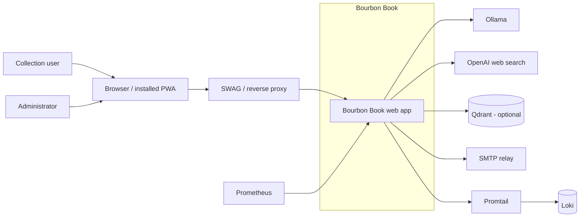

# C1 System Context

Rendered SVG: [c1-system-context.svg](diagrams/c1-system-context.svg)  
Baseline ADR: [ADR 0001](../adr/0001-current-architecture-baseline.md)
Pricing-catalog ADR: [ADR 0002](../adr/0002-local-first-pricing-catalog.md)

This context view shows the people and external systems Bourbon Book currently interacts with. It
includes the shipped local-first pricing/catalog subsystem (SQLite catalog cache + optional
sparse-vector Qdrant fuzzy match). It does **not** include the larger, unimplemented Phase 2 RAG
roadmap (dense-embedding evidence pipeline, governed source registry, scheduled crawling/discovery)
tracked in `docs/adr/plan.md` — those remain future work, not current architecture.

## Notes

- Collection users and administrators both reach the app through a browser or installed PWA.
- SWAG or an equivalent reverse proxy terminates public HTTPS and forwards requests to the app.
- Ollama is the local vision/text-analysis provider and also powers the offline catalog-screenshot
  bulk-price-extraction workflow (`catalog_extract.py` / `make price-catalog-extract-screenshots`).
- OpenAI is used for grounded bottle analysis and price research when selected; price research
  (grounded web search) is OpenAI-only regardless of `ANALYSIS_PROVIDER` and only runs when the
  local catalog and Qdrant have no fresh match.
- Qdrant is an **optional** local-hash sparse-vector index (`QDRANT_URL` unset disables it
  entirely). It accelerates fuzzy product-name matching against the SQLite `catalog_prices` table;
  SQLite remains the source of truth and Qdrant is fully rebuildable from it (`make
  price-catalog-reindex`). See [ADR 0002](../adr/0002-local-first-pricing-catalog.md).
- SMTP is used for production email delivery, while development captures messages locally.
- Prometheus scrapes the app directly.
- Promtail tails the app logs and forwards them to Loki.

## Cross-links

- [C2 Containers](c2-containers.md)
- [C3 Components](c3-components.md)
- [C4 Code](c4-code.md)
- [Rendered SVG](diagrams/c1-system-context.svg)
