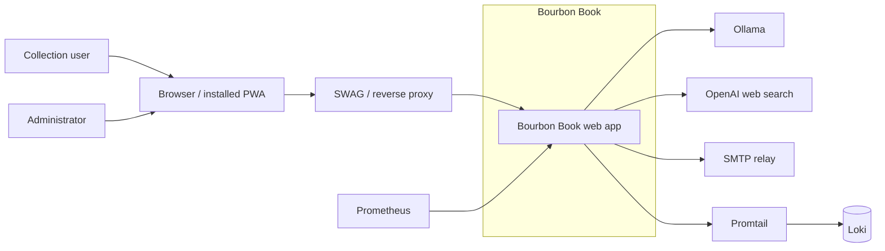

# C1 System Context

Rendered SVG: [c1-system-context.svg](diagrams/c1-system-context.svg)  
Baseline ADR: [ADR 0001](../adr/0001-current-architecture-baseline.md)

This context view shows the people and external systems Bourbon Book currently interacts with. It
does not include the roadmap-only RAG/Qdrant work.

## Notes

- Collection users and administrators both reach the app through a browser or installed PWA.
- SWAG or an equivalent reverse proxy terminates public HTTPS and forwards requests to the app.
- Ollama is the local vision-analysis provider.
- OpenAI is used for grounded bottle analysis and price research when selected.
- SMTP is used for production email delivery, while development captures messages locally.
- Prometheus scrapes the app directly.
- Promtail tails the app logs and forwards them to Loki.

## Cross-links

- [C2 Containers](c2-containers.md)
- [C3 Components](c3-components.md)
- [C4 Code](c4-code.md)
- [Rendered SVG](diagrams/c1-system-context.svg)
