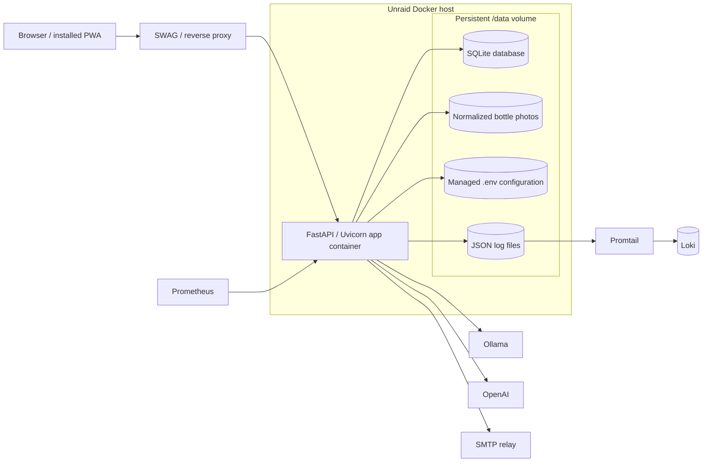

# C2 Containers

Rendered SVG: [c2-containers.svg](diagrams/c2-containers.svg)  
Baseline ADR: [ADR 0001](../adr/0001-current-architecture-baseline.md)

This view shows the deployed containers and the persistent storage boundary that the current
application relies on.

## Notes

- The browser and installed PWA are the user-facing client.
- One FastAPI/Uvicorn container runs the entire app.
- `/data` contains all durable state and should be mounted from Unraid storage.
- SQLite stores application state, while uploads, managed config, and JSON logs sit beside it.
- External services stay outside the app container boundary.

## Cross-links

- [C1 System Context](c1-system-context.md)
- [C3 Components](c3-components.md)
- [C4 Code](c4-code.md)
- [Rendered SVG](diagrams/c2-containers.svg)
