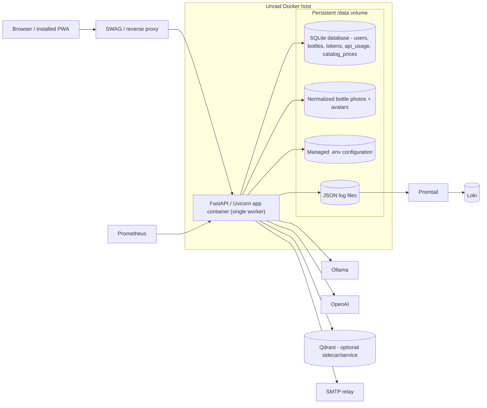

# C2 Containers

Rendered SVG: [c2-containers.svg](diagrams/c2-containers.svg)  
Baseline ADR: [ADR 0001](../adr/0001-current-architecture-baseline.md)
Pricing-catalog ADR: [ADR 0002](../adr/0002-local-first-pricing-catalog.md)

This view shows the deployed containers and the persistent storage boundary that the current
application relies on.

## Notes

- The browser and installed PWA are the user-facing client.
- One FastAPI/Uvicorn container runs the entire app, always as a single worker — session state,
  rate limiting, and the in-process GPU/model-residency assumptions documented in `plan.md` are all
  process-local and would fragment across multiple workers/replicas.
- `/data` contains all durable state and should be mounted from Unraid storage; the container
  filesystem itself is disposable.
- SQLite is the single source of truth for every table, including the shared `catalog_prices` MSRP
  cache; uploads (bottle photos + user avatars), managed config, and JSON logs sit beside it under
  `/data`.
- Qdrant is deployed as a separate service/container reachable over the internal Docker network
  (never exposed through the public SWAG route). It is optional infrastructure: every Qdrant call in
  the app degrades to a no-op on timeout/HTTP error, and the whole collection can be rebuilt from
  SQLite at any time via `make price-catalog-reindex`.
- External services (Ollama, OpenAI, Qdrant, SMTP, Prometheus/Promtail/Loki) stay outside the app
  container boundary.

## Cross-links

- [C1 System Context](c1-system-context.md)
- [C3 Components](c3-components.md)
- [C4 Code](c4-code.md)
- [Rendered SVG](diagrams/c2-containers.svg)
