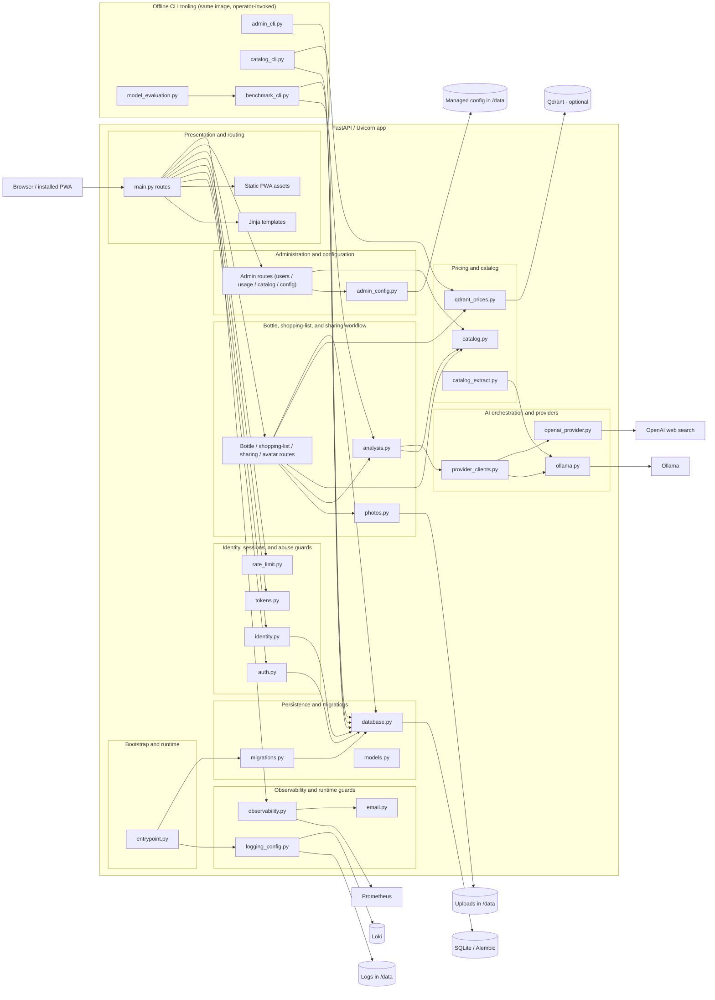

# C3 Components

Rendered SVG: [c3-components.svg](diagrams/c3-components.svg)  
Baseline ADR: [ADR 0001](../adr/0001-current-architecture-baseline.md)
Pricing-catalog ADR: [ADR 0002](../adr/0002-local-first-pricing-catalog.md)
Detailed component design docs: [components/](components/)

This view breaks the app container into the main runtime components that support the current
workflow, plus the offline/CLI tooling that ships in the same image.

## Notes

- `main.py` owns the app assembly and route registration; it is the largest module (~2,080 lines)
  and directly hosts most route handlers plus the pricing-orchestration helper functions
  (`refresh_prices`, `cached_catalog_price`, `qdrant_catalog_price`, `cache_catalog_price`,
  `apply_user_purchase_price`) rather than delegating them to `catalog.py`.
- `auth.py`, `identity.py`, `tokens.py`, and `rate_limit.py` implement the verified-session model
  and abuse-resistant login/registration/verification/reset flows. There is no FastAPI `Depends`
  dependency graph — every protected route manually calls a guard function
  (`auth.current_user`/`require_verified_user`/`require_admin`) and raises an `HTTPException` redirect.
- The bottle workflow now also covers the shopping list (bottles with `status="Empty"` and/or
  `on_shopping_list=True`), collection sharing (a hashed, revocable public share token), and avatar
  upload/serving — all implemented as routes/helpers inside `main.py`, backed by `photos.py`.
- Pricing/catalog is local-first: `catalog.py` (static verified-product short-circuit + cache-key
  normalization), `qdrant_prices.py` (optional sparse-vector fuzzy index over `CatalogPrice`
  rows), and `catalog_extract.py` (bulk screenshot-to-catalog extraction via Ollama vision) work
  together with `main.py`'s `refresh_prices()` orchestration and `openai_provider.search_prices()`
  as the fallback grounded-search tier. See [ADR 0002](../adr/0002-local-first-pricing-catalog.md).
- `provider_clients.py` holds the shared, request-scoped `httpx`/`AsyncOpenAI` client instances used
  by both provider adapters and by `catalog_extract.py`/CLI tooling.
- `admin_config.py` handles the restart-driven managed configuration file under `/data`; the actual
  restart is a self-`SIGTERM` relying on the container's process supervisor (`restart:
  unless-stopped`) to bring the process back up with the new config.
- `database.py`, `models.py`, and `migrations.py` form the persistence layer; `migrations.py`'s
  `bootstrap_database()` safely handles fresh, pre-Alembic, and already-versioned databases.
- `observability.py`, `logging_config.py`, and `email.py` handle metrics, structured/redacted
  logging, AI usage accounting, and observed email delivery (capture in development, SMTP in
  production).
- The **offline CLI tooling** subgraph ships in the same Docker image but is not part of the HTTP
  request path: `admin_cli.py` (interactive sole-admin recovery), `catalog_cli.py` (JSONL catalog
  ingest/reindex), `benchmark_cli.py` (private per-owner Ollama accuracy/latency benchmark fixture
  export/run/compare), and `model_evaluation.py` (deterministic local-model role acceptance gate
  built on `benchmark_cli`'s report format). These are invoked manually or via `make` targets, never
  by an HTTP route.

## Cross-links

- [Detailed component design docs](components/)
- [C1 System Context](c1-system-context.md)
- [C2 Containers](c2-containers.md)
- [C4 Code](c4-code.md)
- [Rendered SVG](diagrams/c3-components.svg)
