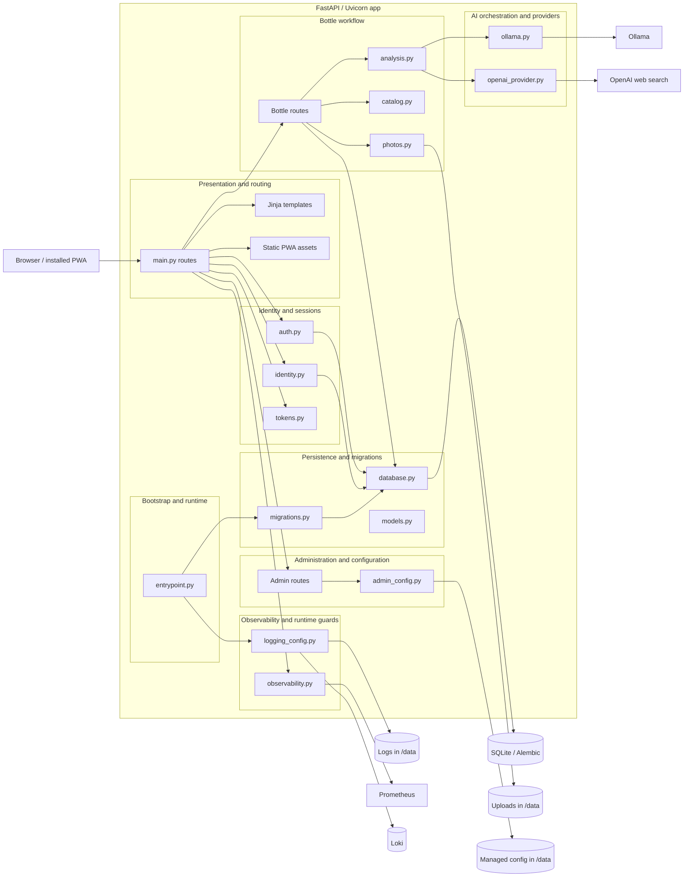

# C3 Components

Rendered SVG: [c3-components.svg](diagrams/c3-components.svg)  
Baseline ADR: [ADR 0001](../adr/0001-current-architecture-baseline.md)

This view breaks the app container into the main runtime components that support the current
workflow.

## Notes

- `main.py` owns the app assembly and route registration.
- `auth.py`, `identity.py`, and `tokens.py` implement the verified-session model.
- Bottle handling spans routes, photo normalization, catalog lookup, and analysis provider dispatch.
- `admin_config.py` handles the restart-driven managed configuration file under `/data`.
- `database.py`, `models.py`, and `migrations.py` form the persistence layer.
- `observability.py` and `logging_config.py` handle metrics, usage recording, and log output.

## Cross-links

- [C1 System Context](c1-system-context.md)
- [C2 Containers](c2-containers.md)
- [C4 Code](c4-code.md)
- [Rendered SVG](diagrams/c3-components.svg)
