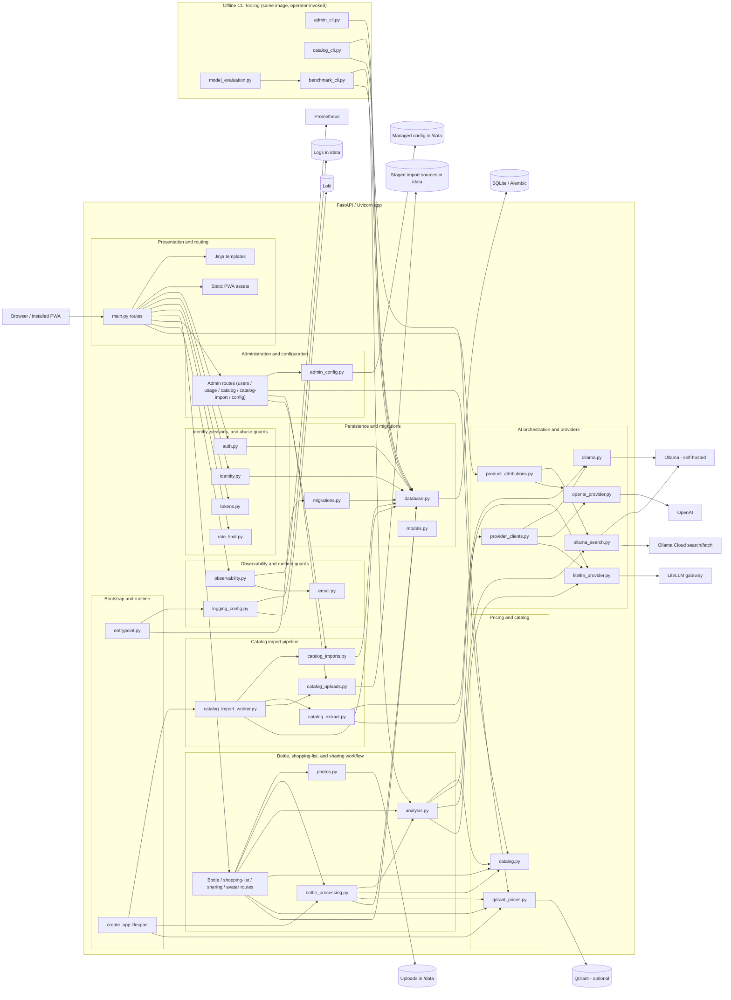

# C3 Components

Rendered SVG: [c3-components.svg](diagrams/c3-components.svg)  
Baseline ADR: [ADR 0001](../adr/0001-current-architecture-baseline.md)
Pricing-catalog ADR: [ADR 0002](../adr/0002-local-first-pricing-catalog.md)
Detailed component design docs: [components/](components/)

This view breaks the app container into the main runtime components that support the current
workflow, plus the offline/CLI tooling that ships in the same image. Note that everything inside the
`FastAPI / Uvicorn app` boundary — including the catalog-import worker — runs in one process; the
`bootstrap` subgraph now distinguishes the pre-Uvicorn `entrypoint.py` step from the FastAPI
lifespan that owns the long-lived runtime objects.

```mermaid
flowchart LR
  browser[Browser / installed PWA]

  subgraph app["FastAPI / Uvicorn app"]
    subgraph bootstrap["Bootstrap and runtime"]
      entrypoint[entrypoint.py]
      lifespan["create_app lifespan"]
    end

    subgraph presentation["Presentation and routing"]
      routes[main.py routes]
      templates[Jinja templates]
      static[Static PWA assets]
    end

    subgraph identity["Identity, sessions, and abuse guards"]
      auth[auth.py]
      identity_mod[identity.py]
      tokens[tokens.py]
      rate_limit[rate_limit.py]
    end

    subgraph bottles["Bottle, shopping-list, and sharing workflow"]
      bottle_routes[Bottle / shopping-list / sharing / avatar routes]
      bottle_processing[bottle_processing.py]
      photos[photos.py]
      analysis[analysis.py]
    end

    subgraph ai["AI orchestration and providers"]
      provider_clients[provider_clients.py]
      ollama_mod[ollama.py]
      ollama_search[ollama_search.py]
      openai_mod[openai_provider.py]
      litellm_mod[litellm_provider.py]
      attributions[product_attributions.py]
    end

    subgraph pricing["Pricing and catalog"]
      catalog[catalog.py]
      qdrant_mod[qdrant_prices.py]
    end

    subgraph importing["Catalog import pipeline"]
      catalog_uploads[catalog_uploads.py]
      catalog_imports[catalog_imports.py]
      import_worker[catalog_import_worker.py]
      catalog_extract[catalog_extract.py]
    end

    subgraph admin["Administration and configuration"]
      admin_routes["Admin routes (users / usage / catalog / catalog-import / config)"]
      admin_config[admin_config.py]
    end

    subgraph persistence["Persistence and migrations"]
      database[database.py]
      models[models.py]
      migrations[migrations.py]
    end

    subgraph obs["Observability and runtime guards"]
      observability[observability.py]
      logging_config[logging_config.py]
      email_mod[email.py]
    end
  end

  subgraph cli["Offline CLI tooling (same image, operator-invoked)"]
    admin_cli[admin_cli.py]
    catalog_cli[catalog_cli.py]
    benchmark_cli[benchmark_cli.py]
    model_evaluation[model_evaluation.py]
  end

  sqlite[(SQLite / Alembic)]
  uploads[(Uploads in /data)]
  import_sources[(Staged import sources in /data)]
  config[(Managed config in /data)]
  logs[(Logs in /data)]
  ollama[Ollama - self-hosted]
  ollama_cloud[Ollama Cloud search/fetch]
  openai[OpenAI]
  litellm[LiteLLM gateway]
  qdrant[(Qdrant - optional)]
  prometheus[Prometheus]
  loki[(Loki)]

  browser --> routes
  routes --> templates
  routes --> static
  routes --> auth
  routes --> identity_mod
  routes --> tokens
  routes --> rate_limit
  routes --> bottle_routes
  routes --> admin_routes
  routes --> observability

  bottle_routes --> photos
  bottle_routes --> bottle_processing
  bottle_routes --> analysis
  bottle_routes --> catalog
  bottle_routes --> qdrant_mod
  bottle_processing --> analysis
  bottle_processing --> catalog
  bottle_processing --> qdrant_mod
  analysis --> catalog
  analysis --> provider_clients
  analysis --> ollama_search
  provider_clients --> ollama_mod
  provider_clients --> openai_mod
  provider_clients --> litellm_mod
  analysis --> litellm_mod
  ollama_mod --> ollama
  ollama_search --> ollama
  ollama_search --> ollama_cloud
  openai_mod --> openai
  litellm_mod --> litellm
  routes --> attributions
  attributions --> ollama_search
  attributions --> openai_mod
  qdrant_mod --> qdrant

  admin_routes --> admin_config
  admin_routes --> catalog
  admin_routes --> catalog_uploads
  admin_routes --> catalog_imports
  admin_config --> config

  lifespan --> import_worker
  lifespan --> bottle_processing
  lifespan --> qdrant_mod
  import_worker --> catalog_imports
  import_worker --> catalog_extract
  import_worker --> catalog_uploads
  catalog_extract --> ollama_mod
  catalog_extract --> litellm_mod
  catalog_uploads --> import_sources
  catalog_imports --> database
  import_worker --> database

  database --> sqlite
  migrations --> database
  bottle_routes --> database
  bottle_processing --> database
  identity_mod --> database
  auth --> database

  observability --> prometheus
  observability --> email_mod
  logging_config --> logs
  logging_config --> loki
  photos --> uploads
  entrypoint --> logging_config
  entrypoint --> migrations

  admin_cli --> database
  catalog_cli --> database
  catalog_cli --> qdrant_mod
  benchmark_cli --> analysis
  benchmark_cli --> database
  model_evaluation --> benchmark_cli
```

## Notes

- `main.py` owns the app assembly and route registration; it is by far the largest module
  (~2,950 lines, roughly a third of the Python in `bourbonbook/`) and directly hosts most route
  handlers plus the pricing-orchestration helper functions (`refresh_prices`,
  `cached_catalog_price`, `qdrant_catalog_price`, `cache_catalog_price`, `apply_user_purchase_price`)
  rather than delegating them to `catalog.py`. Because those helpers live in `main.py`,
  `bottle_processing.py` has to import them lazily inside the function body to break the import
  cycle — a visible symptom of that placement.
- `create_app()`'s `lifespan` owns everything with a lifetime longer than a request: the shared
  `AsyncOpenAI`/`httpx` clients, the `QdrantPriceIndex`, the migration bootstrap, the orphaned
  add-bottle sweep, expired import-source cleanup, admin bootstrap, and the `CatalogImportWorker`
  task (started on entry, stopped on exit via `AsyncExitStack`).
- `auth.py`, `identity.py`, `tokens.py`, and `rate_limit.py` implement the verified-session model
  and abuse-resistant login/registration/verification/reset flows. There is no FastAPI `Depends`
  dependency graph — every protected route manually calls a guard function
  (`auth.current_user`/`require_verified_user`/`require_admin`) and raises an `HTTPException` redirect.
- The bottle workflow now also covers the shopping list (bottles with `status="Empty"` and/or
  `on_shopping_list=True`), collection sharing (a hashed, revocable public share token), and avatar
  upload/serving — all implemented as routes/helpers inside `main.py`, backed by `photos.py`.
- `bottle_processing.py` runs the add-bottle pipeline out of the request path. `POST /bottles`
  returns `202` as soon as the photo is stored and the row is committed; the module then drives
  `analyzing → enriching → pricing → complete|failed`, committing `Bottle.processing_stage` between
  stages so `GET /bottles/{id}/status` reports live progress. It opens its own sessions and never
  lets an exception escape.
- Pricing/catalog is local-first: `catalog.py` (verified-product short-circuit with exact, substring
  and `SequenceMatcher`-fuzzy alias matching at 0.82, plus cache-key normalization) and
  `qdrant_prices.py` (optional sparse-vector fuzzy index over `CatalogPrice` rows) work with
  `main.py`'s `refresh_prices()` orchestration. See
  [ADR 0002](../adr/0002-local-first-pricing-catalog.md).
- The grounded-search tier is **provider-dispatched**, not OpenAI-only:
  `analysis.search_bottle_prices()` selects `openai_provider.search_prices()`,
  `ollama_search.search_prices()`, or `litellm_provider.search_prices()` from `ANALYSIS_PROVIDER`. `ollama_search.py` is the newer of the
  two and is the one component that talks to two different Ollama endpoints — the self-hosted
  `OLLAMA_URL` for `/api/chat`, and Ollama Cloud for the `web_search`/`web_fetch` tool calls the
  model emits.
- The **catalog import pipeline** subgraph is new runtime surface, not CLI tooling:
  `catalog_uploads.py` (validation, staging, TTL cleanup), `catalog_imports.py` (the durable state
  machine, queue reservation, atomic apply), `catalog_import_worker.py` (the lifespan-owned,
  lease-guarded single-lane worker), and `catalog_extract.py` (chunked screenshot/PDF extraction via
  Ollama vision). `catalog_extract.py` is also still reachable from
  `scripts/extract_catalog_screenshots.py`, so it has both an in-app and an offline caller.
- `litellm_provider.py` is the **third** analysis provider, added by
  [ADR 0006](../adr/0006-litellm-gateway-provider.md): an OpenAI-compatible `/chat/completions`
  client aimed at a self-hosted LiteLLM proxy (`LITELLM_URL`) that fronts the same local models
  `ollama.py` reaches directly. It is a separate provider rather than a transport flag on
  `ollama.py` precisely so model names, context windows, and token budgets stay per-gateway facts.
  `catalog_extract.py` also calls into it directly for price-sheet extraction, so it has both an
  analysis and an extraction caller.
- `product_attributions.py` owns the bounded automatic producer/mash-bill grounding permitted by
  [ADR 0004](../adr/0004-source-grounded-product-attributions.md). It resolves `distilled_by` and
  `mash_bill` against the shared `product_attribution_facts` cache (365-day TTL), falls back to the
  provider's `search_product_attributions` adapter, and records per-bottle authority in
  `bottle_attribution_provenance` so a hand-verified value is never overwritten by a later grounded
  result. It persists through a caller-supplied `Session` rather than opening its own.
- `provider_clients.py` holds the shared, request-scoped `httpx`/`AsyncOpenAI` client instances used
  by both provider adapters and by `catalog_extract.py`/CLI tooling. A `provider_client_context`
  HTTP middleware binds them into context vars for the duration of each request; the import worker
  instead receives the lifespan `httpx` client directly, because it runs outside any request.
- `admin_config.py` handles the restart-driven managed configuration file under `/data`; the actual
  restart is a self-`SIGTERM` relying on the container's process supervisor (`restart:
  unless-stopped`) to bring the process back up with the new config.
- `database.py`, `models.py`, and `migrations.py` form the persistence layer; `migrations.py`'s
  `bootstrap_database()` safely handles fresh, pre-Alembic, and already-versioned databases.
  `HEAD_REVISION` is `0011_product_attributions`.
- `observability.py`, `logging_config.py`, and `email.py` handle metrics, structured/redacted
  logging, AI usage accounting, and observed email delivery (capture in development, SMTP in
  production).
- The **offline CLI tooling** subgraph ships in the same Docker image but is not part of the HTTP
  request path: `admin_cli.py` (interactive sole-admin recovery), `catalog_cli.py` (JSONL catalog
  ingest/reindex), `benchmark_cli.py` (private per-owner Ollama accuracy/latency benchmark fixture
  export/run/compare), and `model_evaluation.py` (deterministic local-model role acceptance gate
  built on `benchmark_cli`'s report format). These are invoked manually or via `make` targets, never
  by an HTTP route.

## Cross-links

- [Detailed component design docs](components/)
- [Catalog import pipeline](components/catalog-import.md)
- [C1 System Context](c1-system-context.md)
- [C2 Containers](c2-containers.md)
- [C4 Code](c4-code.md)
- [Rendered SVG](diagrams/c3-components.svg)
