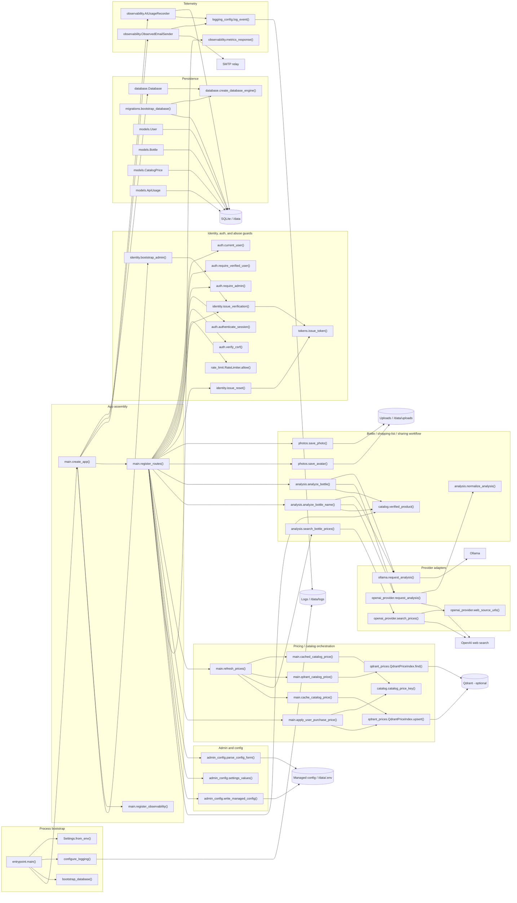

# C4 Code

Rendered SVG: [c4-code.svg](diagrams/c4-code.svg)  
Baseline ADR: [ADR 0001](../adr/0001-current-architecture-baseline.md)
Pricing-catalog ADR: [ADR 0002](../adr/0002-local-first-pricing-catalog.md)

This code view shows the principal modules and symbols that make the current application work. It
is intentionally focused on the implemented runtime path, not roadmap-only features (see
`docs/adr/plan.md` for the deferred Phase 2 RAG/evidence-pipeline direction).

## Notes

- `entrypoint.py` is the process bootstrap that prepares logging and migrations before Uvicorn
  starts (`os.execvp` replaces the process image so a later admin-triggered `SIGTERM` targets the
  same PID uvicorn runs as).
- `main.create_app()` assembles the FastAPI app and binds the supporting services (database,
  usage recorder, email sender, rate limiter, Qdrant price index) onto `app.state`.
- The identity path is session-based (signed cookie, no server-side session store), CSRF-protected
  via a per-session synchronizer token checked manually in every mutating handler, rate-limited by
  `rate_limit.RateLimiter.allow()`, and bootstrap-aware (`identity.bootstrap_admin()`).
- Bottle analysis can use either Ollama or OpenAI (selected by `ANALYSIS_PROVIDER`); price search is
  always OpenAI-grounded-web-search and only runs after `refresh_prices()` finds no fresh SQLite
  catalog hit and no sufficiently-similar Qdrant fuzzy match. Every accepted OpenAI price is written
  back into `CatalogPrice` (and, if enabled, upserted into Qdrant) so future bottles of the same
  product/size resolve locally.
- Admin configuration writes to `/data/.env` and expects a restart to take effect; the restart is a
  self-`SIGTERM`, not a respawn — the container's `restart: unless-stopped` policy does the respawn.
- Telemetry uses local SQLite usage records (`ApiUsage`, no prompts/responses/PII), Prometheus
  metrics, and redacted JSON log output.

## Cross-links

- [C1 System Context](c1-system-context.md)
- [C2 Containers](c2-containers.md)
- [C3 Components](c3-components.md)
- [Rendered SVG](diagrams/c4-code.svg)
