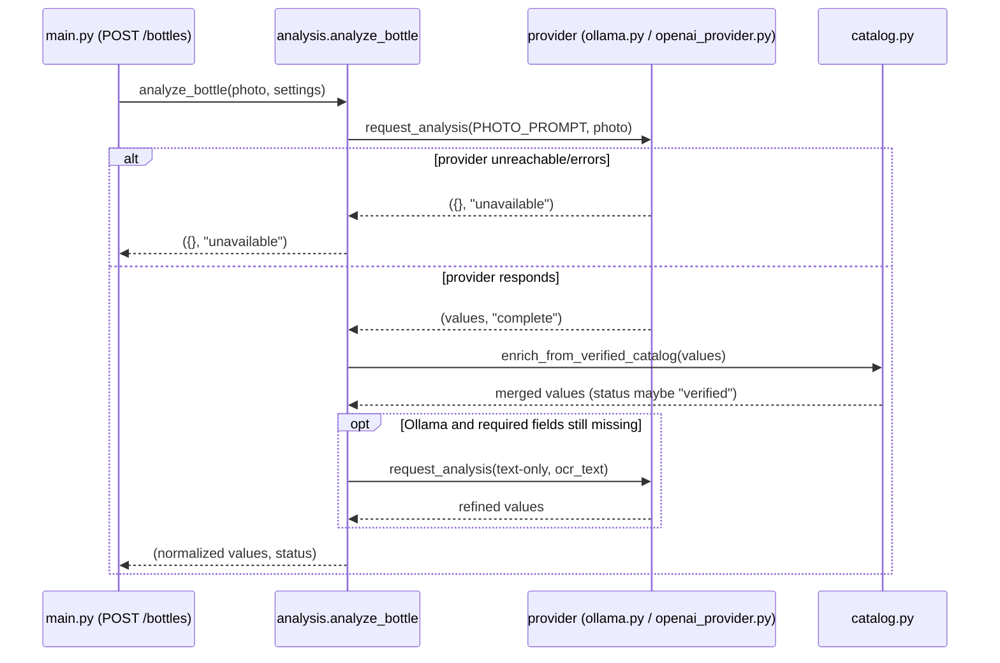

# Component Design: AI Analysis Orchestration

Modules: `bourbonbook/analysis.py`, `bourbonbook/ollama.py`, `bourbonbook/openai_provider.py`,
`bourbonbook/provider_clients.py`
Related: [HLDD](../hldd.md) · [Pricing & catalog](pricing-and-catalog.md) ·
[Model evaluation & benchmarking](model-evaluation-and-benchmarking.md) ·
[ADR 0003: Fixed Local Model, No Benchmark Gate](../../adr/0003-fixed-local-model-no-benchmark-gate.md)

## Responsibility

Turn a bottle photo or a typed name into structured bottle fields (name, brand, mash bill,
proof/ABV, fill level, status, etc.), using either a local Ollama model or OpenAI, with graceful
degradation to manual entry on any provider failure. Price research is handled separately — see
[Pricing & catalog](pricing-and-catalog.md).

## Provider dispatch

`analysis._request_provider_analysis()` is the single dispatch point: it reads
`settings.analysis_provider` and lazily imports either `openai_provider.request_analysis` or
`ollama.request_analysis`. Any other/unset value returns `({}, "unavailable")` immediately — there
is no third path, and provider selection is global (one setting for the whole app), not per-request.

## `analyze_bottle(photo, settings)`

1. Calls the configured provider with `PHOTO_PROMPT` — a detailed prompt covering label reading,
   explicit fill-level/status calibration rules, and an instruction that a photo must never yield an
   `msrp` (pricing is a separate, evidence-gated concern; see ADR 0002).
2. On empty results, returns immediately with `"unavailable"`.
3. `enrich_from_verified_catalog()` merges in any hardcoded `VERIFIED_PRODUCTS` match
   (`catalog.py`) by exact alias or OCR-substring match, forcing `status="verified"` when it hits.
4. **Ollama-only refinement**: if required fields (`MISSING_FIELDS`) are still empty, a second
   text-only Ollama pass runs using the transcribed `ocr_text` as context. OpenAI results are never
   re-refined this way — its structured output is treated as sufficiently complete in one pass.

## `analyze_bottle_name(name, settings)`

Same shape for name-only entry: checks the verified catalog first (short-circuits immediately on a
hit), otherwise calls the provider with an "ungrounded lookup" prompt that explicitly forbids
inventing barrel-specific facts and forces `msrp` null, merges, re-checks the catalog, and (Ollama
only) runs the same refinement pass.

## Field normalization

- `FIELDS` (name, brand, release, edition, spirit_type, distilled_by, mash_bill, proof, abv, size,
  age_statement, barrel_number, bottle_number, warehouse, floor, status, fill_level, msrp) is the
  canonical extraction schema; `OUTPUT_FIELDS` adds `ocr_text`.
- `merge_analysis()` never overwrites an already-set field and always strips `msrp` from any
  "extra" source (catalog enrichment or refinement never injects a price).
- `normalize_analysis()` reconciles `fill_level` against `status` regardless of what the model
  returned: `>= 90` → `100`/`Unopened`; `== 0` → `0`/`Empty`; otherwise → rounded value/`Opened`.

## Provider adapters

### Ollama (`ollama.py` + `provider_clients.py`)

- Model selection (`analysis_model()`): a photo request uses `OLLAMA_VISION_MODEL or OLLAMA_MODEL`;
  a text-only request uses `OLLAMA_TEXT_MODEL or OLLAMA_MODEL`. `OLLAMA_MODEL` is the universal
  fallback.
- `request_analysis()` POSTs to `{OLLAMA_URL}/api/generate` with `format: "json"`, `think: false`,
  `temperature: 0.1`, `num_ctx: 4096`, and a base64-encoded image when a photo is supplied. Uses the
  shared/one-off `httpx.AsyncClient` from `provider_clients.ollama_client_session()` (120s timeout).
- Failures (`httpx.HTTPError`, `KeyError`/`TypeError`, `json.JSONDecodeError`, `OSError`) are
  classified by `failure_context()`/`connection_reason()` into a bounded `failure_kind`
  (`http_status`, `timeout`, `tls_error`, `connect_error`, `request_error`, `invalid_json`,
  `invalid_response`, `photo_read_error`, `unexpected`) purely for structured logging — no secrets,
  just host/port/scheme. **No exception ever propagates to the caller**; a failure always returns
  `({}, "unavailable")`.

### OpenAI (`openai_provider.py`)

- `request_analysis()` uses `client.responses.parse(..., text_format=BottleAnalysis)` — a Pydantic
  model whose `status` is a `Literal["Unopened","Opened","Empty"] | None` and whose `msrp` field is
  hardcoded `None` at the type level, so OpenAI structurally cannot return a photo/name-derived
  price. Gate: returns `({}, "unavailable")` immediately if no API key is configured.
- Every provider call, success or failure, is recorded through `observability.AIUsageRecorder` with
  provider/operation/model/duration and a bounded error type — see
  [Observability & operations](observability-and-operations.md).

`provider_clients.py` provides context-var-backed shared HTTP clients
(`openai_client_session()`/`ollama_client_session()`) so tests and benchmark tooling can inject a
fake client, and so a single request-scoped client is reused rather than opened per call.

## Manual-fallback guarantee

Both `analyze_bottle` and `analyze_bottle_name` are designed so that **no exception ever escapes to
the route handler**. A provider outage, timeout, or malformed response always resolves to
`({}, "unavailable")`; the bottle route always saves the photo and creates the row regardless, with
`analysis_status` set from the outcome. This is the concrete mechanism behind the README's
guarantee: "If the selected analyzer is not reachable, the photo is still saved and the review form
opens for manual entry."

## Sequence: photo analysis with Ollama refinement fallback

## Design properties worth preserving

- Pricing is deliberately absent from this component: `msrp` is stripped or type-forbidden at every
  layer here, so a future change to the analysis prompts cannot accidentally reintroduce
  vision/name-derived pricing outside the governed pricing path in ADR 0002.
- The Ollama-only refinement pass exists because OpenAI's structured output already tends to be
  complete in one call; adding refinement for OpenAI too would double its cost/latency for little
  benefit, so this asymmetry is intentional, not an oversight.
