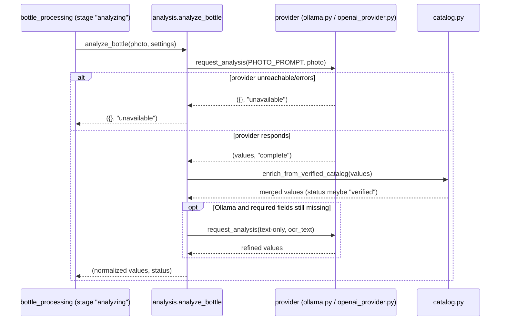

# Component Design: AI Analysis Orchestration

Modules: `bourbonbook/analysis.py`, `bourbonbook/ollama.py`, `bourbonbook/ollama_search.py`,
`bourbonbook/openai_provider.py`, `bourbonbook/provider_clients.py`
Related: [HLDD](../hldd.md) · [Pricing & catalog](pricing-and-catalog.md) ·
[Model evaluation & benchmarking](model-evaluation-and-benchmarking.md) ·
[ADR 0003: Fixed Local Model, No Benchmark Gate](../../adr/0003-fixed-local-model-no-benchmark-gate.md)

## Responsibility

Turn a bottle photo or a typed name into structured bottle fields (name, brand, mash bill,
proof/ABV, fill level, status, etc.), using either a local Ollama model or OpenAI, with graceful
degradation to manual entry on any provider failure. This component also owns the *adapters* for
grounded price search; when and whether that search runs is the pricing component's decision — see
[Pricing & catalog](pricing-and-catalog.md).

## Provider dispatch

There are two dispatch points, both keyed on the same global `settings.analysis_provider` (one
setting for the whole app, never per-request) and both returning a defined answer for any
unrecognized value:

| Function | `openai` | `ollama` | other/unset |
| --- | --- | --- | --- |
| `analysis._request_provider_analysis()` | `openai_provider.request_analysis` | `ollama.request_analysis` | `({}, "unavailable")` |
| `analysis.search_bottle_prices()` | `openai_provider.search_prices` | `ollama_search.search_prices` | `({}, [], "unavailable")` |

Adapters are imported lazily inside each branch so neither provider's client library is required at
import time. `analysis.warm_analysis_model()` is a third, smaller dispatch: it pre-loads the vision
model for Ollama only, because OpenAI has no model-load cost to hide.

Price search being provider-dispatched is a change from the earlier design, where it was OpenAI-only
regardless of `ANALYSIS_PROVIDER`. Both branches must stay implemented — a pricing path that only
works under OpenAI is a regression against the local-first direction.

## `analyze_bottle(photo, settings)`

1. Calls the configured provider with `PHOTO_PROMPT` — a detailed prompt covering label reading,
   explicit fill-level/status calibration rules, and an instruction that a photo must never yield an
   `msrp` (pricing is a separate, evidence-gated concern; see ADR 0002).
2. On empty results, returns immediately with `"unavailable"`.
3. `enrich_from_verified_catalog()` merges in any hardcoded `VERIFIED_PRODUCTS` match
   (`catalog.py`) by exact alias or OCR-substring match, forcing `status="verified"` when it hits.
4. **Ollama-only refinement**: if required fields (`MISSING_FIELDS`) are still empty, a second
   text-only Ollama pass runs using the transcribed `ocr_text` as context. OpenAI results are never
   re-refined this way — its structured output is treated as sufficiently complete in one pass.

## `analyze_bottle_name(name, settings)`

Same shape for name-only entry: checks the verified catalog first (short-circuits immediately on a
hit), otherwise calls the provider with an "ungrounded lookup" prompt that explicitly forbids
inventing barrel-specific facts and forces `msrp` null, merges, re-checks the catalog, and (Ollama
only) runs the same refinement pass.

## Field normalization

- `FIELDS` (name, brand, release, edition, spirit_type, distilled_by, mash_bill, proof, abv, size,
  age_statement, barrel_number, bottle_number, warehouse, floor, status, fill_level, msrp) is the
  canonical extraction schema; `OUTPUT_FIELDS` adds `ocr_text`.
- `merge_analysis()` never overwrites an already-set field and strips `msrp` from any "extra" source
  unless `allow_msrp=True`, which only `enrich_from_verified_catalog()` passes — a hand-curated
  verified product may seed an MSRP; a model may not.
- `normalize_analysis()` reconciles `fill_level` against `status` regardless of what the model
  returned: `>= 90` → `100`/`Unopened`; `== 0` → `0`/`Empty`; otherwise → rounded value/`Opened`.
- `reconcile_proof_and_abv()` derives either of proof/ABV from the other (proof ≡ 2 × ABV) and, when
  both are present but disagree beyond `PROOF_ABV_TOLERANCE = 1.0`, takes whichever implies the
  *higher* proof — a dropped or misread digit understates far more often than it invents.
- `snap_size()` snaps a parsed volume to the nearest standard US size (50/200/375/750/1000/1750 ml)
  when it is within `SIZE_SNAP_TOLERANCE_ML = 15`, so `751ml` OCR noise does not fragment the
  `(product_key, size_key)` cache namespace.
- `apply_analysis()` in `main.py` is the last guard before persistence: it coerces `proof`, `abv`,
  and `msrp` through `parse_float()` so untyped model text like `"107 proof"` can never reach a
  `Float` column and break the commit.

## Provider adapters

### Ollama (`ollama.py` + `provider_clients.py`)

- Model selection (`analysis_model()`): a photo request uses `OLLAMA_VISION_MODEL or OLLAMA_MODEL`;
  a text-only request uses `OLLAMA_TEXT_MODEL or OLLAMA_MODEL`. `OLLAMA_MODEL` is the universal
  fallback.
- `request_analysis()` POSTs to `{OLLAMA_URL}/api/generate` with `format: "json"`, `think: false`,
  `temperature: 0.1`, `num_ctx: 4096`, and a base64-encoded image when a photo is supplied. Uses the
  shared/one-off `httpx.AsyncClient` from `provider_clients.ollama_client_session()` (120s timeout).
- Failures (`httpx.HTTPError`, `KeyError`/`TypeError`, `json.JSONDecodeError`, `OSError`) are
  classified by `failure_context()`/`connection_reason()` into a bounded `failure_kind`
  (`http_status`, `timeout`, `tls_error`, `connect_error`, `request_error`, `invalid_json`,
  `invalid_response`, `photo_read_error`, `unexpected`) purely for structured logging — no secrets,
  just host/port/scheme. **No exception ever propagates to the caller**; a failure always returns
  `({}, "unavailable")`.

### Ollama grounded price search (`ollama_search.py`)

The Ollama branch of `search_bottle_prices()`. Unlike OpenAI, Ollama has no hosted search tool, so
this module implements the loop itself and is the only component that talks to **two** Ollama
endpoints:

- **Self-hosted** `{OLLAMA_URL}/api/chat` — the conversation, with `web_search` and `web_fetch`
  declared as function tools and `stream: false`. Model is `OLLAMA_TEXT_MODEL or OLLAMA_MODEL`.
- **Ollama Cloud** `https://ollama.com/api/web_search` and `/api/web_fetch` — where the tool calls
  the model emits are actually executed, authenticated with `OLLAMA_API_KEY` as a bearer token.

Behavior:

- **Gate**: no `OLLAMA_API_KEY` → `({}, [], "unavailable")` immediately, with a warning log. It does
  not fall through to OpenAI.
- **Bounded loop**: at most `MAX_TOOL_ROUNDS = 4` chat rounds. Exhausting them records a failed
  `ApiUsage` row with `error_type="max_tool_rounds_exceeded"` and returns `unavailable`.
- **Grounding**: every URL returned by a `web_search` and every URL passed to a `web_fetch` is
  canonicalized into a `consulted_urls` set; `_extract_prices()` accepts the model's `msrp` only if
  it is a real number (explicitly rejecting `bool`) *and* its `msrp_source_url` is in that set.
- **Prompt reuse**: the same `analysis.price_search_prompt()` as the OpenAI branch, with
  `TOOL_USE_INSTRUCTIONS` appended, so both providers are held to the same OHLQ-first,
  exact-size, single-USD-value contract.
- **Failure handling**: `httpx.HTTPError`, `KeyError`, `TypeError`, and `json.JSONDecodeError` are
  caught and classified through the shared `ollama.failure_context()` helper; the log records
  scheme/host/port and a bounded `failure_kind`, never a URL path, prompt, or bottle name. The
  endpoint recorded is whichever of the two hosts was last in play. Always returns
  `({}, [], "unavailable")` rather than raising.

### OpenAI (`openai_provider.py`)

- `request_analysis()` uses `client.responses.parse(..., text_format=BottleAnalysis)` — a Pydantic
  model whose `status` is a `Literal["Unopened","Opened","Empty"] | None` and whose `msrp` field is
  hardcoded `None` at the type level, so OpenAI structurally cannot return a photo/name-derived
  price. Gate: returns `({}, "unavailable")` immediately if no API key is configured.
- Every provider call, success or failure, is recorded through `observability.AIUsageRecorder` with
  provider/operation/model/duration and a bounded error type — see
  [Observability & operations](observability-and-operations.md).

`provider_clients.py` provides context-var-backed shared HTTP clients
(`openai_client_session()`/`ollama_client_session()`) so tests and benchmark tooling can inject a
fake client, and so a single request-scoped client is reused rather than opened per call.

## Manual-fallback guarantee

`analyze_bottle`, `analyze_bottle_name`, and both `search_prices` adapters are designed so that
**no exception ever escapes to the caller**. A provider outage, timeout, or malformed response
always resolves to `({}, "unavailable")` (or `({}, [], "unavailable")` for pricing). The bottle
route saves the photo and commits the row *before* any model call, so `analysis_status` is the only
thing an outage changes. This is the concrete mechanism behind the README's guarantee: "If the
selected analyzer is not reachable, the photo is still saved and the review form opens for manual
entry."

The guarantee now has a second layer: `bottle_processing.run_add_bottle_pipeline()` also wraps the
whole staged pipeline in a catch-all, since it runs after the `202` response has been sent. See
[Bottle workflow](bottle-workflow.md).

## Sequence: photo analysis with Ollama refinement fallback

```mermaid
sequenceDiagram
  participant Route as bottle_processing (stage "analyzing")
  participant An as analysis.analyze_bottle
  participant Prov as provider (ollama.py / openai_provider.py)
  participant Cat as catalog.py

  Route->>An: analyze_bottle(photo, settings)
  An->>Prov: request_analysis(PHOTO_PROMPT, photo)
  alt provider unreachable/errors
    Prov-->>An: ({}, "unavailable")
    An-->>Route: ({}, "unavailable")
  else provider responds
    Prov-->>An: (values, "complete")
    An->>Cat: enrich_from_verified_catalog(values)
    Cat-->>An: merged values (status maybe "verified")
    opt Ollama and required fields still missing
      An->>Prov: request_analysis(text-only, ocr_text)
      Prov-->>An: refined values
    end
    An-->>Route: (normalized values, status)
  end
```

## Design properties worth preserving

- Pricing is deliberately absent from this component: `msrp` is stripped or type-forbidden at every
  layer here, so a future change to the analysis prompts cannot accidentally reintroduce
  vision/name-derived pricing outside the governed pricing path in ADR 0002.
- The Ollama-only refinement pass exists because OpenAI's structured output already tends to be
  complete in one call; adding refinement for OpenAI too would double its cost/latency for little
  benefit, so this asymmetry is intentional, not an oversight.
