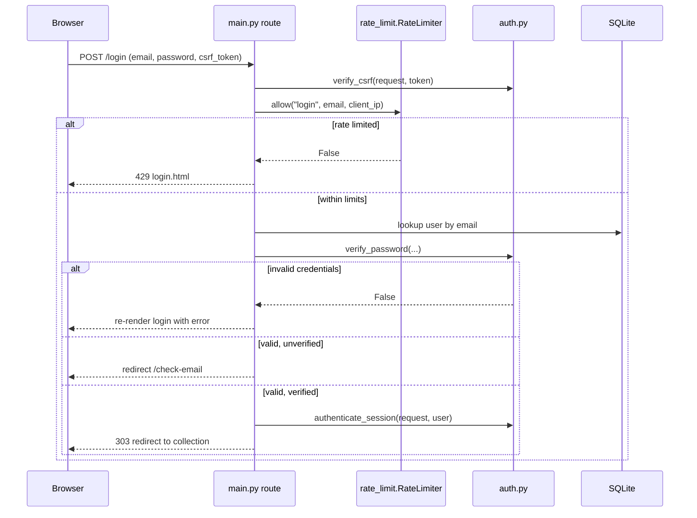

# Component Design: Identity, Sessions & Abuse Guards

Modules: `bourbonbook/auth.py`, `bourbonbook/identity.py`, `bourbonbook/tokens.py`,
`bourbonbook/rate_limit.py`, `bourbonbook/admin_cli.py`
Related: [HLDD](../hldd.md) · [C3 Components](../c3-components.md) · [Persistence & migrations](persistence-and-migrations.md)

## Responsibility

Authenticate users, maintain sessions, protect state-changing requests from CSRF, manage the
email-verification and password-reset token lifecycle, throttle abuse of auth-adjacent endpoints,
and provide a safe operator path to recover the sole administrator account.

## Session model

- **No server-side session store.** Sessions are Starlette's signed-cookie `SessionMiddleware`
  (`secret_key=settings.session_secret`, `same_site="lax"`, `https_only=settings.secure_cookies`,
  `max_age=30 days`), holding `user_id`, `session_version`, and `csrf_token` only.
- `auth.authenticate_session(request, user)` clears the session and re-seeds `user_id` +
  `session_version` on successful login or post-verification/reset login.
- `auth.current_user(request, session)` loads the user by `user_id` and requires
  `request.session["session_version"] == user.session_version`. Any mismatch (including a bumped
  `session_version` from a password change, email change, or admin recovery) silently clears the
  session and returns `None` — this is the *entire* invalidation mechanism, with no session table to
  clean up.
- Guard functions, called explicitly at the top of each protected handler (there is no FastAPI
  `Depends` dependency graph in this codebase):
  - `require_user()` → any authenticated user, else `HTTPException(303, Location: /login)`.
  - `require_verified_user()` → authenticated **and** (if `EMAIL_VERIFICATION_REQUIRED`)
    `email_verified_at` set, else redirect to `/check-email`.
  - `require_admin()` → verified **and** `is_admin`, else `403`.

## Password handling

- `pwdlib.PasswordHash.recommended()` (module-level `password_hash` in `auth.py`) — a modern,
  recommended algorithm (Argon2-class), not a hand-rolled scheme.
- `hash_password()` / `verify_password()` wrap it; `validate_password()` enforces minimum
  requirements before either registration or a password change is accepted.

## CSRF protection

- `csrf_token(request)` lazily generates `secrets.token_urlsafe(24)` on first access and stores it
  in the session; it is threaded into every template render via the shared `render()` helper.
- `verify_csrf(request, token)` compares the submitted `csrf_token` form field against the session
  value with `secrets.compare_digest` (constant-time), raising `403` on mismatch.
- This is **opt-in per handler**, not middleware-enforced — every mutating POST route must
  explicitly call `verify_csrf(...)` as its first line. A new mutating route that forgets this call
  would not be CSRF-protected; this is a structural risk worth flagging in code review checklists.

## Token lifecycle (`tokens.py`)

- Two purposes: `VERIFY_EMAIL`, `RESET_PASSWORD`.
- `issue_token()` first calls `revoke_tokens()` to invalidate any prior unused token of that purpose
  for the user (single active token per purpose at a time), generates
  `secrets.token_urlsafe(32)`, and persists **only its SHA-256 digest**
  (`token_digest()`/`hashlib.sha256(...).hexdigest()`) in `UserToken.token_hash` — the raw token
  exists only in the outgoing email, never at rest.
- Each row also records an `email_snapshot` (so a later email change doesn't retroactively change
  what an outstanding token claims to verify), `expires_at`, and an optional hashed requesting IP.
- `token_is_valid()` / `find_valid_token()` / `consume_token()` (single-use, marks `used_at`) /
  `revoke_tokens()` (bulk-invalidate, optionally purpose-scoped) round out the lifecycle.

## Identity flows (`identity.py`)

- **Email verification**: `issue_verification()` issues a `VERIFY_EMAIL` token
  (`VERIFICATION_TTL_HOURS`, default 24), builds `{PUBLIC_BASE_URL}/verify-email?token=...`, sends
  via the configured `EmailSender`. Confirmed through `GET /verify-email` (stages the token into a
  short-lived session flag) then `POST /verify-email/confirm` (consumes it, sets
  `email_verified_at`, logs the user in).
- **Password reset**: `issue_reset()` issues a `RESET_PASSWORD` token (`RESET_TTL_MINUTES`, default
  60) to `/reset-password?token=...`. `POST /forgot-password` always responds as if the email was
  sent, regardless of whether the address exists, to avoid account enumeration. A completed reset
  bumps `session_version` (killing every other active session), revokes outstanding tokens, and
  sends a `security_message()` notice email.
- **Bootstrap admin** (`bootstrap_admin()`): a no-op once any admin exists. On a truly empty
  database it requires `DEFAULT_ADMIN_EMAIL`/`DEFAULT_ADMIN_PASSWORD` — missing either in
  `production` raises `RuntimeError` (refuses to silently start adminless in prod); in non-production
  it skips silently. When present, it upserts (creates or promotes) that user as admin and either
  issues a verification email or marks it pre-verified, depending on
  `EMAIL_VERIFICATION_REQUIRED`.

## Sequence: login

## Rate limiting (`rate_limit.py`)

- **Algorithm**: sliding-window counters over `deque`s, pruned by `now - window`. Not a token
  bucket.
- **Keying**: `allow(operation, email, client_ip)` checks a global cross-operation ceiling, plus a
  per-key ceiling for `HMAC-SHA256(secret, email)` and, separately,
  `HMAC-SHA256(secret, client_ip)` — both hashed keys must have capacity. HMACing means raw
  emails/IPs are never held in memory in cleartext.
- **State**: in-process only (`app.state.rate_limiter`), bounded by `max_keys` (LRU eviction via
  `OrderedDict`). **Does not survive multiple workers or replicas** — see HLDD §7.3.
- **Gated operations**: `login`, `register`, `resend`, `verify`, `forgot`, `reset`,
  `admin-reset`, `admin-verification`.
- **Config**: `RATE_LIMIT_SECRET` (falls back to `SESSION_SECRET`), `RATE_LIMIT_ATTEMPTS` (default
  8), `RATE_LIMIT_WINDOW_SECONDS` (default 300), `RATE_LIMIT_GLOBAL_ATTEMPTS` (default 200).

## Sole-admin recovery (`admin_cli.py`)

`python -m bourbonbook.admin_cli recover` is the interactive break-glass path when the sole admin is
locked out:

- Refuses to run unless **exactly one** admin exists — not a general admin-creation tool.
- Prompts for email (`input()`) and password (`getpass.getpass()`, hidden) — **never** accepted as a
  CLI argument, so it can't leak via shell history or `ps`.
- Validates the new email isn't already used by another user; resets `email_verified_at` to `None`
  if the email changes (forces re-verification).
- Requires at least one field to actually change.
- On success, bumps `session_version` and calls `revoke_tokens()` — closing the window for a stale
  session or leaked token to survive a recovery event.

## Design properties worth preserving

- No plaintext secrets (tokens, passwords) ever reach persistent storage — only hashes/digests.
- Every session-invalidating event (password change, email change, reset, admin recovery) goes
  through the same `session_version` bump, so there's one mental model for "log everyone out."
- Rate limiting is best-effort and explicitly not a substitute for a WAF; it's scoped to this
  single-process deployment model by design (ADR 0001).
