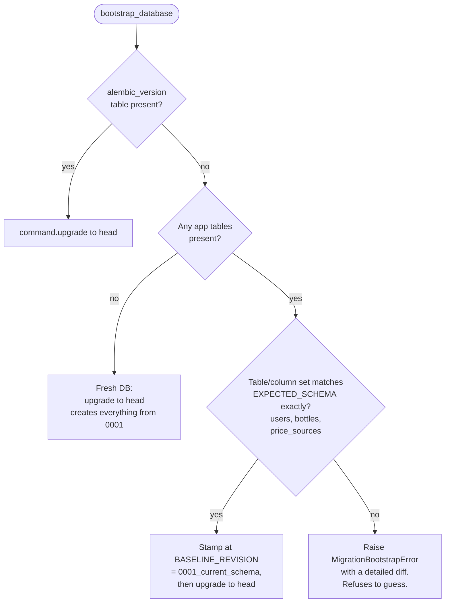

# Component Design: Persistence & Migrations

Modules: `bourbonbook/database.py`, `bourbonbook/models.py`, `bourbonbook/migrations.py`,
`migrations/versions/0001`-`0007`
Related: [HLDD](../hldd.md) · [C3 Components](../c3-components.md)

## Responsibility

Own the SQLAlchemy engine/session lifecycle, define the ORM schema, and safely bring any database
state (fresh, pre-Alembic legacy, or already-versioned) up to the current migration head at process
startup.

## Engine and session (`database.py`)

- `create_database_engine(database_url)` builds the SQLAlchemy engine. For SQLite URLs it passes
  `connect_args={"check_same_thread": False}` and registers an `event.listens_for(engine,
  "connect")` hook that runs `PRAGMA foreign_keys=ON` on every new connection — SQLite does not
  enforce FK constraints by default, so this is required for referential integrity to actually hold.
- `Database` wraps the engine plus `sessionmaker(engine, expire_on_commit=False)`.
  `expire_on_commit=False` avoids re-fetching ORM attributes immediately after a commit, which
  matters because code paths like `authenticate_session()` read `user.session_version` right after
  a commit elsewhere in the same request.
- `Database.session()` yields one `Session` per request/call inside a `with` block, closing it
  afterward — the standard scoped-session-per-request pattern.
- `create_all()` is a `Base.metadata.create_all()` convenience, mainly for tests; production schema
  changes always go through Alembic.

## Schema (`models.py`)

Seven tables:

| Table | Key columns | Notes |
| --- | --- | --- |
| `users` | `username`, `email` (unique, nullable during migration windows), `screen_name`, `avatar_name`, `email_verified_at`, `is_admin`, `session_version`, `collection_share_token_hash` (unique), `password_hash` | Central identity row; `bottles` and `tokens` relationships cascade-delete |
| `user_tokens` | `user_id` FK (`CASCADE`), `purpose`, `token_hash` (unique), `email_snapshot`, `expires_at`, `used_at` | One-time verify/reset tokens; see [Identity & sessions](identity-and-sessions.md) |
| `bottles` | `owner_id` FK, ~25 collection-tracking columns, `on_shopping_list`, `status`, `fill_level`, `analysis_status` | `UniqueConstraint(owner_id, photo_name)`; `estimated_value` is a computed property (`msrp or purchase_price, times quantity`), not a stored column |
| `price_sources` | `bottle_id` FK, `kind`, `title`, `url`, `basis`, `checked_at` | Per-bottle price evidence; ordered by `kind` on load |
| `catalog_prices` | `product_key` + `size_key` (unique together), `msrp`, `title`, `url`, `basis`, `checked_at` | Shared, cross-user MSRP cache — see [Pricing & catalog](pricing-and-catalog.md) and ADR 0002 |
| `api_usage` | `provider`, `operation`, `model`, `success`, `error_type`, `duration_ms`, token-count columns, `user_id` FK (`SET NULL`) | AI/API usage ledger; deliberately excludes prompts/responses/PII |

`Bottle.estimated_value` is the only computed (non-persisted) property on any model.

## Schema evolution

| Migration | Adds |
| --- | --- |
| `0001_current_schema` | Baseline: `users` (username/display_name/password_hash only — no email), `bottles`, `price_sources` |
| `0002_user_email_identity` | `users.email/screen_name/email_verified_at/is_admin/session_version` (with backfill + collision check); new `user_tokens` table |
| `0003_api_usage` | New `api_usage` table |
| `0004_shopping_list` | `bottles.on_shopping_list` (+ index) |
| `0005_collection_sharing` | `users.collection_share_token_hash` (+ unique index), `users.collection_shared_at` |
| `0006_user_avatars` | `users.avatar_name` |
| `0007_catalog_prices` | New `catalog_prices` table, backfilled from existing OHLQ-sourced `price_sources` rows |

`HEAD_REVISION` in `migrations.py` is kept in sync with the latest file (`"0007_catalog_prices"` as
of this writing) and is what `/readyz` compares against.

## Bootstrap (`bootstrap_database()`)

Runs once from `entrypoint.py` before Uvicorn starts, and again (idempotently) inside
`main.create_app()`'s lifespan. It safely classifies the database into one of three states:

The "refuse to guess" branch is a deliberate safety valve: an unrecognized legacy schema fails
startup loudly with a diff, rather than silently mutating data the migration author never saw. A CLI
entrypoint (`python -m bourbonbook.migrations`) exposes the same logic for manual invocation.

## Design properties worth preserving

- Every migration is forward-only and has been exercised against both a fresh database and an
  upgraded copy-shaped legacy database (per `docs/adr/plan.md`'s cross-cutting testing requirement).
- `CatalogPrice` is intentionally not scoped to a user — any schema change that adds ownership to it
  would change the sharing semantics described in ADR 0002.
- SQLite's `check_same_thread=False` plus a single Uvicorn worker means the app never needs a
  connection pool sized for concurrent writers; this is a direct consequence of ADR 0001's
  single-process deployment decision and should not be "fixed" without revisiting that ADR.
