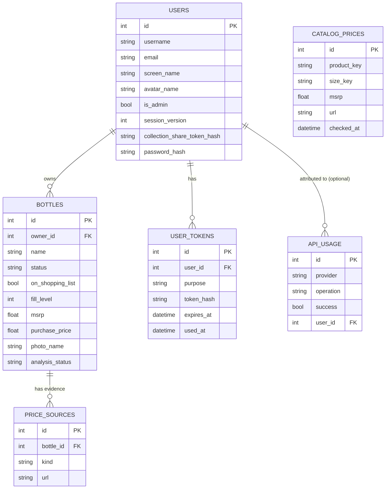
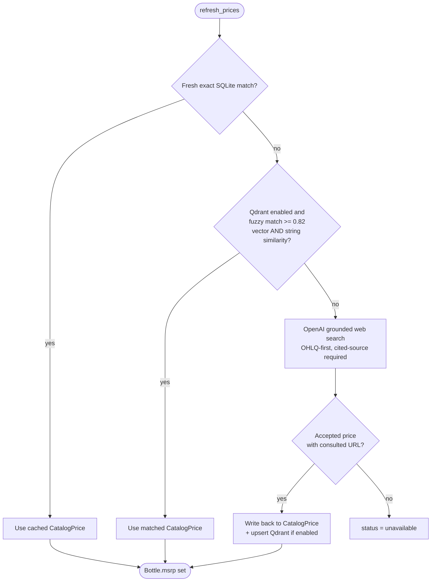

# High-Level Design Document (HLDD): Bourbon Book

Status: Accepted
Date: 2026-07-21
Baseline ADR: [ADR 0001](../adr/0001-current-architecture-baseline.md)
Pricing-catalog ADR: [ADR 0002](../adr/0002-local-first-pricing-catalog.md)
Model-selection ADR: [ADR 0003](../adr/0003-fixed-local-model-no-benchmark-gate.md)
C1-C4 views: [C1](c1-system-context.md) · [C2](c2-containers.md) · [C3](c3-components.md) · [C4](c4-code.md)
Detailed component design: [components/](components/)

## 1. Purpose and Scope

This document describes the current, implemented design of Bourbon Book: a private, mobile-first
bourbon-collection Progressive Web App (PWA). It complements the C1-C4 architecture views (which
show structure) with the *behavior* of the system: how a request flows through it, what each major
subsystem is responsible for, the data model, and the cross-cutting concerns (security,
observability, configuration, deployment) that apply across all of them.

This HLDD covers only what is checked into the repository today. It intentionally excludes the
larger Phase 2 roadmap tracked in `docs/adr/plan.md` (a governed multi-source pricing-evidence
pipeline, dense-embedding RAG, scheduled crawling, durable refresh jobs, OpenAI-assisted source
discovery) — that work is future-facing and not part of the current design.

## 2. System Summary

Bourbon Book lets a small, private set of users (a home-lab deployment, `MAX_USERS` capped, default
10) photograph a bourbon bottle, have a vision-capable AI model read the label, and maintain an
editable personal catalog of their collection — quantity, fill level, tasting notes, storage
location, and an estimated value. It also tracks a shopping list of bottles the user wants but
doesn't have yet, supports sharing a read-only view of a collection via an unguessable link, and
gives administrators tools to manage users, monitor AI/API usage, curate a shared bottle-price
catalog, and change runtime configuration without redeploying the container.

It is deliberately **not** a multi-tenant SaaS product: it is designed to run as one Docker
container on a single Unraid host, with all durable state on a mounted `/data` volume, fronted by a
reverse proxy the operator already runs for other services.

## 3. Architecture at a Glance

- **Presentation**: server-rendered HTML via FastAPI + Jinja2 templates (`bourbonbook/main.py`,
  `bourbonbook/templates/`). No client-side SPA framework; a small amount of vanilla JS
  (`static/app.js`) handles previews, the empty-bottle confirm dialog, and share-link
  copy-to-clipboard. A lightweight service worker caches only the static shell for offline
  installability, not application data.
- **Application/domain logic**: almost entirely inside `bourbonbook/main.py` (~2,080 lines) as route
  handlers plus a set of module-level orchestration functions (form parsing, pricing tiers, catalog
  lookups), supported by focused single-purpose modules (`auth.py`, `identity.py`, `tokens.py`,
  `rate_limit.py`, `photos.py`, `analysis.py`, `catalog.py`, `qdrant_prices.py`, `admin_config.py`,
  `observability.py`, `email.py`).
- **Persistence**: SQLite via SQLAlchemy 2.0 ORM, with Alembic migrations. Single writer, single
  Uvicorn worker by design (see §7).
- **AI providers**: pluggable analysis provider (Ollama local vision/text models, or OpenAI
  structured outputs), selected globally via `ANALYSIS_PROVIDER`; price research is always
  OpenAI-grounded web search, gated behind the local-first pricing cache (ADR 0002).
- **Deployment**: one Docker image, one container, `restart: unless-stopped`, all state under
  `/data`. See [C2 Containers](c2-containers.md).
- **Observability**: Prometheus metrics, structured JSON logs (console + rotation-safe file), a
  local, privacy-conscious `ApiUsage` ledger for AI/API call accounting.

## 4. Major Components

Each component below has its own detailed design document under [`components/`](components/); this
section is a map, not the full detail.

| Component | Module(s) | Responsibility |
| --- | --- | --- |
| [Identity & sessions](components/identity-and-sessions.md) | `auth.py`, `identity.py`, `tokens.py`, `rate_limit.py` | Password auth, signed-cookie sessions, CSRF, email verification, password reset, session invalidation, rate limiting |
| [Persistence & migrations](components/persistence-and-migrations.md) | `database.py`, `models.py`, `migrations.py`, `migrations/versions/*` | SQLAlchemy engine/session, ORM models, Alembic bootstrap across fresh/legacy/versioned databases |
| [Bottle, shopping-list & sharing workflow](components/bottle-workflow.md) | `main.py` (bottle/shopping-list/sharing/avatar routes), `photos.py` | Bottle CRUD, photo upload/normalization, shopping list, collection sharing, avatar upload |
| [AI analysis orchestration](components/ai-analysis.md) | `analysis.py`, `ollama.py`, `openai_provider.py`, `provider_clients.py` | Provider dispatch, prompt construction, field normalization, manual-fallback behavior |
| [Pricing & catalog](components/pricing-and-catalog.md) | `catalog.py`, `qdrant_prices.py`, `catalog_extract.py`, `catalog_cli.py` | Local-first MSRP cache, optional Qdrant fuzzy match, bulk screenshot ingestion (see ADR 0002) |
| [Model evaluation & benchmarking](components/model-evaluation-and-benchmarking.md) | `benchmark_cli.py`, `model_evaluation.py` | Offline accuracy/latency benchmarking of local Ollama models; optional/non-blocking since ADR 0003 retired its use as a model-adoption gate |
| [Administration & configuration](components/admin-and-configuration.md) | `admin_config.py`, admin routes in `main.py`, `admin_cli.py` | User management, usage dashboard, catalog admin, restart-driven managed config, sole-admin recovery |
| [Observability & operations](components/observability-and-operations.md) | `observability.py`, `logging_config.py`, `email.py`, `entrypoint.py` | Metrics, structured/redacted logging, AI usage ledger, email delivery, process bootstrap |
| [PWA shell & frontend](components/pwa-frontend.md) | `templates/`, `static/` | Server-rendered UI, manifest, service worker, self-hosted accessible font |

## 5. Data Model

Seven tables, all in one SQLite database (`bourbonbook.db`), owned by seven Alembic migrations
(`0001`-`0007`). Full detail in [Persistence & migrations](components/persistence-and-migrations.md).

`CatalogPrice` is deliberately **not** owned by any user — it is a shared, cross-user cache keyed by
normalized `(product_key, size_key)`, distinct from the per-bottle, per-owner `PriceSource` evidence
rows. `ApiUsage` deliberately excludes prompts, responses, bottle names, email addresses, URLs, and
API keys by construction (the columns simply don't exist for that data).

## 6. Key Workflows

### 6.1 Add a bottle from a photo

1. User submits a photo via `POST /bottles` (native FastAPI `Form()`/`File()` binding — the one
   route in the app that doesn't hand-parse `request.form()`).
2. `photos.save_photo()` validates (Pillow decode, EXIF auto-rotate, RGB-normalize,
   decompression-bomb guard), downsizes to at most 1800×1800, and stores a UUID-named JPEG under
   `/data/uploads`.
3. `analysis.analyze_bottle()` dispatches to the configured provider (Ollama or OpenAI) with a
   detailed vision prompt. If Ollama and required fields are still missing, a second text-only
   Ollama pass refines using the transcribed OCR text. `normalize_analysis()` reconciles fill-level
   percentage against status (`Unopened`/`Opened`/`Empty`).
2a. A hardcoded `VERIFIED_PRODUCTS` alias/OCR match (`catalog.py`) can short-circuit/override
   extracted fields for a handful of well-known bottles, marking `analysis_status="verified"`.
4. `catalog.verified_product()` / `enrich_bottle_by_name()` attempt a non-network, catalog-only
   enrichment pass (`allow_provider=False`) before any pricing call.
5. Pricing resolves via the three-tier local-first flow (§6.3) unless the user typed a purchase
   price, in which case that seeds/refreshes the shared catalog instead (ADR 0002 §4).
6. The `Bottle` row is created and saved **regardless of analysis outcome** — if the provider is
   unreachable, `analysis_status="unavailable"` and the edit form opens for manual entry. The
   photo is never lost because of an AI failure.

### 6.2 Edit / re-analyze / delete a bottle

- `POST /bottles/{id}/edit` updates fields from a form, handles the "became Empty" transition
  (remove and delete photo, move to shopping list, or block via a client-side confirm dialog until
  the user chooses), and invalidates now-stale `msrp` price-source rows when relevant fields change.
- `POST /bottles/{id}/analyze` supports three independent re-run modes: `photo` (full vision
  re-analysis), `name` (text-only catalog/provider enrichment), `price` (forced pricing refresh,
  bypassing the cache tiers).
- `POST /bottles/{id}/delete` removes the row and its photo file together.

### 6.3 Pricing resolution (local-first, three tiers)

See [ADR 0002](../adr/0002-local-first-pricing-catalog.md) and
[Pricing & catalog](components/pricing-and-catalog.md) for full detail.

### 6.4 Identity lifecycle

Registration → (optional) email verification → session cookie → CSRF-protected mutating actions →
password reset (invalidates all sessions via `session_version` bump + revokes outstanding tokens) →
account deletion (typed confirmation phrase + file cleanup). See
[Identity & sessions](components/identity-and-sessions.md) for the full state machine, including the
bootstrap-admin and CLI sole-admin-recovery paths.

### 6.5 Admin-managed configuration + restart

Admin submits `/admin/config` → `admin_config.parse_config_form()` validates every field against a
typed `CONFIG_FIELDS` registry → atomically writes `<DATA_DIR>/.env` (0600, temp-file + rename) →
admin explicitly triggers `/admin/restart` → app sends itself `SIGTERM` → the container's `restart:
unless-stopped` policy (or an operator-run supervisor) restarts the process → `Settings.from_env()`
re-reads OS env merged with the managed `.env` (managed values win) on the new process. See
[Administration & configuration](components/admin-and-configuration.md).

## 7. Cross-Cutting Concerns

### 7.1 Security

- **Authn**: `pwdlib` recommended hash (Argon2-class), signed-cookie sessions (no server-side
  session store), `session_version` for instant bulk invalidation.
- **CSRF**: manual synchronizer-token check (`secrets.compare_digest`) on every mutating route; not
  middleware-enforced, so a new POST route must remember to call `verify_csrf()`.
- **Rate limiting**: in-process sliding-window limiter, HMAC-hashed email/IP keys, global + per-key
  ceilings, applied to login/register/verify/reset/resend and admin-triggered sends. Explicitly
  process-local — does not survive multiple workers/replicas (see §7.3).
- **Secrets**: never rendered back to the browser (admin config UI); masked in Unraid template
  guidance; redacted in logs via `RedactionFilter` keyed on field-name fragments
  (`password`,`token`,`secret`,`cookie`,`authorization`, etc.).
- **Path/file safety**: UUID-named uploads (no user-controlled filenames), `.resolve()`
  parent-directory checks on avatar/photo serving, decompression-bomb guard on image decode.
- **Public unauthenticated surface**: `/shared/{token}` and its media route are the only
  unauthenticated data-serving endpoints; they're scoped to one owner's non-empty, non-shopping-list
  bottles, hardened with `no-store`/`no-referrer`/`noindex` headers, and instantly revocable.
- **Production hardening gate**: `Settings.validate_identity()` refuses to start in `production`
  without HTTPS `PUBLIC_BASE_URL`, `SECURE_COOKIES=true`, `PROXY_HEADERS=true`, and a non-wildcard
  `FORWARDED_ALLOW_IPS`.

### 7.2 Observability

- **Metrics**: Prometheus counters/histograms for HTTP requests, auth events, AI requests/tokens,
  email deliveries, and (defined but not yet wired into the pricing flow) price-job gauges. Scraped
  directly from the app container, never through the public reverse-proxy route.
- **Logging**: structured JSON everywhere (console optionally text in dev), always JSON to
  `/data/logs/bourbonbook.log` via a rotation-safe `WatchedFileHandler`, redaction applied uniformly.
- **AI usage ledger**: `ApiUsage` table records provider/operation/model/success/duration/token
  counts/bounded error type per call — enough for cost and reliability visibility without storing
  any sensitive content. Retention is configurable (`API_USAGE_RETENTION_DAYS`, default 90) and
  swept on every startup.
- **Health**: `/healthz` is liveness-only; `/readyz` additionally checks DB connectivity and that
  Alembic is at `HEAD_REVISION` — the container `HEALTHCHECK` intentionally uses only `/healthz`.

### 7.3 Deployment & scaling posture

Bourbon Book is intentionally **not** built to scale horizontally (ADR 0001). One Uvicorn worker,
one SQLite writer, in-process rate limiting, and (per `plan.md`) an assumed single local-GPU lane
for Ollama model residency are all load-bearing assumptions. Scaling to multiple workers or replicas
would require, at minimum: a shared rate-limit store, a shared session store (or continuing to rely
purely on stateless signed cookies, which already works), and a database that supports concurrent
writers — none of which are in place today. This is a deliberate trade-off for a personal/home-lab
deployment, not an oversight; see ADR 0001 §Consequences.

### 7.4 Configuration

Two configuration layers merge at `Settings.from_env()`: OS/container environment variables, then
the admin-managed `<DATA_DIR>/.env` file (which **takes precedence**). Both are restart-driven —
there is no live config reload. `admin_config.CONFIG_FIELDS` is the single registry that both the
admin UI and validation walk, so every setting in `.env.example` is admin-editable except secrets
that must be typed fresh or explicitly cleared.

### 7.5 Testing & CI

24 test modules under `tests/` cover identity, sessions, rate limiting, migrations (fresh + legacy +
versioned), catalog/pricing (including Qdrant and OpenAI/Ollama via fakes — no live network calls in
deterministic tests), observability, admin flows, and benchmarking. CI (`.github/workflows/ci.yml`)
runs five parallel gates (`quality`, `security`, `dependency`, `review-readiness`, `container`) on
every PR; a separate workflow builds and publishes a multi-arch (`amd64`/`arm64`) image to GHCR on
`main`. The branch-coverage floor is enforced at 90% (`pyproject.toml`), with a temporarily lowered
80% repository-wide gate noted in `docs/adr/plan.md` while a specific in-flight benchmark rework is
completed — that gate is expected to return to 90% before further PR promotion, per the plan.

## 8. Non-Functional Requirements / Constraints (as designed)

| Concern | Current design point |
| --- | --- |
| Concurrency | Single Uvicorn worker, single SQLite writer — by design, not a limitation to be fixed casually |
| Availability | No built-in process supervision; relies on `restart: unless-stopped` (or operator supervisor) for both crash recovery and the admin-restart flow |
| Data durability | Everything under `/data`; container filesystem is disposable; operator responsible for backup before upgrades |
| Multi-tenancy | Small, capped user count (`MAX_USERS`, default 10); no per-tenant isolation model beyond row ownership |
| AI provider availability | Both photo and name analysis degrade to manual entry, never block bottle creation |
| Pricing availability | Degrades to `unavailable` status rather than fabricating a price; Qdrant absence never blocks pricing |
| Secrets handling | Never logged, never re-rendered in admin UI, masked in deployment docs |
| Config changes | Always restart-driven, deliberately not live-reloaded |

## 9. Open Gaps and Known Divergences

Recorded here for transparency rather than silently left implicit:

- `/admin/catalog-import` (the browser-facing upload) validates files but does not yet invoke
  `catalog_extract.py`'s extraction pipeline — that pipeline is currently only reachable via the
  offline CLI (`make price-catalog-extract-screenshots`). See ADR 0002 Consequences.
- Prometheus price-job metrics (`bourbonbook_price_jobs_total`, `bourbonbook_price_job_duration_seconds`,
  `bourbonbook_price_jobs_current`) are defined in `observability.py` but the current synchronous
  `refresh_prices()` call path does not appear to increment them on every tier — verify before
  building dashboards against these specific series.
- The Phase 2 roadmap in `docs/adr/plan.md` describes a much larger pricing-evidence system as
  "outstanding" or "partial foundation" against the current code; this HLDD and ADR 0002 describe
  only what is actually shipped today, which is smaller and simpler than that roadmap.
- Coverage gate is temporarily 80% repository-wide per `plan.md`'s Confirmed Decision 18, pending a
  specific benchmark-contract rework; the enforced floor in `pyproject.toml` still reads 90%, so
  check current CI status rather than assuming either number is authoritative at any given moment.
- The model-role benchmark acceptance gate (`benchmark_cli.compare_reports()` /
  `model_evaluation.evaluate_role_selection()`) was retired as a blocking requirement by
  [ADR 0003](../adr/0003-fixed-local-model-no-benchmark-gate.md); its known scoring defects
  (`plan.md` action P2-00) were never fixed and no longer need to be, but that also means any report
  it produces should be treated as informal, not decision-ready, if it's ever run again.

## 10. Related Documents

- [ADR 0001: Current Architecture Baseline](../adr/0001-current-architecture-baseline.md)
- [ADR 0002: Local-First Pricing Catalog](../adr/0002-local-first-pricing-catalog.md)
- [ADR 0003: Fixed Local Model Selection, No Benchmark Gate](../adr/0003-fixed-local-model-no-benchmark-gate.md)
- [C1 System Context](c1-system-context.md) / [C2 Containers](c2-containers.md) / [C3 Components](c3-components.md) / [C4 Code](c4-code.md)
- [Component design docs](components/)
- [Phase 2 roadmap (plan.md)](../adr/plan.md)
- [README.md](../../README.md) (operator-facing setup/deployment reference)
- [AGENTS.md](../../AGENTS.md) (contributor workflow reference)
