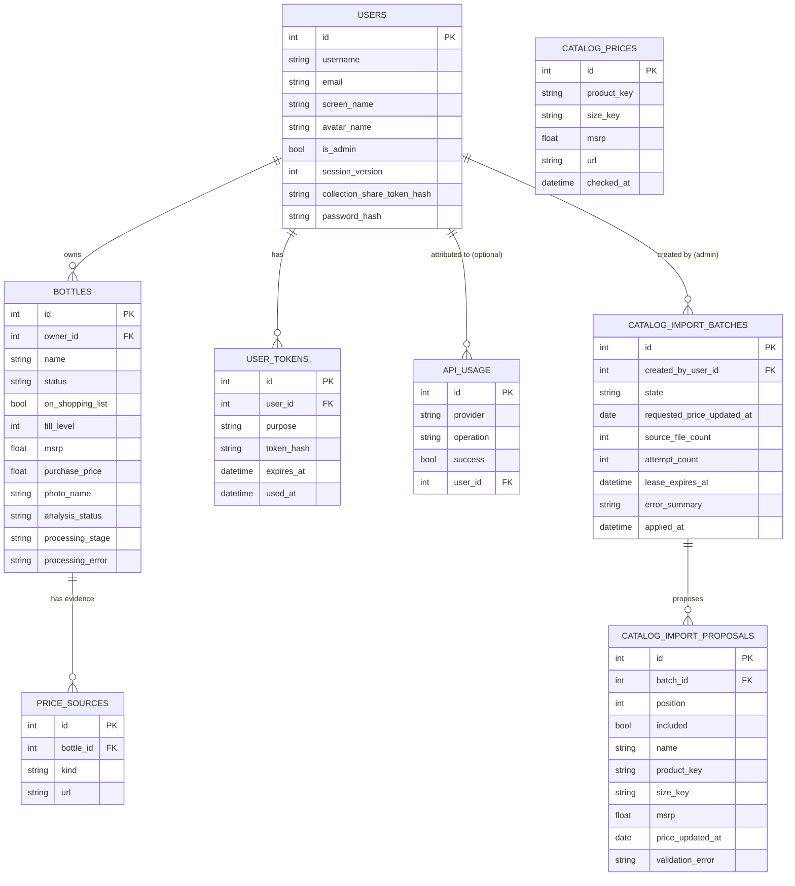
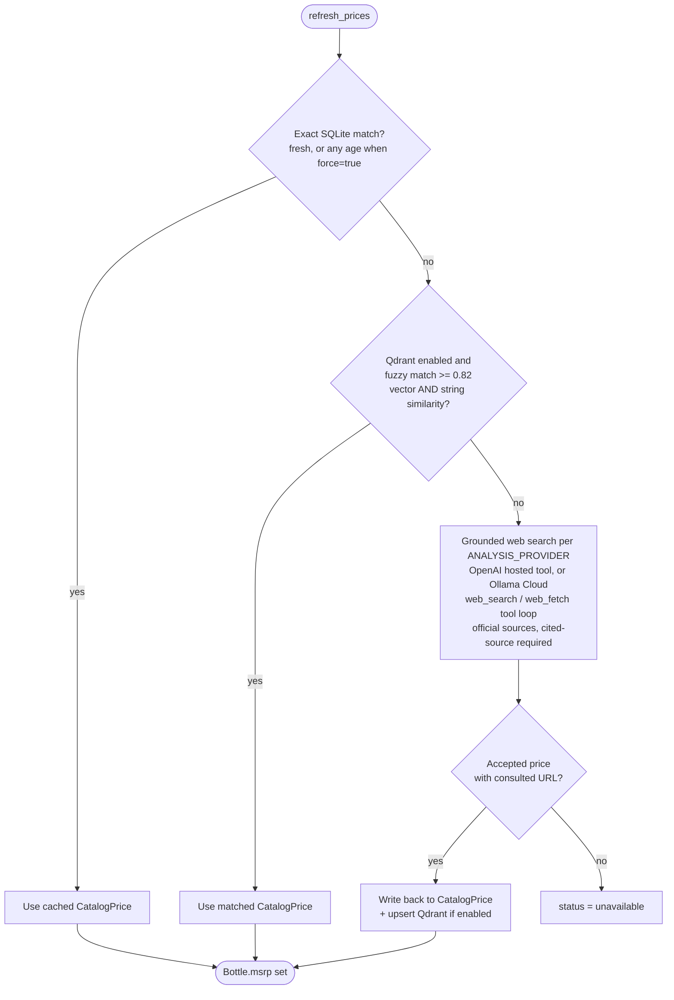

# High-Level Design Document (HLDD): Bourbon Book

Status: Accepted
Date: 2026-08-02
Baseline ADR: [ADR 0001](../adr/0001-current-architecture-baseline.md)
Pricing-catalog ADR: [ADR 0002](../adr/0002-local-first-pricing-catalog.md)
Model-selection ADR: [ADR 0003](../adr/0003-fixed-local-model-no-benchmark-gate.md)
C1-C4 views: [C1](c1-system-context.md) · [C2](c2-containers.md) · [C3](c3-components.md) · [C4](c4-code.md)
Detailed component design: [components/](components/)

## 1. Purpose and Scope

This document describes the current, implemented design of Bourbon Book: a private, mobile-first
bourbon-collection Progressive Web App (PWA). It complements the C1-C4 architecture views (which
show structure) with the *behavior* of the system: how a request flows through it, what each major
subsystem is responsible for, the data model, and the cross-cutting concerns (security,
observability, configuration, deployment) that apply across all of them.

This HLDD covers only what is checked into the repository today. It intentionally excludes the
larger Phase 2 roadmap tracked in `docs/adr/plan.md` (a governed multi-source pricing-evidence
pipeline, dense-embedding RAG, scheduled crawling, durable refresh jobs, OpenAI-assisted source
discovery) — that work is future-facing and not part of the current design.

## 2. System Summary

Bourbon Book lets a small, private set of users (a home-lab deployment, `MAX_USERS` capped, default
10) photograph a bourbon bottle, have a vision-capable AI model read the label, and maintain an
editable personal catalog of their collection — quantity, fill level, tasting notes, storage
location, and an estimated value. It also tracks a shopping list of bottles the user wants but
doesn't have yet, supports sharing a read-only view of a collection via an unguessable link, and
gives administrators tools to manage users, monitor AI/API usage, curate a shared bottle-price
catalog, and change runtime configuration without redeploying the container.

It is deliberately **not** a multi-tenant SaaS product: it is designed to run as one Docker
container on a single Unraid host, with all durable state on a mounted `/data` volume, fronted by a
reverse proxy the operator already runs for other services.

## 3. Architecture at a Glance

- **Presentation**: server-rendered HTML via FastAPI + Jinja2 templates (`bourbonbook/main.py`,
  `bourbonbook/templates/`). No client-side SPA framework; a small amount of vanilla JS
  (`static/app.js`) handles previews, the add-bottle progress poller, the empty-bottle confirm
  dialog, catalog-import review bulk selection, and share-link copy-to-clipboard. A lightweight
  service worker caches only the static shell for offline installability, not application data.
- **Application/domain logic**: mostly inside `bourbonbook/main.py` (~2,780 lines) as route handlers
  plus a set of module-level orchestration functions (form parsing, pricing tiers, catalog lookups),
  supported by focused single-purpose modules (`auth.py`, `identity.py`, `tokens.py`,
  `rate_limit.py`, `photos.py`, `analysis.py`, `bottle_processing.py`, `catalog.py`,
  `catalog_uploads.py`, `catalog_imports.py`, `catalog_import_worker.py`, `catalog_extract.py`,
  `qdrant_prices.py`, `admin_config.py`, `observability.py`, `email.py`).
- **Persistence**: SQLite via SQLAlchemy 2.0 ORM, with Alembic migrations. Single writer, single
  Uvicorn worker by design (see §7).
- **Background work**: two in-process asynchronous paths, both owned by the single app process — a
  per-request FastAPI `BackgroundTasks` job that runs the add-bottle analysis/enrichment/pricing
  pipeline (`bottle_processing.py`), and one lifespan-owned `asyncio` worker task that drains the
  durable catalog-import queue (`catalog_import_worker.py`). There is no Redis, Celery, or external
  scheduler.
- **AI providers**: pluggable analysis provider (Ollama local vision/text models, or OpenAI
  structured outputs), selected globally via `ANALYSIS_PROVIDER`. Grounded price research follows
  the same setting: OpenAI's hosted web-search tool, or Ollama's tool-calling loop against Ollama
  Cloud's `/api/web_search` and `/api/web_fetch`. Either way it is the last tier, gated behind the
  local-first pricing cache (ADR 0002).
- **Deployment**: one Docker image, one container, `restart: unless-stopped`, all state under
  `/data`. See [C2 Containers](c2-containers.md).
- **Observability**: Prometheus metrics, structured JSON logs (console + rotation-safe file), a
  local, privacy-conscious `ApiUsage` ledger for AI/API call accounting.

## 4. Major Components

Each component below has its own detailed design document under [`components/`](components/); this
section is a map, not the full detail.

| Component | Module(s) | Responsibility |
| --- | --- | --- |
| [Identity & sessions](components/identity-and-sessions.md) | `auth.py`, `identity.py`, `tokens.py`, `rate_limit.py` | Password auth, signed-cookie sessions, CSRF, email verification, password reset, session invalidation, rate limiting |
| [Persistence & migrations](components/persistence-and-migrations.md) | `database.py`, `models.py`, `migrations.py`, `migrations/versions/*` | SQLAlchemy engine/session, ORM models, Alembic bootstrap across fresh/legacy/versioned databases |
| [Bottle, shopping-list & sharing workflow](components/bottle-workflow.md) | `main.py` (bottle/shopping-list/sharing/avatar routes), `photos.py`, `bottle_processing.py` | Bottle CRUD, photo upload/normalization, the staged async add-bottle pipeline, shopping list, collection sharing, avatar upload |
| [AI analysis orchestration](components/ai-analysis.md) | `analysis.py`, `ollama.py`, `ollama_search.py`, `openai_provider.py`, `provider_clients.py` | Provider dispatch (analysis and grounded price search), prompt construction, field normalization, manual-fallback behavior |
| [Pricing & catalog](components/pricing-and-catalog.md) | `catalog.py`, `qdrant_prices.py`, `catalog_cli.py`, pricing helpers in `main.py` | Local-first MSRP cache, optional Qdrant fuzzy match, verified-product short-circuit (see ADR 0002) |
| [Catalog import pipeline](components/catalog-import.md) | `catalog_uploads.py`, `catalog_imports.py`, `catalog_import_worker.py`, `catalog_extract.py` | Durable, review-first admin ingestion of price sheets: bounded upload staging, a leased single-lane extraction worker, and an atomic apply into `catalog_prices` |
| [Model evaluation & benchmarking](components/model-evaluation-and-benchmarking.md) | `benchmark_cli.py`, `model_evaluation.py` | Offline accuracy/latency benchmarking of local Ollama models; optional/non-blocking since ADR 0003 retired its use as a model-adoption gate |
| [Administration & configuration](components/admin-and-configuration.md) | `admin_config.py`, admin routes in `main.py`, `admin_cli.py` | User management, usage dashboard, catalog admin, restart-driven managed config, sole-admin recovery |
| [Observability & operations](components/observability-and-operations.md) | `observability.py`, `logging_config.py`, `email.py`, `entrypoint.py` | Metrics, structured/redacted logging, AI usage ledger, email delivery, process bootstrap |
| [PWA shell & frontend](components/pwa-frontend.md) | `templates/`, `static/` | Server-rendered UI, manifest, service worker, self-hosted accessible font |

## 5. Data Model

Eight tables, all in one SQLite database (`bourbonbook.db`), owned by nine Alembic migrations
(`0001`-`0009`). Full detail in [Persistence & migrations](components/persistence-and-migrations.md).

```mermaid
erDiagram
  USERS ||--o{ BOTTLES : owns
  USERS ||--o{ USER_TOKENS : has
  USERS ||--o{ API_USAGE : "attributed to (optional)"
  USERS ||--o{ CATALOG_IMPORT_BATCHES : "created by (admin)"
  BOTTLES ||--o{ PRICE_SOURCES : "has evidence"
  CATALOG_IMPORT_BATCHES ||--o{ CATALOG_IMPORT_PROPOSALS : "proposes"

  USERS {
    int id PK
    string username
    string email
    string screen_name
    string avatar_name
    bool is_admin
    int session_version
    string collection_share_token_hash
    string password_hash
  }
  USER_TOKENS {
    int id PK
    int user_id FK
    string purpose
    string token_hash
    datetime expires_at
    datetime used_at
  }
  BOTTLES {
    int id PK
    int owner_id FK
    string name
    string status
    bool on_shopping_list
    int fill_level
    float msrp
    float purchase_price
    string photo_name
    string analysis_status
    string processing_stage
    string processing_error
  }
  PRICE_SOURCES {
    int id PK
    int bottle_id FK
    string kind
    string url
  }
  CATALOG_PRICES {
    int id PK
    string product_key
    string size_key
    float msrp
    string url
    datetime checked_at
  }
  CATALOG_IMPORT_BATCHES {
    int id PK
    int created_by_user_id FK
    string state
    date requested_price_updated_at
    int source_file_count
    int attempt_count
    datetime lease_expires_at
    string error_summary
    datetime applied_at
  }
  CATALOG_IMPORT_PROPOSALS {
    int id PK
    int batch_id FK
    int position
    bool included
    string name
    string product_key
    string size_key
    float msrp
    date price_updated_at
    string validation_error
  }
  API_USAGE {
    int id PK
    string provider
    string operation
    bool success
    int user_id FK
  }
```

`CatalogPrice` is deliberately **not** owned by any user — it is a shared, cross-user cache keyed by
normalized `(product_key, size_key)`, distinct from the per-bottle, per-owner `PriceSource` evidence
rows. `ApiUsage` deliberately excludes prompts, responses, bottle names, email addresses, URLs, and
API keys by construction (the columns simply don't exist for that data).

`CatalogImportBatch`/`CatalogImportProposal` are staging tables, not collection data: a proposal is
an editable, not-yet-trusted extracted price row that becomes a `CatalogPrice` only when an
administrator applies its batch. They carry an admin `created_by_user_id` for audit, but they are
never scoped to or visible from a collection user's routes.

## 6. Key Workflows

### 6.1 Add a bottle from a photo (asynchronous, stage-tracked)

Bottle creation is split into a fast HTTP request and a background pipeline so the browser is never
held open for a multi-second vision call.

1. `GET /bottles/new` renders the capture form and schedules a best-effort
   `analysis.warm_analysis_model()` background task so Ollama has the vision model resident by the
   time the photo arrives.
2. The browser submits `POST /bottles` via `fetch()` (native FastAPI `Form()`/`File()` binding — the
   one route in the app that doesn't hand-parse `request.form()`).
3. `photos.save_photo()` validates (Pillow decode, EXIF auto-rotate, RGB-normalize,
   decompression-bomb guard), downsizes to at most 1800×1800, and stores a UUID-named JPEG under
   `/data/uploads`.
4. The `Bottle` row is committed immediately with `processing_stage="queued"`, and the route returns
   **`202` with `{"bottle_id": …}`** — the row exists before any model is called.
5. `bottle_processing.run_add_bottle_pipeline()` then runs as a FastAPI `BackgroundTasks` job,
   opening its own session (the request session is already closed) and committing
   `processing_stage` after each step so a poller sees live progress:
   - `analyzing` — `analysis.analyze_bottle()` dispatches to the configured provider with the vision
     prompt. If Ollama and required fields are still missing, a second text-only Ollama pass refines
     using the transcribed OCR text. A `VERIFIED_PRODUCTS` alias/OCR/fuzzy match (`catalog.py`) can
     override extracted fields, marking `analysis_status="verified"`. `normalize_analysis()`
     reconciles fill level against status (`Unopened`/`Opened`/`Empty`).
   - `enriching` — `enrich_bottle_by_name()` runs a non-network, catalog-only pass
     (`allow_provider=False`).
   - `pricing` — the user's typed purchase price seeds/refreshes the shared catalog
     (`apply_user_purchase_price()`, ADR 0002 §4); otherwise pricing resolves via the three-tier
     local-first flow (§6.3).
   - `complete`, or `failed` with a stored `processing_error` if anything unexpected escapes. The
     pipeline never re-raises: an exception after a `202` has already been sent could only strand
     the row.
6. `static/app.js` polls `GET /bottles/{id}/status` every 1.2s (120s ceiling) for
   `{stage, analysis_status, done}` and advances an on-screen progress message, then navigates to
   the edit form.
7. `collection_statement()` filters out bottles still in an in-progress stage, so a half-analyzed
   row never appears in the library. On startup, `recover_orphaned_bottle_processing()` marks any
   row left mid-pipeline by the previous process as `failed` — with one worker, a restart is an
   unambiguous signal that the work was abandoned, so no lease bookkeeping is needed.

The bottle is saved **regardless of analysis outcome**: if the provider is unreachable,
`analysis_status="unavailable"` and the edit form opens for manual entry. The photo is never lost
because of an AI failure.

### 6.2 Edit / re-analyze / delete a bottle

- `POST /bottles/{id}/edit` updates fields from a form, handles the "became Empty" transition
  (remove and delete photo, move to shopping list, or block via a client-side confirm dialog until
  the user chooses), and invalidates now-stale `msrp` price-source rows when relevant fields change.
- `POST /bottles/{id}/analyze` supports three independent re-run modes: `photo` (full vision
  re-analysis), `name` (text-only catalog/provider enrichment), `price` (forced pricing refresh).
  This route is still **synchronous** — it runs inside the request and ends in a `303`, unlike the
  `POST /bottles` creation path. In `price` mode, `force=True` relaxes the cache-freshness
  requirement but still consults the local SQLite and Qdrant tiers first; it does not skip straight
  to a web search.
- `POST /bottles/{id}/delete` removes the row and its photo file together.

### 6.3 Pricing resolution (local-first, three tiers)

See [ADR 0002](../adr/0002-local-first-pricing-catalog.md) and
[Pricing & catalog](components/pricing-and-catalog.md) for full detail.

```mermaid
flowchart TD
  start([refresh_prices]) --> t1{Exact SQLite match?\nfresh, or any age when force=true}
  t1 -- yes --> cached[Use cached CatalogPrice]
  t1 -- no --> t2{Qdrant enabled and\nfuzzy match >= 0.82\nvector AND string similarity?}
  t2 -- yes --> localmatch[Use matched CatalogPrice]
  t2 -- no --> t3[Grounded web search per ANALYSIS_PROVIDER\nOpenAI hosted tool, or Ollama Cloud\nweb_search / web_fetch tool loop\nofficial sources, cited-source required]
  t3 --> t3ok{Accepted price\nwith consulted URL?}
  t3ok -- yes --> writeback[Write back to CatalogPrice\n+ upsert Qdrant if enabled]
  t3ok -- no --> unavailable[status = unavailable]
  writeback --> done([Bottle.msrp set])
  cached --> done
  localmatch --> done
```

Tier 3 is provider-dispatched by `analysis.search_bottle_prices()`, mirroring
`ANALYSIS_PROVIDER`: `openai_provider.search_prices()` uses OpenAI's hosted web-search tool, while
`ollama_search.search_prices()` runs a bounded four-round tool-calling loop over Ollama Cloud's
`/api/web_search` and `/api/web_fetch` (requires `OLLAMA_API_KEY`; returns `unavailable` without
one). Both accept a price only when the model's claimed source URL is one it actually consulted.

### 6.3.1 Catalog import (durable, review-first)

An administrator uploads PNG/JPEG/PDF price sheets to `POST /admin/catalog-import`. The request only
validates and stages; extraction never runs in the HTTP path.

1. **Reserve** — `catalog_imports.reserve_catalog_import_batch()` inserts a `queued` batch with the
   queue-capacity predicate inside the same `INSERT … FROM SELECT`, so two requests cannot both
   claim the last slot.
2. **Stage** — `catalog_uploads.validate_catalog_uploads()` checks declared content type against
   magic bytes, per-file and aggregate size, PDF page count, and decoded image / rendered-PDF pixel
   and dimension budgets; `stage_catalog_uploads()` writes the batch into a `0700` temp directory
   and atomically renames it to `<DATA_DIR>/catalog-imports/<batch_id>/`.
3. **Extract** — the lifespan-owned `CatalogImportWorker` claims one `queued` batch at a time with a
   conditional update, takes a renewed lease, and runs `catalog_extract.extract_catalog_files()`
   against the local Ollama vision model under both a per-chunk and a whole-batch timeout. Transient
   failures requeue up to two automatic attempts; anything else is terminal.
4. **Review** — extracted rows become `CatalogImportProposal` rows and the batch moves to `review`.
   Staged source files are deleted at this point. An admin can edit name/size/price/date, include or
   exclude rows, delete a not-yet-claimed batch, or retry a failed one while its sources survive.
5. **Apply** — `apply_catalog_import_batch()` upserts every included proposal into `catalog_prices`
   in one transaction, refusing to overwrite a fresher existing row, and moves the batch to
   `applied`. Qdrant is refreshed **after** the commit on a best-effort basis; a failed index write
   never changes the import result, because the index is rebuildable.

Full detail in [Catalog import pipeline](components/catalog-import.md).

### 6.4 Identity lifecycle

Registration → (optional) email verification → session cookie → CSRF-protected mutating actions →
password reset (invalidates all sessions via `session_version` bump + revokes outstanding tokens) →
account deletion (typed confirmation phrase + file cleanup). See
[Identity & sessions](components/identity-and-sessions.md) for the full state machine, including the
bootstrap-admin and CLI sole-admin-recovery paths.

### 6.5 Admin-managed configuration + restart

Admin submits `/admin/config` → `admin_config.parse_config_form()` validates every field against a
typed `CONFIG_FIELDS` registry → atomically writes `<DATA_DIR>/.env` (0600, temp-file + rename) →
admin explicitly triggers `/admin/restart` → app sends itself `SIGTERM` → the container's `restart:
unless-stopped` policy (or an operator-run supervisor) restarts the process → `Settings.from_env()`
re-reads OS env merged with the managed `.env` (managed values win) on the new process. See
[Administration & configuration](components/admin-and-configuration.md).

## 7. Cross-Cutting Concerns

### 7.1 Security

- **Authn**: `pwdlib` recommended hash (Argon2-class), signed-cookie sessions (no server-side
  session store), `session_version` for instant bulk invalidation.
- **CSRF**: manual synchronizer-token check (`secrets.compare_digest`) on every mutating route; not
  middleware-enforced, so a new POST route must remember to call `verify_csrf()`.
- **Rate limiting**: in-process sliding-window limiter, HMAC-hashed email/IP keys, global + per-key
  ceilings, applied to login/register/verify/reset/resend and admin-triggered sends. Explicitly
  process-local — does not survive multiple workers/replicas (see §7.3).
- **Secrets**: never rendered back to the browser (admin config UI); masked in Unraid template
  guidance; redacted in logs via `RedactionFilter` keyed on field-name fragments
  (`password`,`token`,`secret`,`cookie`,`authorization`, etc.).
- **Path/file safety**: UUID-named uploads (no user-controlled filenames), `.resolve()`
  parent-directory checks on avatar/photo serving, decompression-bomb guard on image decode.
- **Untrusted-upload budgets (admin catalog import)**: `POST /admin/catalog-import` authenticates
  **before** touching the multipart body, then rejects a missing or oversized `Content-Length`
  (`411`/`413`) so an aggregate body is bounded before Starlette begins spooling parts; chunked
  bodies are refused because they cannot be bounded there. A non-admin caller gets a uniform `403`
  rather than a login redirect, so authorization failure is not distinguishable from upload
  validation behavior. Declared content types are cross-checked against magic bytes, and decoded
  image / rendered-PDF pixel and dimension ceilings are enforced before allocation. `create_app()`
  raises `PIL.Image.MAX_IMAGE_PIXELS` to match the configured ceilings, because Pillow's own default
  otherwise fires first and makes those settings inert.
- **Public unauthenticated surface**: `/shared/{token}` and its media route are the only
  unauthenticated data-serving endpoints; they're scoped to one owner's non-empty, non-shopping-list
  bottles, hardened with `no-store`/`no-referrer`/`noindex` headers, and instantly revocable.
- **Production hardening gate**: `Settings.validate_identity()` refuses to start in `production`
  without HTTPS `PUBLIC_BASE_URL`, `SECURE_COOKIES=true`, `PROXY_HEADERS=true`, and a non-wildcard
  `FORWARDED_ALLOW_IPS`.

### 7.2 Observability

- **Metrics**: Prometheus counters/histograms for HTTP requests, auth events, AI requests/tokens,
  OpenAI web-search calls, email deliveries, catalog-import outcomes (result counter, queue-wait and
  extraction-duration histograms), and — defined but not yet wired into the pricing flow — price-job
  gauges. Scraped directly from the app container, never through the public reverse-proxy route.
- **Logging**: structured JSON everywhere (console optionally text in dev), always JSON to
  `/data/logs/bourbonbook.log` via a rotation-safe `WatchedFileHandler`, redaction applied uniformly.
- **AI usage ledger**: `ApiUsage` table records provider/operation/model/success/duration/token
  counts/bounded error type per call — enough for cost and reliability visibility without storing
  any sensitive content. Retention is configurable (`API_USAGE_RETENTION_DAYS`, default 90) and
  swept on every startup.
- **Health**: `/healthz` is liveness-only; `/readyz` additionally checks DB connectivity and that
  Alembic is at `HEAD_REVISION` — the container `HEALTHCHECK` intentionally uses only `/healthz`.

### 7.3 Deployment & scaling posture

Bourbon Book is intentionally **not** built to scale horizontally (ADR 0001). One Uvicorn worker,
one SQLite writer, in-process rate limiting, and (per `plan.md`) an assumed single local-GPU lane
for Ollama model residency are all load-bearing assumptions. Scaling to multiple workers or replicas
would require, at minimum: a shared rate-limit store, a shared session store (or continuing to rely
purely on stateless signed cookies, which already works), and a database that supports concurrent
writers — none of which are in place today. This is a deliberate trade-off for a personal/home-lab
deployment, not an oversight; see ADR 0001 §Consequences.

Both background paths are built on that same assumption, but they hedge it differently, which is
worth understanding before changing either:

- `bottle_processing.recover_orphaned_bottle_processing()` treats *any* row still mid-pipeline at
  startup as abandoned. That is only correct because exactly one process ever runs the pipeline.
- `CatalogImportWorker` nonetheless uses a persisted lease with a heartbeat, and claims batches with
  a conditional `UPDATE … WHERE state='queued'`. Extraction can run for many minutes, so the worker
  cannot use "the process restarted" as its liveness signal mid-run; the lease is what distinguishes
  "still extracting" from "interrupted". An `asyncio.Semaphore(1)` keeps it to a single extraction
  lane so it never contends with request-path model calls for the GPU.

### 7.4 Configuration

Two configuration layers merge at `Settings.from_env()`: OS/container environment variables, then
the admin-managed `<DATA_DIR>/.env` file (which **takes precedence**). Both are restart-driven —
there is no live config reload. `admin_config.CONFIG_FIELDS` is the registry that both the admin UI
and validation walk; secrets must be typed fresh or explicitly cleared and are never re-rendered.

`CONFIG_FIELDS` currently covers 43 of the ~60 `Settings` attributes, so it is **no longer true**
that every setting is admin-editable. The catalog-import tuning knobs beyond the four basic limits —
`CATALOG_IMPORT_QUEUE_CAPACITY`, `_CHUNK_TIMEOUT_SECONDS`, `_BATCH_TIMEOUT_SECONDS`,
`_LEASE_SECONDS`, `_LEASE_HEARTBEAT_SECONDS`, `_POLL_SECONDS`, `_MAX_IMAGE_PIXELS`,
`_MAX_IMAGE_DIMENSION`, `_MAX_PDF_RENDER_PIXELS`, `_MAX_PDF_RENDER_DIMENSION` — are environment-only
and require editing the container environment or the managed file by hand. `OLLAMA_API_KEY` is a
registered secret field: it is write-only in the admin UI and is never re-rendered. See §9.

### 7.5 Testing & CI

30 test modules under `tests/` cover identity, sessions, rate limiting, migrations (fresh + legacy +
versioned), catalog/pricing (including Qdrant and OpenAI/Ollama via fakes — no live network calls in
deterministic tests), the async add-bottle pipeline, catalog upload validation / import state
machine / import worker, observability, admin flows, runtime boundaries, and benchmarking. CI
(`.github/workflows/ci.yml`) runs five parallel gates (`quality`, `security`, `dependency`,
`review-readiness`, `container`) on every PR; a separate workflow builds and publishes a multi-arch
(`amd64`/`arm64`) image to GHCR on `main`. The enforced branch-coverage floor is **80%** in both
`pyproject.toml` (`fail_under = 80`) and the `make coverage` target — the plan's Confirmed Decision
18 describes this as temporary, and restoring 90% has not happened.

## 8. Non-Functional Requirements / Constraints (as designed)

| Concern | Current design point |
| --- | --- |
| Concurrency | Single Uvicorn worker, single SQLite writer — by design, not a limitation to be fixed casually |
| Background work | In-process only: per-request `BackgroundTasks` for the add-bottle pipeline, one lifespan-owned `asyncio` task for catalog imports. No external broker or scheduler |
| Long-running jobs | Catalog extraction is durable (state machine + lease + heartbeat + bounded retries) and survives restart; the add-bottle pipeline is not durable and is marked `failed` on restart, since it is expected to finish in seconds |
| Availability | No built-in process supervision; relies on `restart: unless-stopped` (or operator supervisor) for both crash recovery and the admin-restart flow |
| Data durability | Everything under `/data`; container filesystem is disposable; operator responsible for backup before upgrades |
| Multi-tenancy | Small, capped user count (`MAX_USERS`, default 10); no per-tenant isolation model beyond row ownership |
| AI provider availability | Both photo and name analysis degrade to manual entry, never block bottle creation |
| Pricing availability | Degrades to `unavailable` status rather than fabricating a price; Qdrant absence never blocks pricing |
| Secrets handling | Never logged, never re-rendered in admin UI, masked in deployment docs |
| Config changes | Always restart-driven, deliberately not live-reloaded |

## 9. Open Gaps and Known Divergences

Recorded here for transparency rather than silently left implicit:

- **Closed since the previous revision**: `/admin/catalog-import` now does invoke the extraction
  pipeline, through the durable queue and `CatalogImportWorker` rather than in the request. The
  offline CLI (`make price-catalog-extract-screenshots`) remains as a second, operator-only entry
  point into the same `catalog_extract.py` code, so there are now two ingestion paths to keep in
  agreement.
- Prometheus price-job metrics (`bourbonbook_price_jobs_total`, `bourbonbook_price_job_duration_seconds`,
  `bourbonbook_price_jobs_current`) were defined in `observability.py` with no call site and have
  been **removed** rather than left as a permanently-empty series. `bourbonbook_catalog_imports_total`
  and its two companion histograms are wired (`observe_catalog_import()` in the worker). A durable
  price-job worker will need to reintroduce its own metrics when it exists.
- `admin_config.CONFIG_FIELDS` covers 43 of the 56 `Settings` attributes; the remaining 13 are
  enumerated with reasons in `admin_config.ENV_ONLY_SETTINGS`. Ten of those are acknowledged drift
  (catalog-import tuning knobs that could reasonably be admin-editable) rather than policy, so the
  registry is still incomplete by intent-to-fix. What is no longer possible is *silent* drift:
  `tests/test_config_registry.py` fails if a `Settings` attribute is neither registered nor
  allowlisted, if a registered field is missing from `.env.example`, or if the allowlist goes stale.
  See §7.4.
- `bourbonbook_openai_web_search_calls_total` is OpenAI-specific by name and label set; the Ollama
  Cloud `web_search`/`web_fetch` tool loop is accounted for in the `ApiUsage` ledger
  (`provider="ollama"`, `operation="price_search"`) but has no equivalent web-search-call counter.
- Neither the async add-bottle pipeline nor the catalog-import subsystem appears in the
  `docs/adr/plan.md` Action Tracker; both were planned in standalone documents
  (`docs/add-bottle-progress-stages-plan.md`, `docs/ollama-web-search-pricing-plan.md`) outside the
  tracker's lifecycle. The tracker is therefore not a complete record of shipped work.
- The Phase 2 roadmap in `docs/adr/plan.md` describes a much larger pricing-evidence system as
  "outstanding" or "partial foundation" against the current code; this HLDD and ADR 0002 describe
  only what is actually shipped today, which is smaller and simpler than that roadmap.
- Coverage gate is 80% repository-wide per `plan.md`'s Confirmed Decision 18, described there as
  temporary pending a benchmark-contract rework that was subsequently retired by ADR 0003. Both
  `pyproject.toml` and `make coverage` now read 80; nothing is scheduled to restore 90.
- The model-role benchmark acceptance gate (`benchmark_cli.compare_reports()` /
  `model_evaluation.evaluate_role_selection()`) was retired as a blocking requirement by
  [ADR 0003](../adr/0003-fixed-local-model-no-benchmark-gate.md); its known scoring defects
  (`plan.md` action P2-00) were never fixed and no longer need to be, but that also means any report
  it produces should be treated as informal, not decision-ready, if it's ever run again.

## 10. Related Documents

- [ADR 0001: Current Architecture Baseline](../adr/0001-current-architecture-baseline.md)
- [ADR 0002: Local-First Pricing Catalog](../adr/0002-local-first-pricing-catalog.md)
- [ADR 0003: Fixed Local Model Selection, No Benchmark Gate](../adr/0003-fixed-local-model-no-benchmark-gate.md)
- [C1 System Context](c1-system-context.md) / [C2 Containers](c2-containers.md) / [C3 Components](c3-components.md) / [C4 Code](c4-code.md)
- [Component design docs](components/)
- [Phase 2 roadmap (plan.md)](../adr/plan.md)
- [README.md](../../README.md) (operator-facing setup/deployment reference)
- [AGENTS.md](../../AGENTS.md) (contributor workflow reference)
