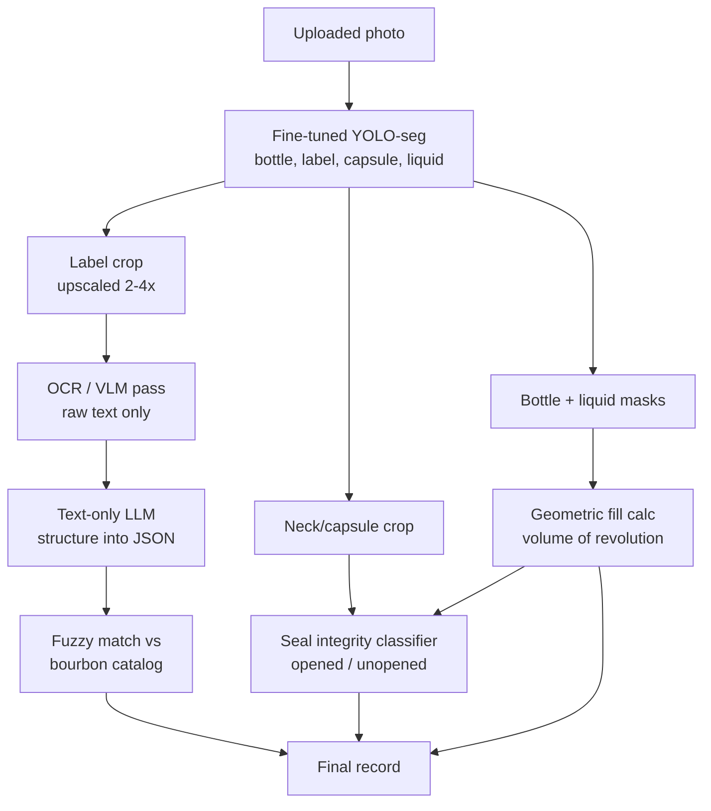

# Recommended changes.  Switch from Ollama to vLLM

Your benchmarks are actually telling you something more useful than "try a bigger model": you have three different problems glued together, and only one of them is a VLM problem.

## Read your own numbers

Look at where each model fails. Qwen3-VL nails proof (89.5%), ABV (89.5%), and size (95.2%) — the printed-text fields. It collapses on status (33.3%) and fill_level (33.3%). Both models sit at exactly 33.3% on fill level, which for a 3-bucket task is chance. That is not a model-quality gap you close by swapping checkpoints. VLMs estimate continuous geometry badly, full stop.

Also worth checking before you conclude anything: Qwen's 33.3% on status is suspiciously identical to its fill_level score. Pull the confusion matrix. If it's emitting one constant class, that's a schema/prompt bug, not a vision failure, and it's a free 40 points.

One aside on gemma4:e4b — that's ~4B effective params. It's a laptop model. It's not really in the comparison.

## The architecture I'd actually build

Stop asking one model to do everything in one pass.

**Fill level is geometry, not language.** Segment the bottle interior and the liquid region, then compute fill as a volume-of-revolution integral over the cross-sectional radius rather than a naive height ratio — bourbon bottles have shoulders and tapers, so height ratio will systematically overestimate. A YOLOv11-seg or SAM2-derived model fine-tuned on 200–400 masked images will run in ~15ms and beat any VLM by a mile. Your real enemies here are amber glass, dark liquid against dark glass, and labels occluding the liquid line — worth adding a capture hint in the app ("shoot against a light background").

**Opened/unopened is mostly free once fill works.** An unopened bottle has a fill line at a tight, consistent position in the neck. Combine that prior with a small binary classifier on the capsule/neck crop looking at seal and tax-strip integrity. Two cheap signals, high accuracy.

## The resolution problem is probably your biggest text lever

A phone photo of a whole bottle, downsampled by Ollama's default preprocessing to ~1M pixels, leaves "Aged 12 Years" and barrel/rick/warehouse stamps at a handful of pixels tall. That likely explains most of your name misses and will absolutely kill barrel info. Detect the bottle, crop to the label, upscale, *then* run text extraction. Do that before you change models — it may be worth more than any swap.

Related: `qwen3-vl:30b` is a MoE with roughly 3B active parameters. You are paying 30B of VRAM for 3B of reasoning. And if your quantization is touching the vision encoder, that hurts OCR disproportionately — keep the ViT at FP16 even if you quantize the LLM.

## Models to try, in order

1. **Qwen2.5-VL-7B-Instruct** at bf16 (~16GB). Still the reference point for open-weight OCR at this scale, and critically it exposes `min_pixels`/`max_pixels` so you control resolution explicitly. A dense 7B often beats a 3B-active MoE on fine print.
2. **A dedicated OCR model + a text LLM.** PaddleOCR-VL, dots.ocr, or Surya for raw text extraction, then any decent 7–14B text model to structure it. This is frequently the winning architecture for label reading, and it's fast — you'd likely land well under your current 3s p50.
3. **InternVL3.5-8B or -14B** as an alternative VLM if you want single-pass.

Move off Ollama to vLLM regardless. You get resolution control, batching, and guided/constrained decoding so the model physically cannot emit a malformed status enum.

## Cheap accuracy you're leaving on the table

- **Proof = 2 × ABV.** Derive one from the other and cross-check. Both fields should equal the max of the two.
- **Catalog matching.** Don't ask the model to produce an exact product name. Get OCR text, then fuzzy-match (rapidfuzz, or embedding search) against a bourbon catalog. Constrain output to catalog entries. This is where your 52% name accuracy goes to 85%+.
- **Size** is nearly always one of ~6 values. Snap to the nearest.

## Two caveats

Your eval set of 63 images gives roughly ±12% confidence intervals — some of the gaps you're reading as real may be noise. Get to 300+, stratified across lighting and bottle shapes.

And for fill level specifically, "accuracy" against subjective ground truth is a rough metric. Score ordinal buckets with mean absolute error instead; being one bucket off should not count the same as being three off.

The honest endgame here: this is a narrow domain with consistent visual structure. A LoRA on Qwen2.5-VL-7B with 500–1000 labeled bottles will outperform every zero-shot model you can fit on that 3090. The pipeline above is what makes that fine-tune cheap, because you're only fine-tuning the text stage on clean crops.